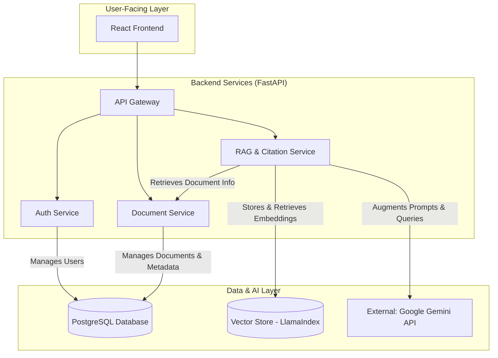
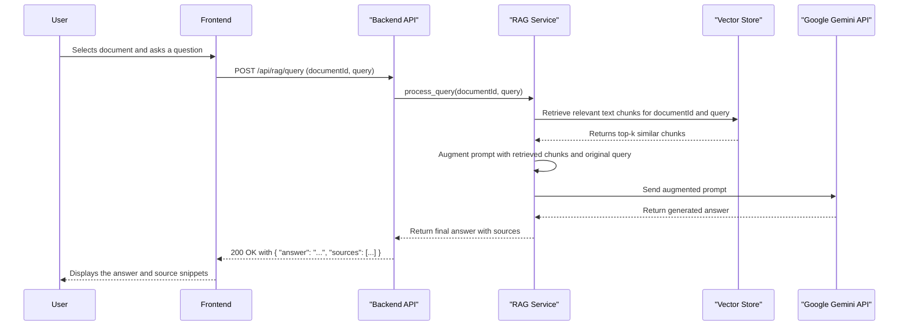

# System Architecture & Design

This document provides an overview of the system architecture for the AI Enhanced PDF Scholar platform. It includes a high-level component diagram and a data flow diagram for the core user workflow.

---

## 1. High-Level System Architecture

This diagram illustrates the major components of the platform and their interactions. The system is designed with a modern, scalable architecture, separating concerns between the frontend, backend services, and data storage.

### Component Descriptions:
- **React Frontend:** A modern, responsive single-page application that provides the user interface.
- **API Gateway:** The single entry point for all client requests, routing them to the appropriate backend service.
- **Auth Service:** Handles user registration, login, and JWT-based session management.
- **Document Service:** Manages the lifecycle of documents, including uploads, storage, and metadata management.
- **RAG & Citation Service:** The core AI engine. It handles PDF parsing, vector embedding creation, similarity search, and interaction with the external LLM.
- **PostgreSQL Database:** The primary relational database for storing user data, document metadata, and citation information.
- **Vector Store:** A specialized database (managed by LlamaIndex) optimized for storing and querying high-dimensional vector embeddings.
- **Google Gemini API:** The external Large Language Model used for the "generation" part of RAG.

---

## 2. Data Flow Diagram: Core RAG Workflow

This sequence diagram details the process of a user asking a question about a specific document. This is the primary value-add workflow of the platform.

This flow demonstrates how we combine the user's query with relevant, retrieved context from their own documents before sending it to the LLM. This ensures that the answers are grounded in the provided source material, making them accurate and verifiable.
