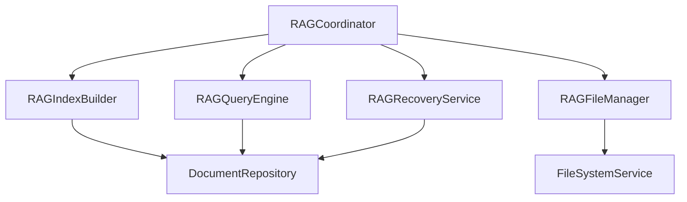

# 🤝 Contributing to AI Enhanced PDF Scholar

Thank you for your interest in contributing to **AI Enhanced PDF Scholar**! This document provides comprehensive guidelines for developers who want to contribute to this enterprise-grade intelligent document management platform.

## 🌟 Table of Contents

- [🚀 Quick Start](#-quick-start)
- [🏗️ Development Environment Setup](#-development-environment-setup)
- [📋 Development Workflow](#-development-workflow)
- [🧪 Testing Guidelines](#-testing-guidelines)
- [📝 Code Style & Standards](#-code-style--standards)
- [🔒 Security Guidelines](#-security-guidelines)
- [📚 Documentation Requirements](#-documentation-requirements)
- [🐛 Bug Reports](#-bug-reports)
- [✨ Feature Requests](#-feature-requests)
- [🔄 Pull Request Process](#-pull-request-process)
- [🏷️ Release Process](#-release-process)

---

## 🚀 Quick Start

### Prerequisites
- **Python 3.11+** with pip and conda (recommended)
- **Node.js 18+** with npm/pnpm
- **Git** for version control
- **Google Gemini API Key** for RAG functionality
- **Optional**: Redis for production caching

### Fork and Clone
```bash
# Fork the repository on GitHub first, then:
git clone https://github.com/YOUR_USERNAME/ai_enhanced_pdf_scholar.git
cd ai_enhanced_pdf_scholar
git remote add upstream https://github.com/Jackela/ai_enhanced_pdf_scholar.git
```

### Environment Setup
```bash
# Create and activate Python environment
conda create -n pdf_scholar_dev python=3.11 -y
conda activate pdf_scholar_dev

# Install dependencies
pip install -r requirements.txt -r requirements-dev.txt

# Setup frontend
cd frontend && npm install && cd ..

# Configure environment
cp .env.example .env
# Edit .env with your API keys and configuration
```

### Verify Installation
```bash
# Run backend tests
python scripts/test_runner.py --unit

# Run frontend tests
cd frontend && npm test && cd ..

# Start development servers
uvicorn web_main:app --reload --port 8000  # Terminal 1
cd frontend && npm run dev                  # Terminal 2
```

---

## 🏗️ Development Environment Setup

### Recommended Development Tools

#### Code Editors & IDEs
- **VS Code** with recommended extensions:
  - Python extension pack
  - TypeScript/JavaScript extensions
  - Prettier code formatter
  - ESLint
  - GitLens
- **PyCharm Professional** (alternative)

#### Pre-commit Hooks
```bash
# Install pre-commit hooks for code quality
pip install pre-commit
pre-commit install

# Test hooks
pre-commit run --all-files
```

#### Development Configuration

**VS Code Settings** (`.vscode/settings.json`):
```json
{
  "python.defaultInterpreterPath": "./venv/bin/python",
  "python.linting.enabled": true,
  "python.linting.pylintEnabled": true,
  "python.formatting.provider": "black",
  "typescript.preferences.importModuleSpecifier": "relative",
  "editor.formatOnSave": true,
  "editor.codeActionsOnSave": {
    "source.organizeImports": true
  }
}
```

**Environment Variables** (`.env`):
```bash
# Core Configuration
ENVIRONMENT=development
DATABASE_URL=sqlite:///./pdf_scholar_dev.db
GOOGLE_API_KEY=your_gemini_api_key_here

# Development Settings
DEBUG=true
LOG_LEVEL=DEBUG
CORS_ORIGINS=http://localhost:3000,http://localhost:5173

# Optional: Redis for caching (development)
REDIS_URL=redis://localhost:6379

# Testing Configuration
TEST_DATABASE_URL=sqlite:///:memory:
```

---

## 📋 Development Workflow

### Branch Strategy
We use **GitHub Flow** with feature branches:

```bash
# Create feature branch
git checkout -b feature/intelligent-citation-parsing

# Make changes and commit frequently
git add .
git commit -m "feat: add citation format detection algorithm"

# Push to your fork
git push origin feature/intelligent-citation-parsing

# Create pull request on GitHub
```

### Commit Message Convention
We follow **Conventional Commits** specification:

```bash
# Format: <type>[optional scope]: <description>

# Types:
feat: new feature for the user
fix: bug fix for the user
docs: changes to documentation
style: formatting, missing semicolons, etc; no code change
refactor: refactoring production code
test: adding missing tests, refactoring tests; no production code change
chore: updating grunt tasks etc; no production code change
perf: performance improvements
security: security fixes or improvements

# Examples:
feat(rag): add multi-document query support
fix(auth): resolve JWT token expiration handling
docs(api): update OpenAPI specification for v2.2
refactor(database): optimize citation repository queries
test(security): add XSS protection test cases
security(api): implement rate limiting middleware
```

### Development Tasks

#### 1. Backend Development
```bash
# Run backend with auto-reload
uvicorn web_main:app --reload --port 8000

# Run specific test suites
python scripts/test_runner.py --unit              # Unit tests
python scripts/test_runner.py --integration       # Integration tests
python scripts/test_runner.py --security         # Security tests
python scripts/test_runner.py --performance      # Performance tests

# Database operations
python scripts/database_management.py --migrate  # Run migrations
python scripts/database_management.py --seed     # Seed test data

# Code quality checks
black src/ backend/ tests/                        # Format code
pylint src/ backend/                              # Linting
mypy src/ backend/                                # Type checking
```

#### 2. Frontend Development
```bash
cd frontend

# Start development server
npm run dev

# Run tests
npm test                    # Unit tests
npm run test:e2e           # End-to-end tests
npm run test:security      # Security tests

# Code quality
npm run lint               # ESLint
npm run type-check         # TypeScript checking
npm run format             # Prettier formatting

# Build for production
npm run build
```

#### 3. Full-Stack Development
```bash
# Run complete test suite
python scripts/comprehensive_test_runner.py

# Performance benchmarking
python scripts/benchmark_suite.py

# Security audit
python scripts/run_security_tests.py

# Documentation generation
python scripts/generate_docs.py
```

---

## 🧪 Testing Guidelines

### Testing Philosophy
- **Test-Driven Development (TDD)**: Write tests before implementation
- **Comprehensive Coverage**: Aim for >90% code coverage
- **Performance Testing**: Include performance benchmarks
- **Security Testing**: Validate security measures

### Test Structure
```
tests/
├── unit_tests/              # Unit tests for individual components
│   ├── test_citation_services.py
│   ├── test_rag_services.py
│   ├── test_security_utils.py
│   └── ...
├── integration/             # Integration tests
│   ├── test_api_endpoints.py
│   ├── test_database_operations.py
│   └── test_real_pdf_processing.py
├── security/               # Security-specific tests
│   ├── test_xss_protection.py
│   ├── test_sql_injection.py
│   └── test_authentication.py
├── performance/            # Performance benchmarks
│   ├── test_rag_performance.py
│   └── test_database_performance.py
├── fixtures/               # Test data and fixtures
│   ├── sample_pdfs/
│   └── academic_pdf_generator.py
└── conftest.py            # Shared test configuration
```

### Writing Tests

#### Unit Tests Example
```python
import pytest
from unittest.mock import Mock, patch
from src.services.citation_service import CitationService

class TestCitationService:
    @pytest.fixture
    def citation_service(self, mock_citation_repo, mock_relation_repo):
        return CitationService(mock_citation_repo, mock_relation_repo)
    
    def test_extract_citations_with_high_confidence(self, citation_service):
        """Test citation extraction with high confidence threshold."""
        # Given
        document_id = 1
        confidence_threshold = 0.9
        
        # When
        result = citation_service.extract_citations_from_document(
            document_id, confidence_threshold
        )
        
        # Then
        assert result.success is True
        assert all(citation.confidence >= 0.9 for citation in result.citations)
        assert len(result.citations) > 0
    
    @patch('src.services.citation_service.LLMCitationParser')
    def test_citation_parsing_with_mocked_llm(self, mock_llm, citation_service):
        """Test citation parsing with mocked LLM service."""
        # Given
        mock_llm.return_value.parse.return_value = [
            {"title": "Test Paper", "authors": ["John Doe"], "confidence": 0.95}
        ]
        
        # When
        result = citation_service.parse_citation_text("Sample citation text")
        
        # Then
        assert len(result) == 1
        assert result[0]["confidence"] == 0.95
```

#### Integration Tests Example
```python
import pytest
from fastapi.testclient import TestClient
from web_main import app

class TestDocumentAPI:
    @pytest.fixture
    def client(self):
        return TestClient(app)
    
    @pytest.fixture
    def auth_headers(self, client):
        # Login and get auth token
        response = client.post("/api/auth/login", json={
            "username": "test@example.com",
            "password": "testpass123"
        })
        token = response.json()["data"]["access_token"]
        return {"Authorization": f"Bearer {token}"}
    
    def test_document_upload_and_query_workflow(self, client, auth_headers, sample_pdf):
        """Test complete document workflow: upload -> index -> query."""
        # Upload document
        with open(sample_pdf, 'rb') as f:
            response = client.post(
                "/api/documents", 
                files={"file": f}, 
                headers=auth_headers
            )
        
        assert response.status_code == 201
        document_id = response.json()["data"]["id"]
        
        # Index for RAG
        response = client.post(
            f"/api/rag/index/{document_id}",
            headers=auth_headers
        )
        assert response.status_code == 200
        
        # Query document
        response = client.post(
            "/api/rag/query",
            json={
                "query": "What are the main findings?",
                "document_id": document_id
            },
            headers=auth_headers
        )
        
        assert response.status_code == 200
        assert "answer" in response.json()["data"]
```

### Test Execution
```bash
# Quick smoke tests (3-7 seconds)
python scripts/test_runner.py --quick

# Full unit test suite
python scripts/test_runner.py --unit

# Integration tests (requires database)
python scripts/test_runner.py --integration

# Security tests
python scripts/test_runner.py --security

# Performance benchmarks
python scripts/test_runner.py --performance

# Specific test files
python scripts/test_runner.py --file tests/test_citation_services.py

# With coverage report
python scripts/test_runner.py --unit --coverage
```

---

## 📝 Code Style & Standards

### Python Code Style

#### Formatting & Linting
- **Black**: Code formatting (line length: 88 characters)
- **Pylint**: Code analysis and style checking
- **MyPy**: Static type checking
- **isort**: Import sorting

#### Code Standards
```python
# Type hints are mandatory
def extract_citations(document: DocumentModel, threshold: float = 0.8) -> List[Citation]:
    """
    Extract citations from document content.
    
    Args:
        document: Document to analyze
        threshold: Minimum confidence threshold (0.0-1.0)
        
    Returns:
        List of extracted citations with confidence scores
        
    Raises:
        ValueError: If threshold is outside valid range
        DocumentProcessingError: If document cannot be processed
    """
    if not 0.0 <= threshold <= 1.0:
        raise ValueError("Threshold must be between 0.0 and 1.0")
    
    citations = []
    # Implementation here...
    return citations

# Use dataclasses for data structures
@dataclass
class CitationExtractionResult:
    """Result of citation extraction operation."""
    document_id: int
    citations: List[Citation]
    confidence_avg: float
    processing_time: float
    
    def __post_init__(self) -> None:
        """Validate result after initialization."""
        if self.confidence_avg < 0 or self.confidence_avg > 1:
            raise ValueError("Average confidence must be between 0 and 1")

# Use enums for constants
class CitationFormat(Enum):
    """Supported citation formats."""
    APA = "apa"
    MLA = "mla"
    CHICAGO = "chicago"
    IEEE = "ieee"
```

#### Error Handling
```python
# Custom exception hierarchy
class PDFScholarError(Exception):
    """Base exception for PDF Scholar operations."""
    pass

class DocumentProcessingError(PDFScholarError):
    """Raised when document processing fails."""
    pass

class CitationExtractionError(DocumentProcessingError):
    """Raised when citation extraction fails."""
    pass

# Proper error handling with context
def process_document(file_path: Path) -> DocumentModel:
    """Process uploaded document file."""
    try:
        if not file_path.exists():
            raise FileNotFoundError(f"Document file not found: {file_path}")
            
        # Process document
        document = DocumentProcessor.process(file_path)
        
        # Log success
        logger.info(f"Successfully processed document: {document.title}")
        return document
        
    except FileNotFoundError:
        logger.error(f"Document file missing: {file_path}")
        raise
    except Exception as e:
        logger.error(f"Unexpected error processing {file_path}: {e}")
        raise DocumentProcessingError(f"Failed to process document: {e}") from e
```

### TypeScript/JavaScript Code Style

#### Configuration
- **Prettier**: Code formatting
- **ESLint**: Linting with TypeScript support
- **TypeScript**: Strict mode enabled

#### React Component Standards
```typescript
// Use functional components with proper typing
interface DocumentListProps {
  documents: Document[]
  onDocumentSelect: (document: Document) => void
  loading?: boolean
  className?: string
}

export const DocumentList: React.FC<DocumentListProps> = ({
  documents,
  onDocumentSelect,
  loading = false,
  className
}) => {
  // Use proper hooks
  const [selectedId, setSelectedId] = useState<number | null>(null)
  
  // Memoize expensive calculations
  const sortedDocuments = useMemo(
    () => documents.sort((a, b) => b.created_at.localeCompare(a.created_at)),
    [documents]
  )
  
  // Proper event handlers
  const handleDocumentClick = useCallback((document: Document) => {
    setSelectedId(document.id)
    onDocumentSelect(document)
  }, [onDocumentSelect])
  
  if (loading) {
    return <LoadingSpinner />
  }
  
  return (
    <div className={clsx('document-list', className)}>
      {sortedDocuments.map(document => (
        <DocumentCard
          key={document.id}
          document={document}
          selected={document.id === selectedId}
          onClick={handleDocumentClick}
        />
      ))}
    </div>
  )
}
```

#### API Client Standards
```typescript
// Proper error handling and typing
export class PDFScholarAPI {
  constructor(
    private baseUrl: string,
    private authToken: string
  ) {}
  
  async uploadDocument(file: File): Promise<DocumentResponse> {
    const formData = new FormData()
    formData.append('file', file)
    
    try {
      const response = await fetch(`${this.baseUrl}/api/documents`, {
        method: 'POST',
        headers: {
          'Authorization': `Bearer ${this.authToken}`
        },
        body: formData
      })
      
      if (!response.ok) {
        throw new APIError(
          `Upload failed: ${response.status} ${response.statusText}`,
          response.status
        )
      }
      
      const data = await response.json()
      return DocumentResponse.parse(data) // Zod validation
      
    } catch (error) {
      if (error instanceof APIError) {
        throw error
      }
      throw new APIError('Network error during upload', 0)
    }
  }
}
```

---

## 🔒 Security Guidelines

### Security-First Development

#### Input Validation
```python
# Always validate and sanitize input
from pydantic import BaseModel, validator
from typing import Optional

class DocumentUploadRequest(BaseModel):
    """Secure document upload request model."""
    title: Optional[str] = None
    tags: List[str] = []
    
    @validator('title')
    def validate_title(cls, v):
        if v is not None:
            # Sanitize title
            sanitized = html.escape(v.strip())
            if len(sanitized) > 200:
                raise ValueError("Title too long")
            return sanitized
        return v
    
    @validator('tags')
    def validate_tags(cls, v):
        # Limit number and length of tags
        if len(v) > 10:
            raise ValueError("Too many tags")
        sanitized_tags = []
        for tag in v:
            clean_tag = re.sub(r'[^a-zA-Z0-9\-_]', '', tag.strip())
            if len(clean_tag) > 50:
                raise ValueError("Tag too long")
            sanitized_tags.append(clean_tag)
        return sanitized_tags
```

#### Authentication Security
```python
# Secure JWT implementation
class JWTManager:
    def __init__(self, private_key: str, public_key: str):
        self.private_key = private_key
        self.public_key = public_key
    
    def create_access_token(self, user_id: int, permissions: List[str]) -> str:
        """Create secure access token with minimal payload."""
        payload = {
            "sub": str(user_id),
            "permissions": permissions,
            "type": "access",
            "exp": datetime.utcnow() + timedelta(minutes=15),
            "iat": datetime.utcnow(),
            "jti": str(uuid.uuid4())  # Unique token ID for revocation
        }
        return jwt.encode(payload, self.private_key, algorithm="RS256")
```

#### XSS Protection (Frontend)
```typescript
// Use security hooks for all user content
import { useSanitizedContent, useXSSDetection } from '@/hooks/useSecurity'

const MessageDisplay: React.FC<{ content: string; role: 'user' | 'assistant' }> = ({
  content, role
}) => {
  const { sanitizedContent, hasXSSRisk } = useSanitizedContent(content)
  const xssDetection = useXSSDetection(content)
  
  // Log security events
  useEffect(() => {
    if (hasXSSRisk) {
      console.warn('XSS attempt detected:', {
        patterns: xssDetection.patterns,
        severity: xssDetection.severity
      })
    }
  }, [hasXSSRisk, xssDetection])
  
  return (
    <div className={clsx('message', {
      'message--user': role === 'user',
      'message--assistant': role === 'assistant',
      'message--security-warning': hasXSSRisk
    })}>
      {hasXSSRisk ? (
        <div className="security-warning">
          ⚠️ Potentially unsafe content detected
        </div>
      ) : null}
      
      <div dangerouslySetInnerHTML={{ __html: sanitizedContent }} />
    </div>
  )
}
```

### Security Checklist
- [ ] **Input Validation**: All user inputs validated and sanitized
- [ ] **Authentication**: Secure JWT implementation with proper expiration
- [ ] **Authorization**: RBAC enforced on all protected endpoints
- [ ] **XSS Protection**: Content sanitization on frontend and backend
- [ ] **SQL Injection**: Parameterized queries and ORM usage
- [ ] **File Upload**: Type validation, size limits, virus scanning
- [ ] **Rate Limiting**: API endpoints protected against abuse
- [ ] **HTTPS**: All communications encrypted in production
- [ ] **Security Headers**: CSP, HSTS, X-Frame-Options implemented
- [ ] **Dependency Scanning**: Regular security audits of dependencies

---

## 📚 Documentation Requirements

### Code Documentation

#### Python Docstrings
```python
def extract_citations_from_document(
    self, 
    document_id: int, 
    confidence_threshold: float = 0.8,
    formats: List[CitationFormat] = None
) -> CitationExtractionResult:
    """
    Extract citations from document using multiple format parsers.
    
    This method uses a combination of regex patterns and machine learning
    models to identify and parse citations in various academic formats.
    The extraction process includes confidence scoring and duplicate detection.
    
    Args:
        document_id: Unique identifier for the document to process
        confidence_threshold: Minimum confidence score (0.0-1.0) for including
            citations in results. Lower values include more potential citations
            but may have higher false positive rates.
        formats: List of citation formats to recognize. If None, all supported
            formats will be used. Supported formats include APA, MLA, Chicago,
            IEEE, Harvard, and Vancouver.
    
    Returns:
        CitationExtractionResult containing:
            - List of extracted citations with confidence scores
            - Average confidence across all extracted citations  
            - Processing time in seconds
            - Extraction statistics and metadata
    
    Raises:
        DocumentNotFoundError: If document_id doesn't exist in database
        DocumentNotProcessedError: If document hasn't been indexed for processing
        ValueError: If confidence_threshold is outside [0.0, 1.0] range
        CitationExtractionError: If extraction process fails due to document
            corruption or unsupported format
    
    Example:
        >>> service = CitationService(citation_repo, relation_repo)
        >>> result = service.extract_citations_from_document(
        ...     document_id=123,
        ...     confidence_threshold=0.9,
        ...     formats=[CitationFormat.APA, CitationFormat.MLA]
        ... )
        >>> print(f"Extracted {len(result.citations)} citations")
        >>> print(f"Average confidence: {result.confidence_avg:.2f}")
    
    Note:
        This operation can be computationally intensive for large documents.
        Consider using background tasks for documents over 100 pages.
        
    See Also:
        - parse_citation_text(): For parsing individual citation strings
        - build_citation_network(): For building relationship networks
        - export_citations(): For exporting results in various formats
    """
    # Implementation here...
```

#### TypeScript Documentation
```typescript
/**
 * Secure RAG query hook with XSS protection and caching
 * 
 * This hook provides a secure interface for querying documents using
 * RAG (Retrieval-Augmented Generation) with built-in XSS protection,
 * response caching, and error handling.
 * 
 * @param config - Configuration object for RAG queries
 * @param config.baseUrl - API base URL (defaults to current origin)
 * @param config.cacheTimeout - Cache timeout in milliseconds (default: 300000)
 * @param config.enableXSSProtection - Enable XSS protection (default: true)
 * 
 * @returns Object containing:
 *   - `query`: Function to execute RAG queries
 *   - `loading`: Boolean indicating query in progress
 *   - `error`: Error object if query failed
 *   - `result`: Last query result with XSS protection
 *   - `clearCache`: Function to clear query cache
 * 
 * @example
 * ```tsx
 * const MyComponent = () => {
 *   const { query, loading, error, result } = useSecureRAG({
 *     baseUrl: 'https://api.example.com',
 *     cacheTimeout: 600000 // 10 minutes
 *   })
 * 
 *   const handleQuery = async () => {
 *     try {
 *       await query({
 *         query: "What are the main findings?",
 *         documentId: 123,
 *         contextWindow: 4000
 *       })
 *     } catch (error) {
 *       console.error('Query failed:', error)
 *     }
 *   }
 * 
 *   return (
 *     <div>
 *       <button onClick={handleQuery} disabled={loading}>
 *         {loading ? 'Querying...' : 'Ask Question'}
 *       </button>
 *       {error && <ErrorDisplay error={error} />}
 *       {result && <ResultDisplay result={result} />}
 *     </div>
 *   )
 * }
 * ```
 * 
 * @security
 * - All query responses are automatically sanitized for XSS protection
 * - User inputs are validated before sending to API
 * - Sensitive information is excluded from cache keys
 * 
 * @performance
 * - Implements intelligent caching with configurable timeout
 * - Debounces rapid successive queries
 * - Automatically retries failed requests with exponential backoff
 */
export const useSecureRAG = (config: RAGConfig = {}): SecureRAGHook => {
  // Implementation here...
}
```

### Architectural Documentation

#### Update TECHNICAL_DESIGN.md
When making architectural changes, update the technical design document:

```markdown
## New Modular RAG Service Architecture (v2.1.0)

### Overview
The RAG service has been decomposed into specialized, SOLID-compliant modules:

### Service Decomposition

#### RAGCoordinator
- **Responsibility**: Service orchestration and facade pattern
- **Dependencies**: All RAG services
- **Interface**: `IRAGCoordinator`

```python
class RAGCoordinator:
    def __init__(
        self,
        index_builder: IRAGIndexBuilder,
        query_engine: IRAGQueryEngine,
        recovery_service: IRAGRecoveryService,
        file_manager: IRAGFileManager
    ):
        # Dependency injection for loose coupling
        
    async def process_document_complete(self, document_id: int) -> ProcessingResult:
        """Orchestrates complete document processing pipeline."""
        # 1. Build index
        # 2. Verify integrity  
        # 3. Enable querying
        # 4. Update status
```

### Integration Points

#### Database Layer


### Migration Guide
For existing code using the monolithic RAG service:

```python
# Before (v2.0)
rag_service = EnhancedRAGService(db_connection)
result = rag_service.query_document(doc_id, query)

# After (v2.1)
coordinator = get_rag_coordinator(db_connection)  # Dependency injection
result = await coordinator.query_document(doc_id, query)
```
```

---

## 🐛 Bug Reports

### Before Reporting
1. **Search existing issues** to avoid duplicates
2. **Update to latest version** to ensure bug still exists
3. **Reproduce in clean environment** to isolate the issue

### Bug Report Template
```markdown
## 🐛 Bug Report

### Description
A clear and concise description of the bug.

### Steps to Reproduce
1. Go to '...'
2. Click on '...'
3. Enter '...'
4. See error

### Expected Behavior
What you expected to happen.

### Actual Behavior
What actually happened.

### Screenshots/Logs
If applicable, add screenshots or error logs.

### Environment
- **OS**: [e.g., Windows 11, Ubuntu 22.04]
- **Python**: [e.g., 3.11.5]
- **Node.js**: [e.g., 18.17.0]
- **Browser**: [e.g., Chrome 119, Firefox 118]
- **Version**: [e.g., v2.1.0]

### Additional Context
Any other relevant information.

### Severity
- [ ] Critical (system unusable)
- [ ] High (major feature broken)
- [ ] Medium (minor feature issue)
- [ ] Low (cosmetic issue)
```

---

## ✨ Feature Requests

### Feature Request Template
```markdown
## ✨ Feature Request

### Problem Statement
Describe the problem you're trying to solve.

### Proposed Solution
Describe your ideal solution.

### Alternative Solutions
Describe alternative solutions you've considered.

### Use Cases
Provide specific use cases for this feature.

### Implementation Considerations
- Technical complexity
- Breaking changes
- Performance impact
- Security implications

### Priority
- [ ] Critical (blocking workflow)
- [ ] High (significant improvement)
- [ ] Medium (nice to have)
- [ ] Low (future consideration)
```

---

## 🔄 Pull Request Process

### Before Creating PR

#### 1. Code Quality Checklist
```bash
# Run complete quality checks
python scripts/quality_check.py --all

# Equivalent to:
black src/ backend/ tests/           # Format code
pylint src/ backend/                 # Lint Python
mypy src/ backend/                   # Type checking
cd frontend && npm run lint          # Lint TypeScript
cd frontend && npm run type-check    # TypeScript checking
```

#### 2. Testing Checklist
```bash
# Run comprehensive tests
python scripts/test_runner.py --all

# Security tests
python scripts/run_security_tests.py

# Frontend tests
cd frontend && npm test && npm run test:e2e
```

#### 3. Documentation Checklist
- [ ] Code comments updated
- [ ] API documentation updated (if applicable)
- [ ] README updated (if applicable)
- [ ] TECHNICAL_DESIGN.md updated (if architectural changes)

### Pull Request Template
```markdown
## 🎯 Description
Brief description of changes and motivation.

## 📋 Type of Change
- [ ] 🐛 Bug fix (non-breaking change which fixes an issue)
- [ ] ✨ New feature (non-breaking change which adds functionality)
- [ ] 💥 Breaking change (fix or feature that causes existing functionality to change)
- [ ] 📝 Documentation update
- [ ] 🔧 Refactoring (no functional changes)
- [ ] ⚡ Performance improvement
- [ ] 🔒 Security fix/improvement

## 🧪 Testing
- [ ] Unit tests pass
- [ ] Integration tests pass
- [ ] Security tests pass
- [ ] Manual testing completed
- [ ] Performance impact assessed

## 📚 Documentation
- [ ] Code comments updated
- [ ] API documentation updated
- [ ] User documentation updated
- [ ] Architecture documentation updated

## 🔒 Security Checklist
- [ ] Input validation implemented
- [ ] XSS protection verified
- [ ] Authentication/authorization updated
- [ ] No sensitive data exposed
- [ ] Dependencies security-scanned

## 📸 Screenshots (if applicable)
Screenshots showing changes in UI.

## 🔗 Related Issues
Fixes #123
Closes #456
```

### Review Process

#### Automated Checks
- **CI/CD Pipeline**: All tests must pass
- **Code Quality**: Linting and formatting checks
- **Security Scan**: Dependency vulnerabilities
- **Performance**: Benchmark comparisons

#### Manual Review Criteria
1. **Code Quality**: Clean, readable, maintainable
2. **Architecture**: Follows SOLID principles
3. **Security**: No security vulnerabilities introduced
4. **Testing**: Adequate test coverage
5. **Documentation**: Clear and complete
6. **Performance**: No significant regressions

---

## 🏷️ Release Process

### Versioning Strategy
We follow **Semantic Versioning (SemVer)**:
- **MAJOR** (x.0.0): Breaking changes
- **MINOR** (x.y.0): New features (backward compatible)
- **PATCH** (x.y.z): Bug fixes (backward compatible)

### Release Workflow

#### 1. Pre-Release Preparation
```bash
# Update version numbers
python scripts/update_version.py --version 2.2.0

# Update CHANGELOG.md
python scripts/generate_changelog.py --version 2.2.0

# Run complete test suite
python scripts/comprehensive_test_suite.py
```

#### 2. Release Branch
```bash
# Create release branch
git checkout -b release/2.2.0

# Final testing and bug fixes
git commit -am "fix: resolve final issues for v2.2.0"

# Merge to main
git checkout main
git merge release/2.2.0
git tag -a v2.2.0 -m "Release v2.2.0"
```

#### 3. Deployment
```bash
# Build production artifacts
python scripts/build_release.py --version 2.2.0

# Deploy to staging
python scripts/deploy.py --env staging --version 2.2.0

# Deploy to production (after validation)
python scripts/deploy.py --env production --version 2.2.0
```

---

## 🙏 Recognition

### Contributors Hall of Fame
We recognize contributors in multiple ways:
- **README.md**: All contributors listed
- **Release Notes**: Major contributors highlighted
- **GitHub Profile**: Contribution statistics
- **Annual Report**: Top contributors featured

### Contribution Types
We value all types of contributions:
- 💻 **Code**: Bug fixes, features, optimizations
- 📝 **Documentation**: Guides, API docs, tutorials
- 🐛 **Bug Reports**: Detailed issue reporting
- 🧪 **Testing**: Test cases, manual testing
- 💡 **Ideas**: Feature suggestions, architecture improvements
- 🎨 **Design**: UI/UX improvements, graphics
- 🌍 **Translation**: Internationalization support
- 📢 **Advocacy**: Blog posts, presentations, community building

### Getting Help

#### Community Support
- **GitHub Discussions**: [Project discussions](https://github.com/Jackela/ai_enhanced_pdf_scholar/discussions)
- **Discord Server**: Real-time chat support
- **Stack Overflow**: Tag questions with `ai-pdf-scholar`

#### Maintainer Contact
- **Email**: maintainers@pdf-scholar.com
- **Issues**: For bug reports and feature requests
- **Security**: security@pdf-scholar.com for security issues

---

**Thank you for contributing to AI Enhanced PDF Scholar! 🚀**

*Together, we're building the future of intelligent document management.*

---

**📊 Last Updated**: 2025-01-19  
**🔖 Version**: 2.1.0  
**👥 Maintained by**: AI Enhanced PDF Scholar Team