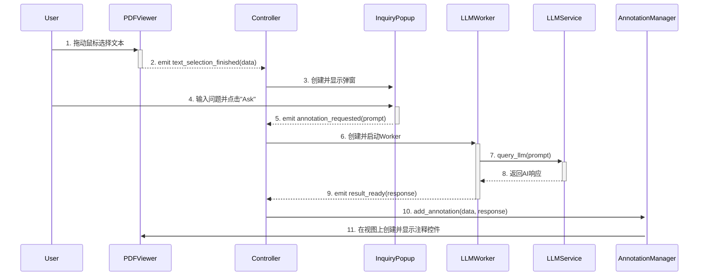

# AI-Enhanced PDF Scholar - Design Document (Web Architecture)

## 1. Introduction

This document outlines the modern Web-based architectural design for the AI-Enhanced PDF Scholar application. The architecture follows a clean separation between Frontend (React TypeScript) and Backend (FastAPI Python), designed to be modular, testable, and maintainable, following SOLID principles to ensure robustness and flexibility.

**Note: This project has completely migrated from desktop PyQt to a modern web stack.**

## 2. Architectural Principles

The design is strictly guided by the following principles:

*   **Layered Web Architecture:** The application follows a modern web architecture pattern.
    *   **Frontend (React/TypeScript):** React components handle UI presentation and user interaction
    *   **Backend API (FastAPI):** RESTful API endpoints handle business logic and data operations
    *   **Database Layer:** SQLite with Repository pattern for data persistence
    *   **Service Layer:** Business logic services (RAG, Document Management, Citation Analysis)
*   **SOLID Principles:** All five SOLID principles are applied, with a strong emphasis on:
    *   **Single Responsibility Principle (SRP):** Each class has a single, well-defined purpose (e.g., `PDFViewer` only views, `AnnotationManager` only manages annotations).
    *   **Dependency Inversion Principle (DIP):** High-level components like `MainWindow` depend on abstractions (`LLMService`), not on concrete implementations.
*   **High Cohesion, Low Coupling:** Communication between frontend and backend is managed via RESTful APIs and WebSocket connections, preventing direct dependencies.
*   **Dependency Injection:** Dependencies (like services and managers) are passed into constructors, making components easy to test with mocks.

## 3. Core Modules and Their Refactored Responsibilities

The application is structured around the following decoupled modules:

### 3.1. `Backend API` (The Orchestrator)
*   **File:** `backend/api/main.py`
*   **Description:** FastAPI application that acts as the central controller. It initializes all services and manages the entire backend lifecycle.

### 3.2. `Document Models` (The Data Layer)
*   **File:** `src/database/models.py`
*   **Description:** SQLAlchemy-like data models that encapsulate document metadata and relationships.
*   **Responsibilities:** Data validation, serialization, and database mapping. Completely UI-agnostic.

### 3.3. `React Frontend` (The View Layer)
*   **File:** `frontend/src/components/`
*   **Description:** React TypeScript components responsible for UI presentation and user interaction.
*   **Responsibilities:**
    *   Document list display and management
    *   PDF viewing and interaction
    *   Real-time updates via WebSocket
    *   Responsive design with Tailwind CSS
    *   **Completely decoupled from backend logic**

### 3.4. `Service Layer` (Business Logic)
*   **File:** `src/services/`
*   **Description:** Manages business logic for various domain areas.
*   **Responsibilities:**
    *   Document library management
    *   RAG query processing  
    *   Citation extraction and analysis
    *   Content hashing and deduplication
    *   Vector index management

### 3.5. `LLMService` & `LLMWorker` (Service Layer)
*   **Files:** `src/llm_service.py`, `src/llm_worker.py`
*   **Description:** Abstracted service for AI interaction.
*   **Responsibilities:**
    *   `LLMService` defines an abstract interface for querying an LLM and raises specific exceptions on failure.
    *   `LLMWorker` runs the `LLMService` query in a separate `QThread` to keep the UI responsive. It emits `result_ready` or `error_occurred` signals.

### 3.6. UI Components
*   **Files:** `src/inquiry_popup.py`, `src/annotation.py`, `src/settings_dialog.py`
*   **Description:** Self-contained, reusable `QWidget` subclasses that have minimal internal logic and primarily communicate via signals.

## 4. Interaction Workflow (Signal & Slot)

The decoupled components interact in a clear, orchestrated sequence. The primary user workflow for asking a question is as follows:

1.  **Selection:** The User selects text in the `PDFViewer`.
2.  **Signal `text_selection_finished`:** `PDFViewer` completes the selection, calculates the PDF coordinates and extracts the selected/context text, then emits `text_selection_finished(page_num, pdf_rect, selected_text, context_text)`.
3.  **`MainWindow` Handles Signal:** `MainWindow` has a slot connected to this signal. The slot (`handle_text_selection`) is triggered.
4.  **`InquiryPopup` Created:** The `MainWindow` slot creates an `InquiryPopup` instance, passing it the selected text and context.
5.  **Signal `annotation_requested`:** The User types a question (or leaves it blank) in the `InquiryPopup` and clicks "Ask AI". The popup then emits `annotation_requested(prompt, selected_text)`.
6.  **`MainWindow` Handles Query:** `MainWindow` has a slot (`start_ai_query`) connected to this signal. This slot instantiates and starts an `LLMWorker`.
7.  **`LLMWorker` Executes:** The `LLMWorker` calls `llm_service.query_llm()` in a background thread.
8.  **Signal `result_ready` / `error_occurred`:** Upon completion, the `LLMWorker` emits `result_ready(ai_response)` on success or `error_occurred(error_message)` on failure.
9.  **`MainWindow` Handles Response:** `MainWindow`'s `handle_ai_response` slot is connected to `result_ready`. It receives the AI response.
10. **Annotation Created:** The `handle_ai_response` slot calls `annotation_manager.add_annotation()`, passing it the necessary data (page number, coordinates, AI response).
11. **View Updated:** The `AnnotationManager` creates the `Annotation` widget and places it correctly on the `PDFViewer`.

This signal-based flow ensures that components remain independent and testable.

## 5. Sequence Diagram: AI Inquiry Workflow

This diagram illustrates the full interaction sequence from user action to AI response.

## 6. Future Enhancements (Extensibility Points)

*   **Multiple LLM Providers:** The `LLMService` interface allows easy integration of other LLM APIs (e.g., OpenAI, local models) by simply creating new concrete implementations.
*   **Diverse Annotation Types:** Extend the `Annotation` class or create new annotation types (e.g., highlights, underlines, text notes) by adding new UI elements and corresponding management logic.
*   **Search Functionality:** Integrate text search within the PDF document.
*   **Export Annotations:** Allow users to export their annotations.
*   **Document Outline/Thumbnails:** Enhance navigation with a document outline or page thumbnails.
*   **Error Handling and User Feedback:** Improve error reporting and provide more informative user feedback.
