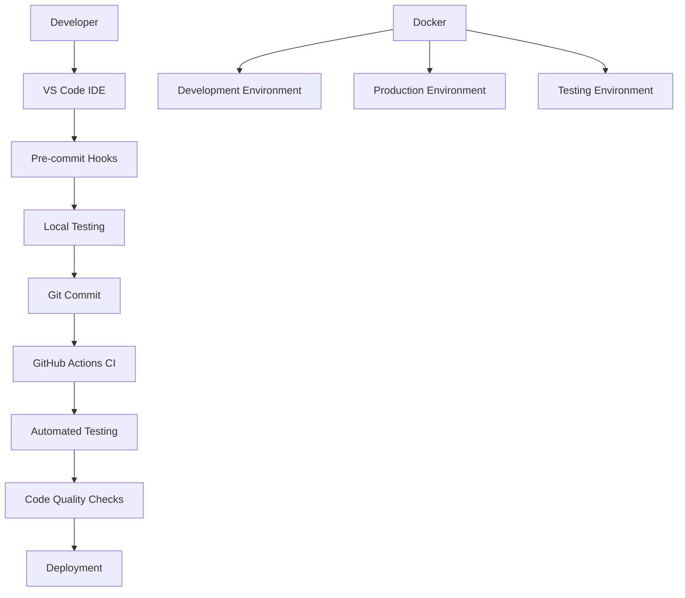
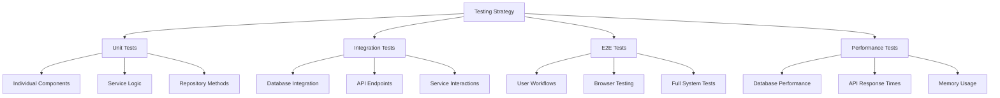

# 🚀 AI Enhanced PDF Scholar - Development Setup Guide

## 📋 Table of Contents

- [Overview](#overview)
- [Prerequisites](#prerequisites)
- [Quick Start](#quick-start)
- [Development Environment Options](#development-environment-options)
- [Code Quality Tools](#code-quality-tools)
- [Testing Strategy](#testing-strategy)
- [VS Code Configuration](#vs-code-configuration)
- [Docker Development](#docker-development)
- [CI/CD Pipeline](#cicd-pipeline)
- [Troubleshooting](#troubleshooting)

## 🎯 Overview

This guide provides comprehensive instructions for setting up the AI Enhanced PDF Scholar development environment. The project follows modern development practices with automated testing, code quality enforcement, and containerized deployment.

### 🏗️ Architecture Overview



## 📋 Prerequisites

### System Requirements

- **Python**: 3.10+ (recommended: 3.11)
- **Node.js**: 18+ (for frontend development)
- **Git**: Latest version
- **Docker** (optional): For containerized development
- **VS Code** (recommended): With extension pack

### Operating System Support

- ✅ **Windows 10/11** (WSL2 recommended)
- ✅ **macOS 10.15+**
- ✅ **Linux** (Ubuntu 20.04+, Debian 11+, Fedora 35+)

## 🚀 Quick Start

### 1. Clone and Setup

```bash
# Clone the repository
git clone https://github.com/Jackela/ai_enhanced_pdf_scholar.git
cd ai_enhanced_pdf_scholar

# Create Python virtual environment
python -m venv .venv

# Activate virtual environment
# Windows:
.venv\Scripts\activate
# macOS/Linux:
source .venv/bin/activate

# Install Python dependencies
pip install --upgrade pip
pip install -r requirements.txt

# Install development tools
pip install pre-commit black isort flake8 mypy pytest-cov
```

### 2. Environment Configuration

```bash
# Copy environment template
cp .env.example .env

# Edit .env file with your settings
# IMPORTANT: Set your GEMINI_API_KEY for AI functionality
```

### 3. Database Setup

```bash
# Initialize database
python -c "
from src.database.connection import DatabaseConnection
from src.database.migrations import DatabaseMigrator
db = DatabaseConnection('library.db')
migrator = DatabaseMigrator(db)
migrator.create_tables_if_not_exist()
print('✅ Database initialized')
"
```

### 4. Frontend Setup (Optional)

```bash
# Navigate to frontend directory
cd frontend

# Install dependencies
npm ci

# Build frontend
npm run build

# Return to project root
cd ..
```

### 5. Install Pre-commit Hooks

```bash
# Install pre-commit hooks
pre-commit install
pre-commit install --hook-type commit-msg

# Test hooks (optional)
pre-commit run --all-files
```

### 6. Start Development Server

```bash
# Start backend server
python web_main.py --host 0.0.0.0 --port 8000 --debug

# In another terminal (optional): Start frontend dev server
cd frontend && npm run dev
```

### 7. Verify Setup

- 🌐 **Backend**: http://localhost:8000
- 📚 **API Docs**: http://localhost:8000/docs
- 🎨 **Frontend** (if running): http://localhost:3000

## 🛠️ Development Environment Options

### Option 1: Native Development (Recommended)

Perfect for day-to-day development with maximum performance:

```bash
# Setup as described in Quick Start
# All tools run natively on your system
```

**Pros**: Fast, direct debugging, full IDE integration
**Cons**: Requires local Python/Node.js setup

### Option 2: Docker Development

Consistent environment across all systems:

```bash
# Start development environment
docker-compose --profile dev up --build

# Or with specific services
docker-compose --profile dev --profile frontend up --build
```

**Pros**: Consistent environment, easy cleanup
**Cons**: Slightly slower, requires Docker knowledge

### Option 3: VS Code Dev Containers

Best of both worlds with VS Code integration:

```bash
# Open in VS Code
code .

# Use Command Palette: "Dev Containers: Reopen in Container"
```

**Pros**: Isolated environment, full VS Code integration
**Cons**: Requires VS Code and Docker

## 🔧 Code Quality Tools

### Automated Code Formatting

```bash
# Format Python code
black src/ backend/ tests/

# Sort imports
isort src/ backend/ tests/

# Format frontend code
cd frontend && npm run lint --fix
```

### Code Linting

```bash
# Python linting
flake8 src/ backend/ tests/

# TypeScript linting
cd frontend && npm run lint
```

### Type Checking

```bash
# Python type checking
mypy src/ backend/

# TypeScript type checking
cd frontend && npm run type-check
```

### Security Scanning

```bash
# Python security scan
bandit -r src/ backend/

# Dependency vulnerability check
safety check
pip-audit

# Frontend security audit
cd frontend && npm audit
```

## 🧪 Testing Strategy

### Test Categories



### Running Tests

```bash
# Run all tests with coverage
pytest tests/ -v --cov=src --cov-report=html

# Run only unit tests
pytest tests/ -v -m "unit"

# Run only integration tests
pytest tests/ -v -m "integration"

# Run specific test file
pytest tests/test_database_models.py -v

# Run with specific markers
pytest tests/ -v -m "database and not slow"

# Run E2E tests
pytest tests_e2e/ -v

# Run performance benchmarks
python performance_benchmark.py
```

### Test Coverage

Current coverage targets:
- **Unit Tests**: 85%+ coverage
- **Integration Tests**: 90%+ critical path coverage
- **E2E Tests**: 100% user workflow coverage

```bash
# Generate detailed coverage report
pytest --cov=src --cov-report=html:htmlcov --cov-report=term-missing

# Open coverage report
# Windows: start htmlcov/index.html
# macOS: open htmlcov/index.html
# Linux: xdg-open htmlcov/index.html
```

## 🔧 VS Code Configuration

### Recommended Extensions

The workspace includes automatic extension recommendations. Install them for the best experience:

#### Essential Extensions
- **Python**: Complete Python development support
- **Black Formatter**: Code formatting
- **ESLint**: JavaScript/TypeScript linting
- **Prettier**: Code formatting for web files
- **GitLens**: Enhanced Git capabilities

#### Quality & Testing
- **Error Lens**: Inline error highlighting
- **Coverage Gutters**: Code coverage visualization
- **Test Explorer**: Unified test interface
- **REST Client**: API testing

#### Productivity
- **Auto Rename Tag**: Synchronized tag editing
- **Path Intellisense**: File path autocomplete
- **TODO Tree**: Task management
- **Bookmarks**: Code navigation

### Workspace Settings

The project includes optimized VS Code settings:

```json
{
  "python.defaultInterpreterPath": "./.venv/bin/python",
  "python.formatting.provider": "black",
  "editor.formatOnSave": true,
  "editor.codeActionsOnSave": {
    "source.organizeImports": true,
    "source.fixAll.eslint": true
  }
}
```

### Debugging Configuration

Launch configurations are provided for:
- 🐍 **Python Backend**: Debug FastAPI server
- 🌐 **Frontend**: Debug React application
- 🧪 **Tests**: Debug individual test files
- 🐳 **Docker**: Debug containerized application

Access via `F5` or Debug panel in VS Code.

### Tasks and Shortcuts

Common development tasks available via `Ctrl+Shift+P > Tasks: Run Task`:

- **🚀 Start Backend Server (Development)**
- **🏗️ Build Frontend**
- **🧪 Run All Tests**
- **🎨 Format Python Code**
- **🔍 Lint Python Code**
- **🐳 Start Development Environment (Docker)**

## 🐳 Docker Development

### Available Profiles

```bash
# Development with hot reload
docker-compose --profile dev up --build

# Production environment
docker-compose --profile prod up -d --build

# Testing environment
docker-compose --profile test up --build

# Frontend development only
docker-compose --profile frontend up --build

# Full stack with monitoring
docker-compose --profile prod --profile monitoring up -d --build
```

### Container Management

```bash
# View logs
docker-compose logs -f app-dev

# Execute commands in container
docker-compose exec app-dev bash

# Rebuild specific service
docker-compose build app-dev

# Clean up
docker-compose down --volumes --remove-orphans
```

### Environment Variables

Configure via `.env` file or environment variables:

```bash
# Core settings
ENVIRONMENT=development
DEBUG=true
GEMINI_API_KEY=your_api_key_here

# Docker-specific
COMPOSE_PROFILES=dev
PYTHONPATH=/app
```

## 🔄 CI/CD Pipeline

### GitHub Actions Workflows

The project includes three main workflows:

#### 1. CI/CD Pipeline (`.github/workflows/ci.yml`)
- ✅ Code quality checks
- ✅ Multi-platform testing (Python 3.10, 3.11, 3.12)
- ✅ Frontend build and test
- ✅ E2E testing with Playwright
- ✅ Performance benchmarking
- ✅ Build and package creation

#### 2. Security Scanning (`.github/workflows/security.yml`)
- 🔒 Dependency vulnerability scanning
- 🛡️ Static application security testing (SAST)
- 📜 License compliance checking
- 🔐 Secrets detection

#### 3. Release Automation (`.github/workflows/release.yml`)
- 🏷️ Automated releases on version tags
- 📦 Multi-platform package creation
- 📝 Automatic release notes generation
- 🚀 GitHub release publishing

### Triggering CI/CD

```bash
# Push to main/develop triggers full CI
git push origin main

# Create release tag triggers release workflow
git tag v2.0.1
git push origin v2.0.1

# Pull requests trigger full testing
# Security scans run daily and on main branch pushes
```

### Status Badges

Add to your repository README:

```markdown


```

## 🐛 Troubleshooting

### Common Issues

#### Python Environment Issues

```bash
# Issue: ModuleNotFoundError
# Solution: Ensure virtual environment is activated and PYTHONPATH is set
export PYTHONPATH="${PWD}:${PYTHONPATH}"  # Linux/macOS
set PYTHONPATH=%CD%;%PYTHONPATH%          # Windows

# Issue: pip install fails
# Solution: Upgrade pip and use specific versions
python -m pip install --upgrade pip
pip install -r requirements.txt --no-cache-dir
```

#### Database Issues

```bash
# Issue: Database connection errors
# Solution: Re-initialize database
rm -f library.db  # Remove existing database
python -c "from src.database.migrations import DatabaseMigrator; from src.database.connection import DatabaseConnection; migrator = DatabaseMigrator(DatabaseConnection('library.db')); migrator.create_tables_if_not_exist()"

# Issue: Database locked
# Solution: Close all connections
pkill -f "python.*web_main.py"  # Kill running server
```

#### Frontend Issues

```bash
# Issue: npm install fails
# Solution: Clear cache and reinstall
cd frontend
rm -rf node_modules package-lock.json
npm cache clean --force
npm install

# Issue: TypeScript errors
# Solution: Check TypeScript configuration
npm run type-check
```

#### Docker Issues

```bash
# Issue: Container build fails
# Solution: Clean Docker cache
docker system prune -a
docker-compose build --no-cache

# Issue: Port already in use
# Solution: Find and kill process using port
# Windows: netstat -ano | findstr :8000
# Linux/macOS: lsof -ti:8000 | xargs kill
```

#### VS Code Issues

```bash
# Issue: Python interpreter not found
# Solution: Set interpreter path manually
# Ctrl+Shift+P > "Python: Select Interpreter"
# Choose .venv/bin/python (or .venv\Scripts\python.exe on Windows)

# Issue: Extensions not working
# Solution: Reload VS Code and reinstall extensions
# Ctrl+Shift+P > "Developer: Reload Window"
```

### Performance Issues

```bash
# Issue: Slow tests
# Solution: Run specific test subsets
pytest tests/ -v -m "not slow"

# Issue: High memory usage
# Solution: Monitor and limit resources
# Check memory usage during development
python -c "import psutil; print(f'Memory: {psutil.virtual_memory().percent}%')"
```

### Getting Help

1. **Check the logs**: Always start with application and test logs
2. **Run diagnostics**: Use provided diagnostic commands
3. **Search issues**: Check GitHub issues for similar problems
4. **Create issue**: If problem persists, create a detailed issue report

```bash
# Diagnostic commands
python --version
pip list
docker --version
node --version
npm --version

# System information
python -c "import platform; print(platform.platform())"
```

## 📚 Additional Resources

### Documentation
- 📖 **[Project Documentation](PROJECT_DOCS.md)**: Complete project overview
- 🔗 **[API Reference](API_ENDPOINTS.md)**: Detailed API documentation
- 🏗️ **[Technical Design](TECHNICAL_DESIGN.md)**: Architecture and design decisions

### External Resources
- 🐍 **[FastAPI Documentation](https://fastapi.tiangolo.com/)**
- ⚛️ **[React Documentation](https://reactjs.org/docs/)**
- 🔧 **[Pytest Documentation](https://pytest.org/)**
- 🐳 **[Docker Documentation](https://docs.docker.com/)**
- 📝 **[Pre-commit Documentation](https://pre-commit.com/)**

### Community
- 💬 **[GitHub Discussions](https://github.com/Jackela/ai_enhanced_pdf_scholar/discussions)**
- 🐛 **[Issue Tracker](https://github.com/Jackela/ai_enhanced_pdf_scholar/issues)**
- 📧 **[Contact the Team](mailto:contact@example.com)**

---

## 🎉 Congratulations!

You now have a fully configured development environment for AI Enhanced PDF Scholar. The setup includes:

- ✅ **Modern Python development** with virtual environments and quality tools
- ✅ **Frontend development** with React and TypeScript
- ✅ **Automated testing** with comprehensive coverage
- ✅ **Code quality enforcement** with pre-commit hooks
- ✅ **Containerized deployment** with Docker
- ✅ **CI/CD pipeline** with GitHub Actions
- ✅ **Security scanning** and vulnerability detection
- ✅ **VS Code integration** with optimized settings

Happy coding! 🚀

---

**Last Updated**: July 14, 2025
**Version**: 2.0.0
**Maintainers**: AI Enhanced PDF Scholar Team