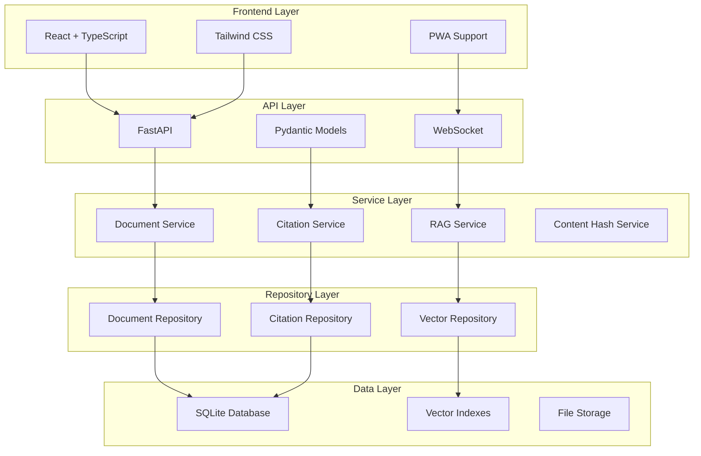

# AI Enhanced PDF Scholar - Complete Documentation Hub

## 📚 Documentation Overview

This document serves as the central hub for all AI Enhanced PDF Scholar documentation. Navigate to specific areas using the sections below.

## 🚀 Quick Start Guide

### Prerequisites
- **Python 3.11+** with pip package manager
- **Node.js 18+** with npm or yarn
- **Git** for version control
- **4GB RAM** minimum, 8GB recommended

### Installation & Setup

```bash
# 1. Clone the repository
git clone <repository-url>
cd ai_enhanced_pdf_scholar

# 2. Backend setup
python -m pip install -r requirements.txt

# 3. Frontend setup
cd frontend
npm install

# 4. Environment configuration
cp .env.example .env
# Edit .env with your API keys

# 5. Database initialization
python -m src.database.migrations

# 6. Start development servers
# Terminal 1 - Backend
uvicorn src.main:app --reload --host 0.0.0.0 --port 8000

# Terminal 2 - Frontend
cd frontend && npm run dev
```

### First Usage
1. Open http://localhost:3000 in your browser
2. Upload your first PDF document
3. Wait for processing and indexing
4. Try the chat interface with document queries
5. Explore citation analysis features

## 📋 Documentation Index

### Core Documentation
- **[PROJECT_DOCS.md](PROJECT_DOCS.md)** - Complete project documentation with architecture diagrams
- **[API_ENDPOINTS.md](API_ENDPOINTS.md)** - Detailed API reference with examples
- **[TECHNICAL_DESIGN.md](TECHNICAL_DESIGN.md)** - Architecture decisions and design patterns
- **[DEVELOPMENT_PLAN.md](DEVELOPMENT_PLAN.md)** - Feature roadmap and development phases

### System Documentation
- **[Database Design](DATABASE_DESIGN.md)** - Schema, models, and migration guide
- **[Citation System Guide](CITATION_SYSTEM.md)** - Academic citation parsing and network analysis
- **[Security Documentation](SECURITY.md)** - Security implementation and best practices
- **[Performance Guide](PERFORMANCE.md)** - Optimization strategies and benchmarks

### Developer Documentation
- **[Setup Guide](SETUP.md)** - Detailed development environment setup
- **[Testing Guide](TESTING.md)** - Testing strategy, execution, and contribution guidelines
- **[Contributing Guidelines](CONTRIBUTING.md)** - Code standards and contribution process
- **[Deployment Guide](DEPLOYMENT.md)** - Production deployment and operations

### User Documentation
- **[User Manual](USER_MANUAL.md)** - Complete feature guide for end users
- **[FAQ](FAQ.md)** - Frequently asked questions and troubleshooting
- **[Changelog](CHANGELOG.md)** - Version history and release notes
- **[Citation Libraries Guide](CITATION_LIBRARIES_GUIDE.md)** - Academic citation parsing features

## 🏗️ Architecture Overview



## 🎯 Key Features

### 📄 Document Management
- **Smart Import**: Automatic PDF processing and metadata extraction
- **Duplicate Detection**: Content-based and file-based deduplication
- **Full-text Search**: Advanced search with filtering capabilities
- **Bulk Operations**: Batch processing and organization tools

### 🧠 AI-Powered Features
- **RAG (Retrieval-Augmented Generation)**: Chat with your documents
- **Intelligent Citations**: Automatic extraction and analysis of academic citations
- **Content Analysis**: Document summarization and key insight extraction
- **Semantic Search**: Vector-based similarity search

### 📊 Citation Analysis ⭐ **New**
- **Multi-format Support**: APA, MLA, Chicago, IEEE citation parsing
- **Confidence Scoring**: Reliability assessment for parsed data
- **Citation Networks**: Document relationship mapping and visualization
- **Academic Statistics**: Publication metrics and analysis

### ⚡ Performance & Reliability
- **Real-time Processing**: WebSocket-based live updates
- **Concurrent Operations**: Thread-safe database operations
- **Caching System**: Intelligent query caching with TTL
- **Error Recovery**: Robust error handling and logging

## 🛠️ Technology Stack

### Backend Technologies
- **FastAPI** - Modern Python web framework
- **SQLite** - Embedded database with WAL mode
- **LlamaIndex** - RAG framework for document processing
- **Google Gemini** - AI model for document analysis
- **Pydantic** - Data validation and serialization

### Frontend Technologies
- **React 18** - User interface framework
- **TypeScript** - Type-safe JavaScript
- **Vite** - Fast build tool and development server
- **Tailwind CSS** - Utility-first CSS framework
- **Zustand** - State management

### Development Tools
- **pytest** - Python testing framework
- **Vitest** - JavaScript testing framework
- **Playwright** - End-to-end testing
- **GitHub Actions** - CI/CD automation
- **Docker** - Containerization

## 🧪 Testing & Quality

### Test Coverage
- **Unit Tests**: 75%+ coverage across all modules
- **Integration Tests**: Database and service layer testing
- **E2E Tests**: Full workflow validation
- **Performance Tests**: Automated benchmarking

### Quality Assurance
- **Code Formatting**: Black (Python), Prettier (JavaScript)
- **Linting**: Ruff (Python), ESLint (JavaScript)
- **Type Checking**: MyPy (Python), TypeScript
- **Security Scanning**: Bandit, Safety, Semgrep, NPM Audit

## 📈 Performance Metrics

### Database Performance
- **Write Operations**: 3,948 ops/second
- **Read Operations**: 10,877 cache hits/second
- **Connection Pool**: 20 concurrent connections
- **Query Optimization**: 12+ specialized indexes

### Frontend Performance
- **Bundle Size**: <300KB main bundle
- **Load Time**: <2 seconds first contentful paint
- **PWA Score**: 95+ Lighthouse performance
- **Code Splitting**: Lazy loading for optimal performance

## 🔐 Security Features

### Security Implementation
- **Input Validation**: Comprehensive Pydantic model validation
- **File Security**: PDF validation and path traversal protection
- **API Security**: CORS configuration and request sanitization
- **Data Protection**: Local-first architecture with secure API handling

### Security Scanning
- **Static Analysis**: Multiple security scanning tools
- **Dependency Scanning**: Automated vulnerability detection
- **Code Quality**: Security-focused code review processes
- **Regular Updates**: Automated dependency updates and security patches

## 🔄 CI/CD Workflows

This repository leverages **GitHub Actions** to automate testing, quality checks and deployments.

- `main-pipeline.yml` – full enterprise pipeline with build, tests, security scanning and deployment phases.
- `pre-commit.yml` – runs pre-commit hooks on every pull request to ensure code style and lint rules are satisfied.

## 🚀 Getting Help

### Support Channels
- **Documentation**: Start with this documentation hub
- **Issues**: GitHub Issues for bug reports and feature requests
- **Development**: See CONTRIBUTING.md for development guidelines
- **Security**: See SECURITY.md for security-related concerns

### Common Tasks
- **Adding Features**: See DEVELOPMENT_PLAN.md for roadmap
- **Running Tests**: See TESTING.md for test execution
- **Deploying**: See DEPLOYMENT.md for production setup
- **API Usage**: See API_ENDPOINTS.md for complete API reference

### Troubleshooting
- **Installation Issues**: Check SETUP.md for detailed setup instructions
- **Performance Issues**: See PERFORMANCE.md for optimization guides
- **Database Issues**: Check DATABASE_DESIGN.md for schema information
- **Frontend Issues**: Check package.json and frontend setup

---

## 📄 License & Contributing

This project is open source and welcomes contributions. Please read CONTRIBUTING.md for guidelines on how to contribute to the project.

For questions, issues, or suggestions, please open an issue on GitHub or refer to the appropriate documentation section above.

---

*Last Updated: 2025-01-21*
*Documentation Version: 2.1.0*