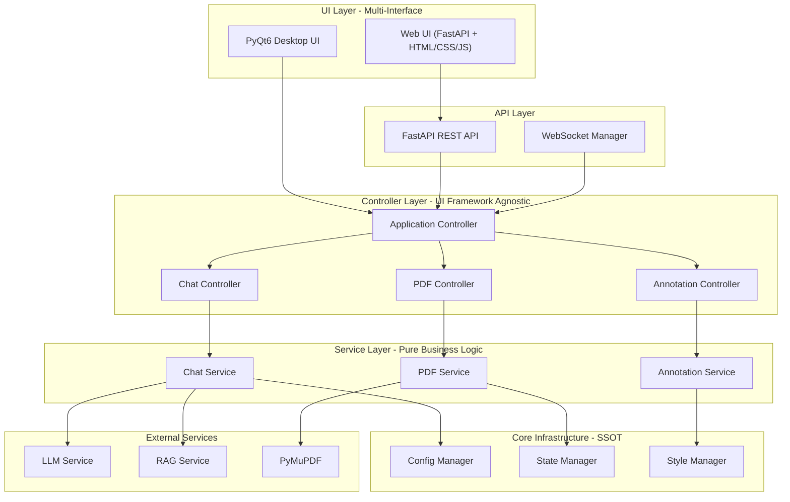
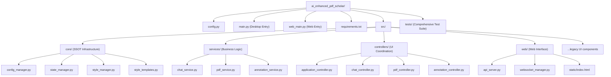
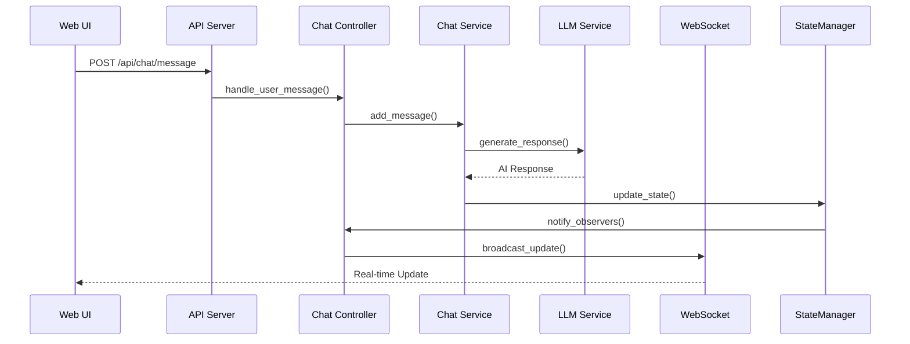
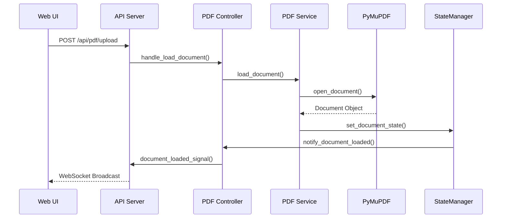

# AI Enhanced PDF Scholar - 项目文档

## 项目概述

AI Enhanced PDF Scholar 是一个AI驱动的PDF分析和注释工具，现在支持**双UI模式**：
- **PyQt6桌面应用** (main.py) - 传统桌面界面
- **Web界面** (web_main.py) - 现代浏览器访问

项目采用激进重构后的**完全解耦架构**，实现了真正的SSOT(Single Source of Truth)原则，业务逻辑与UI框架完全分离，为未来扩展奠定了坚实基础。

## 🏗️ 项目架构 - Web Ready



## 🗂️ 项目结构



## 🧩 核心组件详解

### SSOT基础设施 (src/core/)

#### ConfigManager
- **目的**: 全局配置的单一真实来源
- **特性**: 单例模式、层级配置、点标记路径、Observer模式
- **接口**:
  ```python
  ConfigManager.get_instance().get("chat.panel.title", "默认标题")
  ConfigManager.get_instance().set("app.theme", "dark")
  ConfigManager.get_instance().add_observer(callback)
  ```

#### StateManager  
- **目的**: 应用状态的中央管理
- **特性**: 嵌套路径、状态历史、类型验证、响应式更新
- **接口**:
  ```python
  StateManager.get_instance().set_state("chat.messages", messages)
  StateManager.get_instance().get_state("app.current_document")
  StateManager.get_instance().add_observer("pdf.current_page", callback)
  ```

#### StyleManager
- **目的**: 统一样式管理，支持Web和桌面
- **特性**: 模板编译、变量替换、响应式样式、缓存优化
- **接口**:
  ```python
  StyleManager.get_instance().compile_template("chat_panel", variables)
  StyleManager.get_instance().get_compiled_styles("responsive")
  ```

### 业务服务层 (src/services/)

#### ChatService
- **目的**: 聊天业务逻辑，完全UI框架无关
- **功能**: 消息管理、LLM集成、RAG查询、对话导出
- **数据类**: ChatMessage (纯数据结构，无UI依赖)

#### PDFService
- **目的**: PDF文档管理业务逻辑
- **功能**: 文档加载、导航、缩放、文本选择、元数据提取

#### AnnotationService  
- **目的**: 注释业务逻辑
- **功能**: CRUD操作、搜索分类、导出、统计分析
- **数据类**: AnnotationData (纯数据结构)

### 控制器层 (src/controllers/)

#### ApplicationController
- **目的**: 顶层应用协调器，依赖注入中心
- **职责**: 初始化所有服务、管理Controller生命周期、提供统一接口

#### 专用Controllers (Chat/PDF/Annotation)
- **目的**: UI事件到Service操作的适配器
- **特性**: 异步处理、错误处理、状态同步、信号机制

### Web接口层 (src/web/)

#### APIServer
- **目的**: 将Controller接口暴露为REST API
- **特性**: FastAPI、自动文档、错误处理、CORS支持
- **端点**: 
  - `/api/chat/message` - 发送聊天消息
  - `/api/pdf/upload` - 上传PDF文件
  - `/api/annotations` - 注释管理

#### WebSocketManager  
- **目的**: 实时更新通信
- **特性**: 连接管理、广播消息、自动重连

## 🚀 使用方式

### 桌面版启动
```bash
python main.py
```

### Web版启动
```bash
python web_main.py [--host HOST] [--port PORT] [--debug]
```

**Web版访问**: http://localhost:8000

### 功能特性

1. **PDF文档分析**
   - 拖拽上传PDF文件
   - 文本选择和注释
   - 页面导航和缩放

2. **AI聊天助手**
   - 基于文档内容的智能问答
   - RAG增强的上下文理解
   - 实时响应和错误处理

3. **注释管理**
   - 创建、编辑、删除注释
   - 搜索和分类
   - 导出功能

4. **响应式设计**
   - 桌面自适应布局
   - Web移动端友好
   - 实时UI状态同步

## 📊 数据流与交互

### 聊天消息流程


### PDF加载流程


## 🧪 测试策略

项目遵循**TDD原则**，确保:
- **测试覆盖率 ≥ 80%**
- **17个E2E测试全部通过**
- **所有新功能先写测试**
- **回归测试防止破坏**
- **架构组件独立测试**

### 测试层次

#### 单元测试 (tests/)
- Core组件单元测试 (StateManager, ConfigManager, StyleManager)
- Service层业务逻辑测试 (ChatService, PDFService, AnnotationService)
- Controller集成测试 (ApplicationController, ChatController等)
- UI组件测试 (PyQt6 widgets)
- 响应式设计测试 (ResponsiveCalculator)

#### E2E测试 (tests_e2e/)
- **Web UI基础功能测试** (test_web_ui_basics.py):
  - 主页加载和UI组件显示
  - PDF上传界面功能
  - 聊天输入功能
  - WebSocket连接测试
  - 响应式设计验证
  - 页面导航和错误处理
  - 基础可访问性测试
- **用户工作流测试** (test_user_workflows.py):
  - 完整PDF分析工作流
  - 多轮聊天交互
  - 响应式用户体验
  - 错误恢复工作流
  - 性能和可访问性测试
  - 数据持久化验证
  - 实时通信工作流

#### 技术栈测试工具
- **pytest**: 主测试框架
- **pytest-qt**: PyQt6 GUI测试
- **playwright**: E2E Web UI测试
- **pytest-mock**: Mock和Stub
- **pytest-cov**: 代码覆盖率分析

## 🔧 技术栈

**后端**:
- Python 3.12+
- FastAPI (Web API)
- PyQt6 (桌面UI)
- Uvicorn (ASGI服务器)

**AI/ML**:
- LlamaIndex (RAG)
- Google Gemini (LLM)
- PyMuPDF (PDF处理)

**前端**:
- HTML5/CSS3/JavaScript
- WebSocket (实时通信)
- 响应式设计

**测试**:
- pytest
- pytest-mock
- pytest-qt

## 🌟 架构优势

1. **真正的UI框架无关**: 业务逻辑可以无缝切换到任何UI框架
2. **SSOT原则**: 配置、状态、样式都有唯一真实来源
3. **高内聚低耦合**: 模块边界清晰，依赖关系简单
4. **测试友好**: 每层都可独立测试
5. **Web就绪**: 无需额外重构即可支持Web界面
6. **可扩展性**: 易于添加新UI界面或集成新服务

## 🔮 未来扩展

- **移动端应用**: 利用相同的Service层快速开发
- **API生态**: 第三方集成和插件系统  
- **多租户支持**: Web版的用户管理和权限
- **高级AI功能**: 更多LLM集成和智能分析
- **云端部署**: 容器化和微服务架构

---

**重构完成状态**: ✅ Web UI迁移完成
**架构成熟度**: 生产就绪
**下一步**: 功能增强和性能优化 