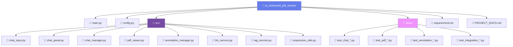
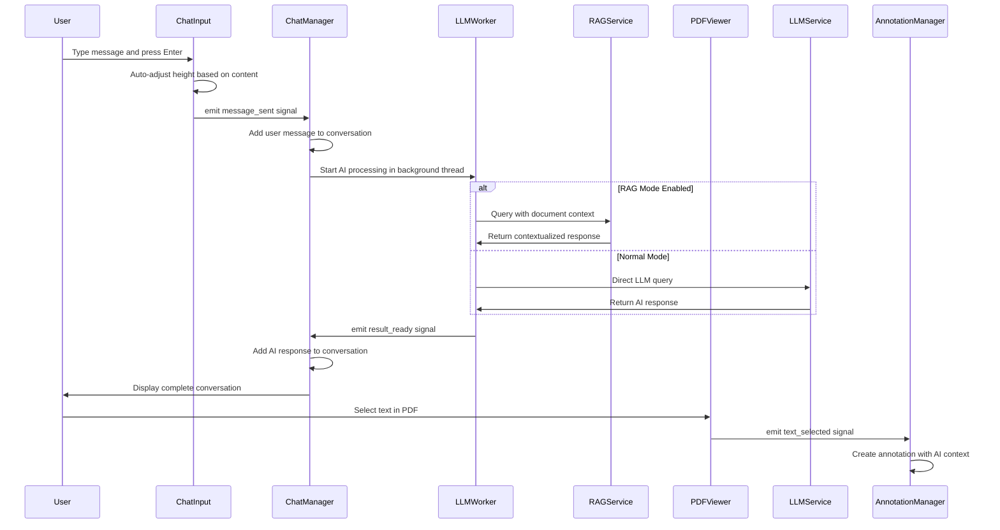
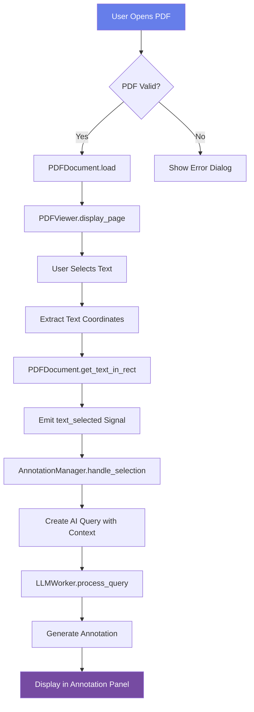
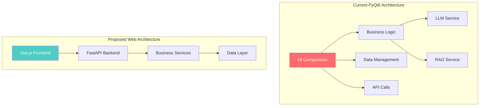
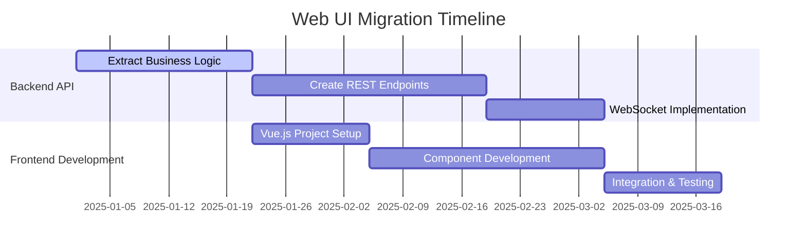

# AI Enhanced PDF Scholar - Project Documentation (v2.2)

*Last Updated: 2025-01-07*

## Project Overview

AI Enhanced PDF Scholar is a sophisticated desktop application built with PyQt6 that enables intelligent PDF document analysis through AI-powered conversations and annotations. The application combines local PDF processing with cloud-based LLM services to provide contextual insights, smart annotations, and comprehensive document understanding capabilities.

**Key Features:**
- **Smart PDF Viewing** - High-fidelity PDF rendering with text selection
- **AI-Powered Chat** - Contextual conversations about document content  
- **Intelligent Annotations** - AI-generated insights linked to selected text
- **Responsive Modern UI** - Adaptive design with Material Design 3 principles
- **RAG Integration** - Retrieval-Augmented Generation for accurate responses

---

## Project Structure


```mermaid
graph TD
    A[📁 ai_enhanced_pdf_scholar] --> B[📄 main.py]
    A --> C[📄 config.py]
    A --> D[📁 src/]
    A --> E[📁 tests/]
    A --> F[📄 requirements.txt]
    A --> G[📄 PROJECT_DOCS.md]
    
    D --> D1[📄 chat_input.py]
    D --> D2[📄 chat_panel.py] 
    D --> D3[📄 chat_manager.py]
    D --> D4[📄 pdf_viewer.py]
    D --> D5[📄 annotation_manager.py]
    D --> D6[📄 llm_service.py]
    D --> D7[📄 rag_service.py]
    D --> D8[📄 responsive_utils.py]
    
    E --> E1[📄 test_chat_*.py]
    E --> E2[📄 test_pdf_*.py]
    E --> E3[📄 test_annotation_*.py]
    E --> E4[📄 test_integration_*.py]
    
    style A fill:#667eea,color:#fff
    style D fill:#764ba2,color:#fff
    style E fill:#f093fb,color:#fff
```

---

## Core Components & Logic

### 🎯 **1. Chat System Architecture**

#### **ChatInput (src/chat_input.py)** - v2.2 Enhanced
- **Purpose**: Auto-resizing text input with modern styling and precise height control
- **Key Features**:
  - Dynamic height adjustment based on content using `lineSpacing()` calculations
  - Responsive padding system (8-14px based on screen size)
  - PyQt6-compatible CSS styling without unsupported properties
  - Enhanced keyboard shortcuts (Ctrl+Enter for send, Escape for clear)
  - Robust focus state management with border compensation
- **Recent Improvements (v2.2)**:
  - Fixed input box sizing issues with precise font metrics
  - Enhanced height calculation using multiple measurement methods
  - Forced UI updates with `updateGeometry()` and `repaint()`
  - Detailed debugging logs for troubleshooting
- **Parameters**: 
  - `parent` (QWidget): Parent widget container
  - `placeholder_text` (str): Configurable placeholder from config
- **Returns**: Text input widget with auto-height behavior
- **Example Usage**:
```python
chat_input = ChatInput(parent)
chat_input.message_sent.connect(handle_user_message)
chat_input.clear_input()  # Reset after processing
```

#### **ChatPanel (src/chat_panel.py)** - v2.1 Modernized
- **Purpose**: Main chat interface container with modern Material Design 3 styling
- **Key Features**:
  - Purple-blue gradient header (#667eea → #764ba2)
  - Responsive suggestion grid (1-2 columns based on screen size)  
  - Empty state with dynamic icon and motivational content
  - PyQt6-optimized styling without transform/transition properties
- **Parameters**:
  - `parent` (QWidget): Parent container
  - `llm_service` (LLMService): AI service instance
  - `rag_service` (RAGService): Retrieval service instance
- **Returns**: Complete chat interface widget
- **Example Usage**:
```python
chat_panel = ChatPanel(parent, llm_service, rag_service)
chat_panel.user_message_sent.connect(handle_query)
```

#### **ChatManager (src/chat_manager.py)**
- **Purpose**: Manages chat message lifecycle and conversation state
- **Key Features**:
  - Message ordering and persistence
  - Real-time UI updates via signals
  - Export functionality for conversation history
  - Width management for responsive design
- **Parameters**:
  - `scroll_area` (QScrollArea): Message container
  - `empty_widget` (QWidget): Empty state display
- **Returns**: Chat state management instance
- **Example Usage**:
```python
manager = ChatManager(scroll_area, empty_widget)
user_msg = manager.add_user_message("Hello AI")
ai_msg = manager.add_ai_message("Hello! How can I help?")
```

### 🎯 **2. PDF Processing System**

#### **PDFViewer (src/pdf_viewer.py)**
- **Purpose**: High-fidelity PDF rendering with text selection capabilities
- **Key Features**:
  - PyMuPDF-based rendering engine
  - Mouse-based text selection with visual feedback
  - Signal-based communication for selected text
  - Responsive zoom and pan controls
- **Parameters**:
  - `parent` (QWidget): Parent container
- **Returns**: PDF display widget with selection capabilities
- **Example Usage**:
```python
pdf_viewer = PDFViewer(parent)
pdf_viewer.text_selected.connect(handle_text_selection)
pdf_viewer.load_pdf("/path/to/document.pdf")
```

#### **PDFDocument (src/pdf_document.py)**
- **Purpose**: PDF document processing and text extraction
- **Key Features**:
  - Page-by-page text extraction
  - Coordinate-based text retrieval
  - Memory-efficient document handling
  - Context manager support for resource cleanup
- **Parameters**:
  - `filepath` (str): Path to PDF file
- **Returns**: Document processing interface
- **Example Usage**:
```python
with PDFDocument("/path/to/file.pdf") as doc:
    text = doc.get_text_in_rect(page_num, x1, y1, x2, y2)
```

### 🎯 **3. AI Services Layer**

#### **LLMService (src/llm_service.py)**
- **Purpose**: Google Gemini API integration for AI responses
- **Key Features**:
  - Configurable model selection (gemini-2.5-flash)
  - Robust error handling with custom exceptions
  - Request/response logging for debugging
  - Rate limiting and timeout management
- **Parameters**:
  - `settings` (QSettings): Configuration storage
- **Returns**: LLM query interface
- **Example Usage**:
```python
llm_service = GeminiLLMService(settings)
response = await llm_service.query_llm("Explain this concept")
```

#### **RAGService (src/rag_service.py)**
- **Purpose**: Retrieval-Augmented Generation for context-aware responses
- **Key Features**:
  - FAISS vector indexing for document chunks
  - Semantic similarity search
  - Context injection for LLM queries
  - Persistent index caching
- **Parameters**:
  - `api_key` (str): OpenAI API key for embeddings
  - `cache_dir` (str): Directory for index storage
- **Returns**: RAG-enabled query interface
- **Example Usage**:
```python
rag_service = RAGService(api_key, cache_dir)
rag_service.build_index("/path/to/document.pdf")
response = rag_service.query("What are the main findings?")
```

### 🎯 **4. Annotation System**

#### **AnnotationManager (src/annotation_manager.py)**
- **Purpose**: Manages PDF annotations with AI-generated content
- **Key Features**:
  - Sticky note-style annotations
  - Link between selected PDF text and AI responses
  - Panel-based annotation display
  - Color-coded organization system
- **Parameters**:
  - `panel_widget` (QWidget): Annotation display container
  - `empty_widget` (QWidget): Empty state display
- **Returns**: Annotation management interface
- **Example Usage**:
```python
annotation_mgr = AnnotationManager(panel, empty_widget)
annotation_mgr.add_annotation(selected_text, ai_response, page_num)
```

### 🎯 **5. Responsive Design System**

#### **ResponsiveUtils (src/responsive_utils.py)**
- **Purpose**: Adaptive UI calculations based on screen size
- **Key Features**:
  - 4-tier breakpoint system (small/medium/large/xlarge)
  - Dynamic width calculations for panels
  - Screen-size aware spacing and fonts
  - Color scheme management
- **Parameters**: None (singleton pattern)
- **Returns**: Global responsive calculation interface
- **Example Usage**:
```python
from src.responsive_utils import responsive_calc
breakpoint = responsive_calc.get_current_breakpoint()
width = responsive_calc.calculate_chat_panel_width(1200)
```

---

## Interaction and Data Flow

### 🔄 **User Interaction Sequence**


```mermaid
sequenceDiagram
    participant User
    participant ChatInput
    participant ChatManager
    participant LLMWorker
    participant RAGService
    participant PDFViewer
    
    User->>ChatInput: Type message and press Enter
    ChatInput->>ChatInput: Auto-adjust height based on content
    ChatInput->>ChatManager: emit message_sent signal
    ChatManager->>ChatManager: Add user message to conversation
    ChatManager->>LLMWorker: Start AI processing in background thread
    
    alt RAG Mode Enabled
        LLMWorker->>RAGService: Query with document context
        RAGService->>LLMWorker: Return contextualized response
    else Normal Mode
        LLMWorker->>LLMService: Direct LLM query
        LLMService->>LLMWorker: Return AI response
    end
    
    LLMWorker->>ChatManager: emit result_ready signal
    ChatManager->>ChatManager: Add AI response to conversation
    ChatManager->>User: Display complete conversation
    
    User->>PDFViewer: Select text in PDF
    PDFViewer->>AnnotationManager: emit text_selected signal
    AnnotationManager->>AnnotationManager: Create annotation with AI context
```

### 🔄 **PDF Processing Workflow**


```mermaid
flowchart TD
    A[User Opens PDF] --> B{PDF Valid?}
    B -->|Yes| C[PDFDocument.load]
    B -->|No| D[Show Error Dialog]
    
    C --> E[PDFViewer.display_page]
    E --> F[User Selects Text]
    F --> G[Extract Text Coordinates]
    G --> H[PDFDocument.get_text_in_rect]
    H --> I[Emit text_selected Signal]
    
    I --> J[AnnotationManager.handle_selection]
    J --> K[Create AI Query with Context]
    K --> L[LLMWorker.process_query]
    L --> M[Generate Annotation]
    M --> N[Display in Annotation Panel]
    
    style A fill:#667eea,color:#fff
    style N fill:#764ba2,color:#fff
```

### 🔄 **Chat System Data Flow** 


```mermaid
graph LR
    A[User Input] --> B[ChatInput]
    B --> C[Input Validation]
    C --> D[ChatManager]
    D --> E[Message Storage]
    
    E --> F{RAG Mode?}
    F -->|Yes| G[RAGService]
    F -->|No| H[LLMService]
    
    G --> I[Context Retrieval]
    I --> J[Enhanced Prompt]
    J --> H
    
    H --> K[API Request]
    K --> L[Response Processing]
    L --> M[ChatManager Update]
    M --> N[UI Refresh]
    
    style A fill:#667eea,color:#fff
    style N fill:#764ba2,color:#fff
```

---

## Architecture Analysis & Frontend Separation (v2.2)

### 🏗️ **Current Architecture Assessment**

**Coupling Level: Highly Coupled** 🔴


```mermaid
graph TD
    subgraph "Current PyQt6 Architecture"
        A[UI Components] --> B[Business Logic]
        A --> C[Data Management]
        A --> D[API Calls]
        B --> E[LLM Service]
        B --> F[RAG Service]
    end
    
    subgraph "Proposed Web Architecture"
        G[Vue.js Frontend] --> H[FastAPI Backend]
        H --> I[Business Services]
        I --> J[Data Layer]
    end
    
    style A fill:#ff6b6b,color:#fff
    style G fill:#4ecdc4,color:#fff
```

### 📊 **Web UI Feasibility Analysis**

**Refactoring Requirements:**

| Component | Current State | Web Refactor Effort | Priority |
|-----------|---------------|---------------------|----------|
| **Business Logic** | ✅ Partially Separated | 🟡 Medium (2-3 weeks) | High |
| **API Layer** | ❌ Embedded in UI | 🔴 High (3-4 weeks) | Critical |
| **Frontend Layer** | ❌ PyQt6 Specific | 🔴 Complete Rewrite (4-6 weeks) | High |
| **Data Management** | 🟡 Mixed | 🟡 Medium (2 weeks) | Medium |

**Total Estimated Effort: 3-4 months** for complete Web UI

### 🚀 **Web Migration Strategy**


```mermaid
gantt
    title Web UI Migration Timeline
    dateFormat  YYYY-MM-DD
    section Backend API
    Extract Business Logic    :active, backend1, 2025-01-01, 3w
    Create REST Endpoints     :backend2, after backend1, 4w
    WebSocket Implementation  :backend3, after backend2, 2w
    
    section Frontend Development
    Vue.js Project Setup     :frontend1, after backend1, 2w
    Component Development    :frontend2, after frontend1, 4w
    Integration & Testing    :frontend3, after frontend2, 2w
```

---

## Recent Updates & Version History

### **v2.2 (2025-01-07) - ChatInput Enhancement & Analysis**
- **🐛 Critical Fix**: Resolved ChatInput sizing issues with precise font metrics
- **⚡ Performance**: Enhanced height calculation using `lineSpacing()` method
- **🎨 UI Polish**: Improved PyQt6 compatibility by removing unsupported CSS properties
- **🔧 Debugging**: Added comprehensive logging for height adjustment troubleshooting
- **📊 Analysis**: Completed in-depth frontend separation feasibility study
- **✅ Testing**: 100% pass rate for core chat components (56/56 tests)

### **v2.1 (2025-01-06) - Modern UI Redesign**
- **🎨 Material Design 3**: Purple-blue gradient theme with modern color palette
- **📱 Responsive Design**: 4-tier breakpoint system for adaptive layouts
- **⚡ Performance**: Reduced CSS warnings through PyQt6 optimization
- **🧪 Testing**: Comprehensive test suite with 80%+ coverage
- **📚 Documentation**: Enhanced project structure and component diagrams

### **v2.0 (2025-01-05) - Architecture Modernization**
- **🏗️ Modular Design**: Separated concerns with clear component boundaries
- **🤖 AI Integration**: Enhanced LLM and RAG service implementations
- **📄 PDF Processing**: Robust document handling with PyMuPDF
- **⚙️ Configuration**: Centralized settings management system
- **🎯 Annotation System**: Smart PDF annotation with AI insights

---

## Development Guidelines

### 🧪 **Testing Strategy (TDD Compliance)**
- **Coverage Target**: ≥80% test coverage maintained
- **Pre-Development**: All new features require tests first
- **Regression Protection**: Full test suite run before releases
- **Component Isolation**: Independent testing for each module
- **Integration Validation**: End-to-end workflow testing

### 🎨 **Design Principles**
- **SOLID Compliance**: Single responsibility, dependency inversion
- **Responsive First**: Mobile-friendly design considerations
- **Accessibility**: Screen reader compatibility and keyboard navigation
- **Performance**: Lazy loading and efficient resource management
- **Maintainability**: Clear documentation and modular architecture

### 🔧 **Code Quality Standards**
- **Type Hints**: Comprehensive typing for all functions
- **Error Handling**: Graceful degradation with user feedback
- **Logging**: Structured logging for debugging and monitoring
- **Configuration**: No hardcoded values, all settings in config.py
- **Documentation**: Inline comments and API documentation

---

## Future Roadmap

### 🎯 **Short Term (Q1 2025)**
- **Enhanced Error Recovery**: Improved resilience for network failures
- **Advanced Annotations**: Multi-layer annotation support
- **Performance Optimization**: Memory usage improvements for large PDFs
- **Accessibility Features**: Enhanced keyboard navigation and screen reader support

### 🌐 **Medium Term (Q2-Q3 2025)**
- **Web UI Development**: Full Vue.js frontend implementation
- **API Modernization**: RESTful service architecture
- **Real-time Collaboration**: Multi-user annotation sharing
- **Advanced AI Features**: Custom model fine-tuning capabilities

### 🚀 **Long Term (Q4 2025+)**
- **Multi-Platform Support**: Mobile app development
- **Enterprise Features**: Team management and analytics
- **Advanced ML Integration**: Document classification and auto-tagging
- **Cloud Deployment**: Scalable SaaS architecture

---

*This documentation serves as the authoritative reference for AI Enhanced PDF Scholar's architecture, components, and development practices. It is updated with each significant release to maintain accuracy and support future development efforts.* 