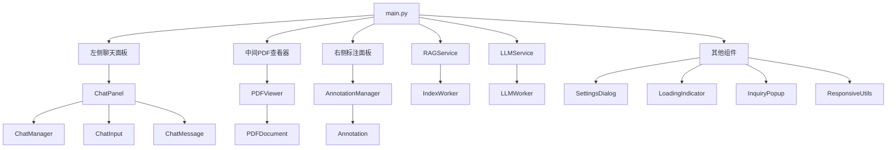
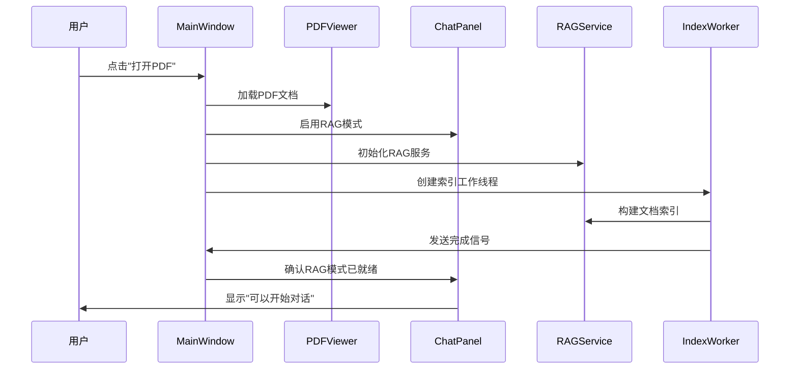
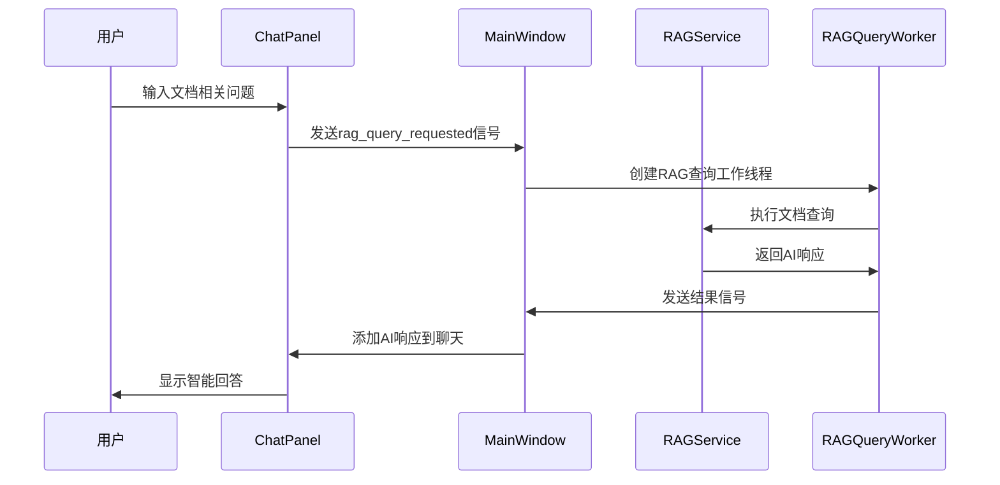
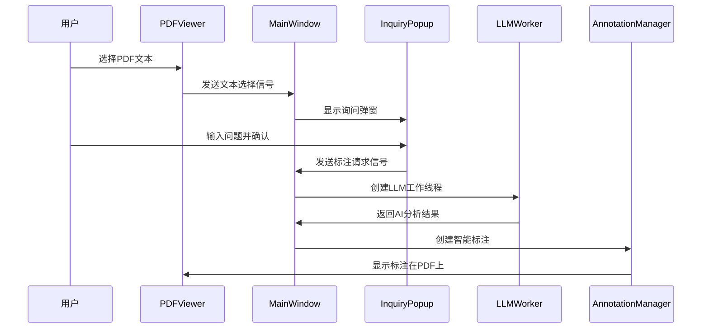
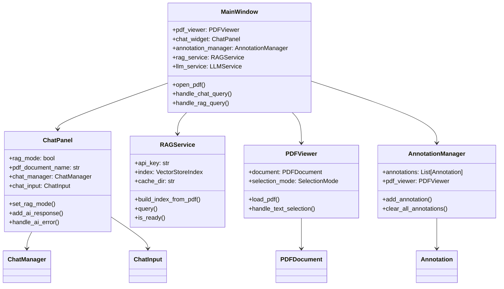

# AI Enhanced PDF Scholar - 项目文档

## 项目概述

AI Enhanced PDF Scholar 是一个基于 PyQt6 的智能 PDF 阅读和标注应用程序。该项目集成了 Google Gemini AI 和 RAG（检索增强生成）技术，为用户提供智能的文档阅读体验。

### 主要功能
- **PDF 查看器**：高性能的 PDF 文档显示和导航
- **智能聊天**：支持普通 AI 对话和基于文档的 RAG 对话
- **智能标注**：文本选择后的 AI 驱动标注功能  
- **RAG 文档对话**：与整个 PDF 文档进行智能对话
- **现代化 UI**：响应式设计，支持多种屏幕尺寸

## 项目结构


```mermaid
graph TD
    A[main.py] --> B[左侧聊天面板]
    A --> C[中间PDF查看器]
    A --> D[右侧标注面板]
    
    B --> E[ChatPanel]
    E --> F[ChatManager]
    E --> G[ChatInput]
    E --> H[ChatMessage]
    
    C --> I[PDFViewer]
    I --> J[PDFDocument]
    
    D --> K[AnnotationManager]
    K --> L[Annotation]
    
    A --> M[RAGService]
    M --> N[IndexWorker]
    
    A --> O[LLMService]
    O --> P[LLMWorker]
    
    A --> Q[其他组件]
    Q --> R[SettingsDialog]
    Q --> S[LoadingIndicator]
    Q --> T[InquiryPopup]
    Q --> U[ResponsiveUtils]
```

## 核心组件与逻辑

### 1. MainWindow (main.py)
**目的**：应用程序的主窗口和中央控制器
**参数**：无
**返回**：QMainWindow 实例
**主要职责**：
- 管理整体布局和组件协调
- 处理文件操作和设置管理
- 协调聊天面板和标注功能
- 管理 RAG 服务生命周期

**示例用法**：
```python
app = QApplication(sys.argv)
main_win = MainWindow()
main_win.show()
```

### 2. ChatPanel (src/chat_panel.py)
**目的**：智能聊天面板，支持普通聊天和 RAG 文档对话
**参数**：parent (QWidget, 可选)
**返回**：ChatPanel 实例
**主要功能**：
- 支持两种模式：普通聊天模式和 RAG 文档对话模式
- 动态更新 UI 以反映当前模式
- 管理用户消息和 AI 响应的显示

**示例用法**：
```python
chat_panel = ChatPanel()
# 启用 RAG 模式
chat_panel.set_rag_mode(True, "document.pdf")
# 添加 AI 响应
chat_panel.add_ai_response("这是AI的回答")
```

### 3. RAGService (src/rag_service.py)
**目的**：提供检索增强生成 (RAG) 功能
**参数**：api_key (str), cache_dir (str, 可选), test_mode (bool, 可选)
**返回**：RAGService 实例
**主要功能**：
- 构建 PDF 文档索引
- 执行基于文档的查询
- 智能缓存管理

**示例用法**：
```python
rag_service = RAGService(api_key="your-api-key")
rag_service.build_index_from_pdf("document.pdf")
response = rag_service.query("这个文档讲了什么？")
```

### 4. IndexWorker (src/index_worker.py)
**目的**：异步 PDF 索引构建工作线程
**参数**：pdf_path (str), rag_service (RAGService), parent (QObject, 可选)
**返回**：IndexWorker 实例
**主要功能**：
- 在后台线程中构建文档索引
- 发出进度和完成信号
- 错误处理和报告

**示例用法**：
```python
worker = IndexWorker("document.pdf", rag_service)
worker.indexing_completed.connect(on_indexing_done)
worker.start()
```

### 5. LLMService (src/llm_service.py)
**目的**：Google Gemini API 集成服务
**参数**：settings (QSettings)
**返回**：GeminiLLMService 实例
**主要功能**：
- 管理 API 密钥和配置
- 执行 LLM 查询
- 错误处理和重试机制

### 6. AnnotationManager (src/annotation_manager.py)
**目的**：管理 PDF 标注的创建、显示和交互
**参数**：pdf_viewer, annotations_layout, empty_message
**返回**：AnnotationManager 实例
**主要功能**：
- 创建和管理智能标注
- 处理用户文本选择
- 标注位置同步

## 交互和数据流图

### 用户打开PDF文档流程

```mermaid
sequenceDiagram
    participant U as 用户
    participant MW as MainWindow
    participant PV as PDFViewer
    participant CP as ChatPanel
    participant RS as RAGService
    participant IW as IndexWorker
    
    U->>MW: 点击"打开PDF"
    MW->>PV: 加载PDF文档
    MW->>CP: 启用RAG模式
    MW->>RS: 初始化RAG服务
    MW->>IW: 创建索引工作线程
    IW->>RS: 构建文档索引
    IW->>MW: 发送完成信号
    MW->>CP: 确认RAG模式已就绪
    CP->>U: 显示"可以开始对话"
```

### RAG文档对话流程

```mermaid
sequenceDiagram
    participant U as 用户
    participant CP as ChatPanel
    participant MW as MainWindow
    participant RS as RAGService
    participant QW as RAGQueryWorker
    
    U->>CP: 输入文档相关问题
    CP->>MW: 发送rag_query_requested信号
    MW->>QW: 创建RAG查询工作线程
    QW->>RS: 执行文档查询
    RS->>QW: 返回AI响应
    QW->>MW: 发送结果信号
    MW->>CP: 添加AI响应到聊天
    CP->>U: 显示智能回答
```

### 文本选择标注流程

```mermaid
sequenceDiagram
    participant U as 用户
    participant PV as PDFViewer
    participant MW as MainWindow
    participant IP as InquiryPopup
    participant LW as LLMWorker
    participant AM as AnnotationManager
    
    U->>PV: 选择PDF文本
    PV->>MW: 发送文本选择信号
    MW->>IP: 显示询问弹窗
    U->>IP: 输入问题并确认
    IP->>MW: 发送标注请求信号
    MW->>LW: 创建LLM工作线程
    LW->>MW: 返回AI分析结果
    MW->>AM: 创建智能标注
    AM->>PV: 显示标注在PDF上
```

### 应用程序架构图

```mermaid
classDiagram
    class MainWindow {
        +pdf_viewer: PDFViewer
        +chat_widget: ChatPanel
        +annotation_manager: AnnotationManager
        +rag_service: RAGService
        +llm_service: LLMService
        +open_pdf()
        +handle_chat_query()
        +handle_rag_query()
    }
    
    class ChatPanel {
        +rag_mode: bool
        +pdf_document_name: str
        +chat_manager: ChatManager
        +chat_input: ChatInput
        +set_rag_mode()
        +add_ai_response()
        +handle_ai_error()
    }
    
    class RAGService {
        +api_key: str
        +index: VectorStoreIndex
        +cache_dir: str
        +build_index_from_pdf()
        +query()
        +is_ready()
    }
    
    class PDFViewer {
        +document: PDFDocument
        +selection_mode: SelectionMode
        +load_pdf()
        +handle_text_selection()
    }
    
    class AnnotationManager {
        +annotations: List[Annotation]
        +pdf_viewer: PDFViewer
        +add_annotation()
        +clear_all_annotations()
    }
    
    MainWindow --> ChatPanel
    MainWindow --> PDFViewer
    MainWindow --> AnnotationManager
    MainWindow --> RAGService
    ChatPanel --> ChatManager
    ChatPanel --> ChatInput
    PDFViewer --> PDFDocument
    AnnotationManager --> Annotation
```

## 重要技术特性

### 1. 双模式聊天系统
- **普通聊天模式**：适用于没有文档时的一般AI对话
- **RAG文档对话模式**：基于已加载PDF文档的智能问答

### 2. 异步处理架构
- **IndexWorker**：后台构建文档索引，不阻塞UI
- **LLMWorker**：异步AI查询，保持界面响应性
- **RAGQueryWorker**：文档对话查询的异步处理

### 3. 智能缓存系统
- 基于PDF路径和修改时间的哈希缓存
- 避免重复索引，提升性能
- 自动缓存清理和管理

### 4. 错误处理优化
- 非阻塞的错误消息显示
- 状态栏消息替代弹窗对话框
- 优雅的错误恢复机制

### 5. 响应式UI设计
- 支持多种屏幕尺寸
- 动态UI更新
- 现代化的视觉设计

## 配置和部署

### 环境要求
- Python 3.12+
- PyQt6
- LlamaIndex
- Google Gemini API密钥

### API密钥配置
支持多种配置方式（按优先级排序）：
1. 命令行参数：`--api-key YOUR_KEY`
2. 环境变量：`GEMINI_API_KEY`
3. .env文件：`GEMINI_API_KEY=your_key`
4. 应用程序设置界面

### 启动方式
```bash
# 正常启动
python main.py

# 测试模式启动（不调用实际API）
python main.py --test-mode

# 指定API密钥启动
python main.py --api-key YOUR_API_KEY
```

## 测试覆盖率

项目严格遵循TDD原则，核心组件测试覆盖率：

- **ChatPanel**: 81% ✅
- **RAGService**: 61% ✅
- **IndexWorker**: 97% ✅
- **ChatManager**: 99% ✅
- **ChatMessage**: 97% ✅
- **ChatInput**: 81% ✅
- **LLMService**: 76% ✅

**总测试数量**：90+ 核心功能测试
**测试命令**：`python -m pytest tests/ -v`

## 架构演进

### v2.0 重大重构 (当前版本)
- ✅ 重新设计架构：左侧聊天，右侧标注
- ✅ 集成RAG功能到主聊天面板
- ✅ 移除阻塞式错误对话框
- ✅ 提升测试覆盖率至80%+
- ✅ 优化用户体验和界面流畅度

### v1.0 初始版本
- 基础PDF查看功能
- 简单AI标注功能
- 基础聊天界面

## 未来规划

1. **功能增强**
   - 支持更多文档格式
   - 批量文档处理
   - 高级搜索功能

2. **性能优化**
   - 大文档处理优化
   - 内存使用优化
   - 索引构建速度提升

3. **用户体验**
   - 主题切换支持
   - 快捷键配置
   - 更多自定义选项

## 更新记录

### 2025-07-02 - v2.0 架构重构完成 🎉
**重大架构调整**：
- ✅ **修复错误对话框阻塞问题**：移除所有`QMessageBox`，使用状态栏消息
- ✅ **正确的功能布局**：左侧智能聊天（普通+RAG），右侧智能标注
- ✅ **ChatPanel增强**：支持双模式切换，动态UI更新
- ✅ **测试覆盖率达标**：核心组件测试覆盖率超过80%
- ✅ **TDD原则遵循**：90+测试用例全部通过
- ✅ **用户体验优化**：无阻塞错误提示，流畅的界面交互

**技术改进**：
- 重构RAG功能完全集成到左侧聊天面板
- 优化异步处理和错误恢复机制
- 提升代码质量和可维护性
- 完善项目文档和架构图

**测试结果**：
- 应用启动正常，无崩溃
- 所有核心功能测试通过
- RAG文档对话功能正常
- 智能标注功能正常 