# AI Enhanced PDF Scholar - Project Documentation

## Project Overview

AI Enhanced PDF Scholar is a modern intelligent document management and RAG-enhanced platform designed for academic literature management. The project uses a complete Web UI architecture, providing modern browser interface and RESTful APIs, with all PyQt desktop components completely removed.

The project strictly follows SOLID principles and modern software engineering best practices, implementing high cohesion, low coupling clean architecture, providing a production-grade solution for intelligent document analysis and management.

## Project Structure

```mermaid
graph TD
    A[Project Root] --> B[src/]
    A --> C[backend/]
    A --> D[frontend/]
    A --> E[tests/]
    A --> F[Config Files]

    B --> B1[controllers/]
    B --> B2[services/]
    B --> B3[repositories/]
    B --> B4[database/]
    B --> B5[interfaces/]
    B --> B6[core/]

    B1 --> B11[library_controller.py]

    B2 --> B21[document_library_service.py]
    B2 --> B22[enhanced_rag_service.py]
    B2 --> B23[content_hash_service.py]
    B2 --> B24[rag_cache_service.py]
    B2 --> B25[vector_index_manager.py]

    B3 --> B31[base_repository.py]
    B3 --> B32[document_repository.py]
    B3 --> B33[vector_repository.py]

    B4 --> B41[connection.py]
    B4 --> B42[models.py]
    B4 --> B43[migrations.py]

    B5 --> B51[repository_interfaces.py]
    B5 --> B52[service_interfaces.py]

    B6 --> B61[state_manager.py]

    C --> C1[api/]
    C1 --> C11[main.py]
    C1 --> C12[dependencies.py]
    C1 --> C13[models.py]
    C1 --> C14[websocket_manager.py]
    C1 --> C15[routes/]

    C15 --> C151[documents.py]
    C15 --> C152[library.py]
    C15 --> C153[rag.py]
    C15 --> C154[system.py]

    D --> D1[src/]
    D --> D2[package.json]
    D --> D3[vite.config.ts]

    D1 --> D11[components/]
    D1 --> D12[contexts/]
    D1 --> D13[lib/]

    E --> E1[conftest.py]
    E --> E2[test_database_models.py]
    E --> E3[test_database_connection.py]
    E --> E4[test_database_connection_optimized.py]
    E --> E5[test_content_hash_service.py]
    E --> E6[scripts/benchmark_tests.py]

    F --> F1[web_main.py]
    F --> F2[config.py]
    F --> F3[requirements.txt]
```



## Testing Strategy & Quality Assurance

### Test Coverage

The project implements comprehensive test coverage:

| Component | Test Coverage | Status |
|-----------|---------------|--------|
| **BaseRepository** | Basic functionality | ✅ Tested |
| **DocumentRepository** | Core CRUD | ✅ Tested |
| **VectorIndexRepository** | Index management | ✅ Tested |
| **EnhancedRAGService** | RAG functionality | ✅ Tested |
| **Database Layer** | Connection management | ✅ Optimized |

### Testing Architecture Features

#### 🏗️ **High-Performance Testing Infrastructure**
- **pytest framework** with optimized plugin ecosystem (pytest-xdist, pytest-benchmark)
- **Shared database connections** reducing 90% database setup overhead
- **Intelligent parallel execution** automatic CPU scaling (`-n auto`) achieving significant speedup
- **Optimized fixture management** session-level sharing and intelligent cleanup strategies
- **Strategic Mock usage** intelligent simulation of external dependencies
- **Performance monitoring** automatic detection of slow tests (>1s) and performance benchmarks
- **Optimized CI/CD configuration** complete test suite within 15 minutes

#### 🔍 **Test Coverage Types**

**Unit Testing**
```python
# Example: Repository pattern validation
def test_document_crud_operations():
    doc = DocumentModel(title="Test", file_path="/test.pdf", file_hash="hash123")
    created = repository.create(doc)
    assert created.id is not None
    assert created.title == "Test"
```

**Integration Testing**
```python
# Example: Database integration validation
def test_database_transaction_integrity():
    with db.get_connection() as conn:
        # Transaction safety validation
        conn.execute("INSERT INTO documents ...")
        # Verify ACID properties
```

**End-to-End Testing**
```python
# Example: Complete workflow validation
def test_document_to_rag_workflow():
    # Document import -> Index building -> RAG query -> Cache validation
    doc = library_service.import_document("test.pdf")
    index = rag_service.build_index_from_document(doc)
    response = rag_service.query_document("query", doc.id)
    assert response is not None
```

#### 📊 **Test Quality Metrics**

**Test Coverage Goals**
- **Basic functionality**: Core business logic covered
- **Error handling**: Exception scenario testing
- **Integration testing**: Component interaction validation
- **Performance testing**: Basic performance benchmarks

**Error Handling Validation**
- **Exception scenarios**: Comprehensive error simulation and recovery testing
- **Boundary conditions**: Extreme values and edge case validation
- **Concurrency safety**: Multi-threaded access and race condition testing
- **Resource management**: Memory leak and connection pool validation

### Performance Benchmarking

#### 🚀 **Performance Testing Suite**

The project includes a **comprehensive performance analysis framework** to validate system performance in production environments:

**Basic Performance Validation**
```
✅ Database Operations
   ├── Basic CRUD operations normal
   ├── Transaction processing stable
   ├── Concurrent access safe
   └── Connection management optimized

✅ Test Execution Performance
   ├── Unit tests: Fast execution
   ├── Integration tests: Reasonable time
   ├── Parallel execution: Supports acceleration
   └── CI pipeline: Optimized configuration
```

### Continuous Integration Configuration

#### 🔧 **High-Performance pytest Configuration (pytest.ini)**
```ini
[pytest]
testpaths = tests
addopts =
    -v --tb=short --strict-markers
    --cov=src --cov-report=html:coverage_html
    --cov-report=term-missing --cov-report=xml:coverage.xml
    --cov-fail-under=50
    -n auto --dist=loadfile --maxfail=10

markers =
    unit: Unit tests - isolated component testing
    integration: Integration tests - component interaction testing
    e2e: End-to-end tests - complete workflow testing
    database: Database tests - requires database setup
    services: Service layer tests
    repositories: Repository layer tests
    performance: Performance benchmark tests

# Performance optimization configuration
timeout = 60  # 1 minute timeout (optimized)
timeout_method = thread
```

#### ⚡ **Test Performance Optimization**

**Test Performance Improvements**
```
✅ Optimization Results
   ├── Test execution time: Significantly reduced
   ├── Database setup: Reduced repetitive creation
   ├── Parallel execution: Multi-core utilization support
   ├── CI pipeline: Shortened execution time
   └── Overall goal: Reasonable test time
```

**Performance Optimization Techniques**
- **Shared fixtures**: `tests/conftest.py` provides session-level database connections
- **Parallel distribution**: `--dist=loadfile` distributes test load by file
- **Intelligent cleanup**: Table-level cleanup instead of complete database recreation
- **Performance monitoring**: Automatic tracking and reporting of slow tests
- **Benchmark testing**: `scripts/benchmark_tests.py` performance validation script

## Core Components & Logic

### 1. LibraryController
- **Purpose**: Document library Web API controller, providing service interfaces for frontend
- **Parameters**: `db_connection: DatabaseConnection, enhanced_rag_service: EnhancedRAGService`
- **Returns**: JSON responses and WebSocket messages
- **Example usage**:
```python
# Web API mode (only supported mode)
controller = LibraryController(
    db_connection=db,
    enhanced_rag_service=rag
)
documents = controller.get_all_documents()
response = controller.query_document(doc_id, "query")
```

### 2. DocumentLibraryService
- **Purpose**: Document library core business logic, handling document CRUD and business rules
- **Parameters**: `db_connection: DatabaseConnection`
- **Returns**: DocumentModel objects and operation results
- **Example usage**:
```python
library_service = DocumentLibraryService(db_connection)
document = library_service.import_document("path/to/file.pdf")
```

---

**Last Updated**: 2025-01-15
**Documentation Version**: v2.1.0
**Project Phase**: Performance Optimization Complete