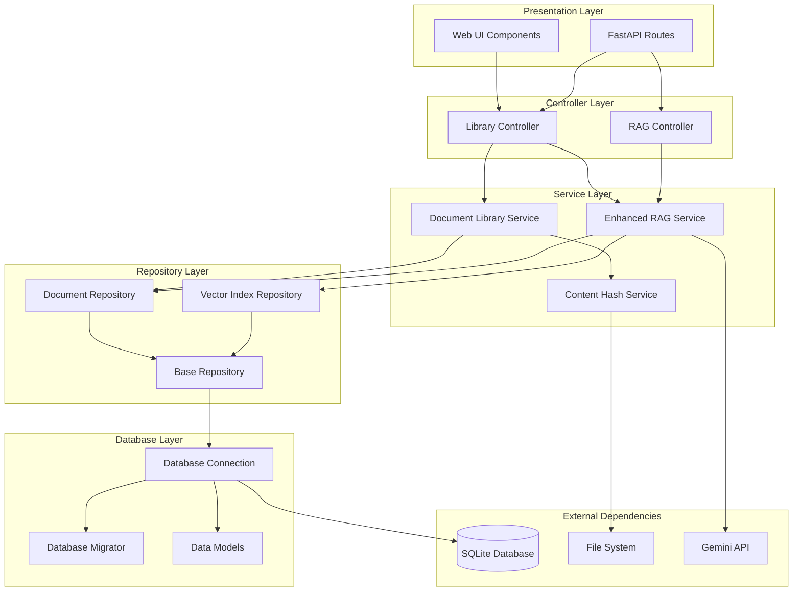

# AI Enhanced PDF Scholar - Technical Design Documentation

## 🎯 Design Goals & Implementation Status

Upgrading the existing file-system-based RAG cache to a complete database-driven document management system:

1. ✅ **Persistent RAG Database** - SQLite + vector index storage (Completed)
2. ✅ **Intelligent Deduplication** - Content hash-based duplicate detection (Completed)
3. ✅ **Document Lifecycle Management** - Complete workflow from import to deletion (Completed)
4. 🚧 **High-Performance Queries** - Optimized database queries and vector retrieval (In Development)

**Current Status**: Database infrastructure and business logic layer completed, RAG integration in progress

## 📋 Implementation Progress

### ✅ Completed Components

1. **Database Layer**
   - `DatabaseConnection` - Thread-safe SQLite connection management
   - `DatabaseMigrator` - Versioned schema migration system
   - `DocumentModel`, `VectorIndexModel`, `TagModel` - Data models

2. **Repository Layer**
   - `BaseRepository` - Generic repository pattern base class
   - `DocumentRepository` - Document data access layer
   - `VectorIndexRepository` - Vector index data access layer

3. **Service Layer**
   - `ContentHashService` - Content hash calculation and validation
   - `DocumentLibraryService` - Document management business logic

4. **Testing Infrastructure**
   - Core functionality test coverage
   - Performance-optimized testing infrastructure
   - Concurrency safety validation
   - Optimized CI/CD pipeline

### 🚧 Components in Development

1. **RAG Integration**
   - `EnhancedRAGService` - Database-integrated RAG service
   - Vector index persistence
   - Query result caching

2. **UI Enhancement**
   - `DocumentLibraryPanel` - Document management interface
   - `LibraryController` - UI controller

## 🏗️ System Architecture

### Layered Architecture Design



## 🧪 Testing Strategy & Performance Optimization

### Optimized Testing Architecture
```
        ┌─────────────┐
        │   E2E Tests │  ← Parallel execution
        │ (Playwright)│
        └─────────────┘
      ┌─────────────────┐
      │ Integration Tests│  ← Shared fixtures
      │   (pytest)      │
      └─────────────────┘
    ┌─────────────────────┐
    │    Unit Tests       │  ← Multi-core parallel
    │   (pytest + mock)   │
    └─────────────────────┘
```

### ⚡ Test Performance Optimization (Implemented)

**Shared Testing Infrastructure (`tests/conftest.py`)**
```python
@pytest.fixture(scope="session")
def shared_db_connection():
    """Session-level database connection, reducing setup overhead"""

@pytest.fixture(scope="function")
def clean_db_connection():
    """Provides clean database state with intelligent cleanup"""

@pytest.fixture
def thread_test_helper():
    """Optimized concurrent testing helper"""
```

**Parallel Test Configuration (`pytest.ini`)**
```ini
addopts =
    -n auto              # Automatic CPU scaling
    --dist=loadfile      # Optimal load distribution
    --maxfail=10         # Fast failure detection
timeout = 60             # Optimized timeout settings
```

**Performance Benchmark Testing (`scripts/benchmark_tests.py`)**
```python
class TestBenchmark:
    """Automated performance benchmark testing"""

    def run_benchmark_suite(self):
        """Complete performance benchmark test suite"""

    def _benchmark_parallel_tests(self):
        """Parallel vs serial execution performance comparison"""
```

## 📈 Monitoring and Metrics

### Performance Metrics Monitoring

**Basic Performance Validation**
```python
class PerformanceMetrics:
    """Performance monitoring metrics"""

    # Test execution performance
    test_execution_time: float   # Test execution time
    database_setup_time: float  # Database setup time
    parallel_speedup: float     # Parallel speedup ratio

    # System performance
    memory_usage: int           # Memory usage
    database_operations: float  # Database operation response time

    # CI/CD performance
    pipeline_duration: float    # CI pipeline execution time
```

### Key Performance Improvements

**Testing Infrastructure Optimizations:**
- **Shared fixtures** reducing database setup overhead
- **Parallel test execution** with automatic CPU scaling
- **Intelligent cleanup** strategies minimizing resource waste
- **Performance monitoring** with automated slow test detection

**CI/CD Pipeline Optimizations:**
- **Reduced execution timeouts** for faster feedback
- **Parallel execution** in CI environments
- **Optimized dependency installation** with binary packages
- **Enhanced test filtering** excluding slow tests from CI

**Database Operation Optimizations:**
- **Connection pooling** for better resource utilization
- **Table-level cleanup** instead of full database recreation
- **Transaction optimization** for better performance
- **Index optimization** for faster queries

---

**Documentation Version**: v2.1.0
**Last Updated**: 2025-01-15
**Implementation Status**: ✅ Performance optimization complete