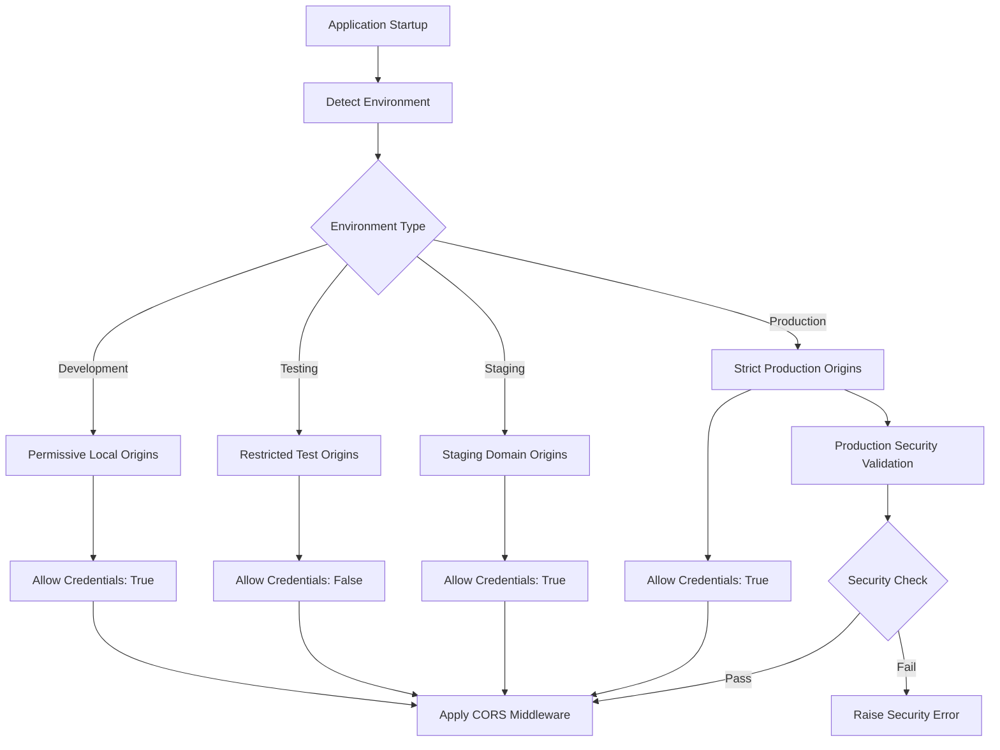
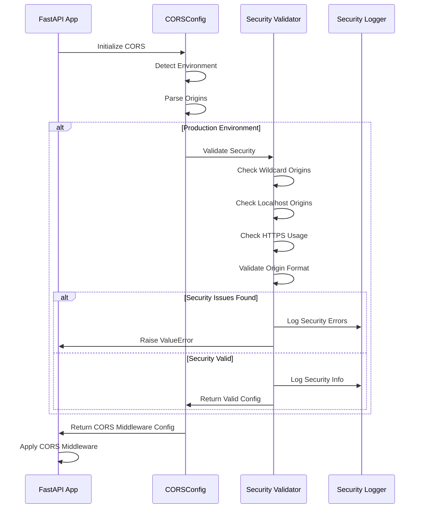

# CORS Security Configuration Guide

## Overview

Cross-Origin Resource Sharing (CORS) security has been completely redesigned to eliminate the critical security vulnerability caused by wildcard (`*`) origins. This guide covers the new secure CORS implementation, configuration options, and best practices.

## 🚨 Security Issue Fixed

**Previous Vulnerable Configuration:**
```python
# ❌ DANGEROUS - Allows any origin to access the API
app.add_middleware(
    CORSMiddleware,
    allow_origins=["*"],  # Critical security vulnerability
    allow_credentials=True,
    allow_methods=["*"],
    allow_headers=["*"],
)
```

**New Secure Configuration:**
```python
# ✅ SECURE - Environment-specific, validated origins
cors_config = get_cors_config()
app.add_middleware(CORSMiddleware, **cors_config.get_middleware_config())
```

## Architecture

### Environment-Based Configuration

The new CORS system uses environment-specific configurations with different security levels:



### Security Validation Flow



## Environment Configurations

### Development Environment

**Purpose:** Local development with frontend dev servers
**Security Level:** Permissive for development efficiency

```yaml
Environment: development
Default Origins:
  - http://localhost:3000
  - http://localhost:8000
  - http://127.0.0.1:3000
  - http://127.0.0.1:8000
Allow Credentials: true
Allow Methods: [GET, POST, PUT, DELETE, OPTIONS, HEAD, PATCH]
Max Age: 86400 seconds (24 hours)
```

**Configuration:**
```bash
# .env
ENVIRONMENT=development
CORS_ORIGINS=http://localhost:3000,http://localhost:8000
```

### Testing Environment

**Purpose:** Automated testing and CI/CD
**Security Level:** Restrictive for test isolation

```yaml
Environment: testing
Default Origins:
  - http://localhost:3000
  - http://127.0.0.1:3000
Allow Credentials: false  # More restrictive
Allow Methods: [GET, POST, PUT, DELETE, OPTIONS]  # Limited methods
Max Age: 3600 seconds (1 hour)
```

**Configuration:**
```bash
# .env.test
ENVIRONMENT=testing
CORS_ORIGINS=http://localhost:3000,http://127.0.0.1:3000
```

### Staging Environment

**Purpose:** Pre-production testing with production-like security
**Security Level:** Production-equivalent with staging domains

```yaml
Environment: staging
Default Origins: [] # Must be explicitly configured
Allow Credentials: true
Allow Methods: [GET, POST, PUT, DELETE, OPTIONS]
Max Age: 3600 seconds (1 hour)
```

**Configuration:**
```bash
# .env.staging
ENVIRONMENT=staging
CORS_ORIGINS=https://staging-frontend.yourdomain.com,https://staging-admin.yourdomain.com
```

### Production Environment

**Purpose:** Live production system
**Security Level:** Maximum security with strict validation

```yaml
Environment: production
Default Origins: [] # MUST be explicitly configured
Allow Credentials: true
Allow Methods: [GET, POST, PUT, DELETE, OPTIONS]  # Minimal necessary
Max Age: 3600 seconds (1 hour)
Security Validation: Strict
```

**Configuration:**
```bash
# .env.production
ENVIRONMENT=production
CORS_ORIGINS=https://app.yourdomain.com,https://admin.yourdomain.com
```

## Production Security Validation

The system performs comprehensive security validation in production:

### 1. Wildcard Origin Prevention
```python
# ❌ These will FAIL in production:
CORS_ORIGINS=*
CORS_ORIGINS=https://app.com,*,https://admin.com
```

### 2. Localhost Origin Prevention
```python
# ❌ These will FAIL in production:
CORS_ORIGINS=https://app.com,http://localhost:3000
CORS_ORIGINS=https://app.com,http://127.0.0.1:8000
```

### 3. HTTPS Enforcement
```python
# ❌ This will FAIL in production:
CORS_ORIGINS=http://app.yourdomain.com  # Should be https://

# ✅ This is correct:
CORS_ORIGINS=https://app.yourdomain.com
```

### 4. Origin Format Validation
```python
# ❌ These will be filtered out:
CORS_ORIGINS=app.com                    # Missing protocol
CORS_ORIGINS=https://app.com/           # Trailing slash
CORS_ORIGINS=ftp://app.com             # Wrong protocol

# ✅ These are correct:
CORS_ORIGINS=https://app.com
CORS_ORIGINS=https://subdomain.app.com
```

## Configuration Examples

### Single Page Application (SPA)
```bash
# Production SPA
ENVIRONMENT=production
CORS_ORIGINS=https://app.yourdomain.com

# Development SPA
ENVIRONMENT=development
CORS_ORIGINS=http://localhost:3000
```

### Multiple Frontend Applications
```bash
# Production with multiple frontends
ENVIRONMENT=production
CORS_ORIGINS=https://app.yourdomain.com,https://admin.yourdomain.com,https://mobile.yourdomain.com

# Development with multiple frontends
ENVIRONMENT=development
CORS_ORIGINS=http://localhost:3000,http://localhost:3001,http://localhost:8080
```

### Microservices Architecture
```bash
# Production microservices
ENVIRONMENT=production
CORS_ORIGINS=https://gateway.yourdomain.com,https://dashboard.yourdomain.com

# Staging microservices
ENVIRONMENT=staging
CORS_ORIGINS=https://staging-gateway.yourdomain.com,https://staging-dashboard.yourdomain.com
```

### Development with Docker
```bash
# Docker Compose development
ENVIRONMENT=development
CORS_ORIGINS=http://localhost:3000,http://host.docker.internal:3000,http://192.168.1.100:3000
```

## Security Best Practices

### 1. Environment Isolation
- **Never** use production origins in development
- **Never** use wildcard origins in any environment
- **Never** use HTTP origins in production
- **Always** use environment-specific configurations

### 2. Origin Validation
- Use exact origin matching (case-sensitive)
- Include port numbers when necessary
- Avoid subdomain wildcards
- Validate origin format during configuration

### 3. Credential Handling
```python
# Production and Development: Credentials allowed
allow_credentials = True

# Testing: Credentials disabled for security
allow_credentials = False
```

### 4. Method Restrictions
```python
# Development: Broad method support
allow_methods = ["GET", "POST", "PUT", "DELETE", "OPTIONS", "HEAD", "PATCH"]

# Production: Minimal necessary methods
allow_methods = ["GET", "POST", "PUT", "DELETE", "OPTIONS"]
```

### 5. Header Security
```python
# Only allow necessary headers
allow_headers = [
    "Accept",
    "Content-Type",
    "Authorization",
    "X-Requested-With",
    "X-CSRF-Token",
]

# Expose minimal headers
expose_headers = ["X-Request-ID"]
```

## Deployment Configuration

### Docker Deployment
```dockerfile
# Dockerfile
ENV ENVIRONMENT=production
ENV CORS_ORIGINS=https://app.yourdomain.com
```

### Kubernetes Deployment
```yaml
# k8s-deployment.yaml
apiVersion: v1
kind: ConfigMap
metadata:
  name: app-config
data:
  ENVIRONMENT: "production"
  CORS_ORIGINS: "https://app.yourdomain.com,https://admin.yourdomain.com"
```

### Docker Compose
```yaml
# docker-compose.yml
version: '3.8'
services:
  api:
    environment:
      - ENVIRONMENT=production
      - CORS_ORIGINS=https://app.yourdomain.com
```

### Cloud Platform Deployment

#### Heroku
```bash
# Set config vars
heroku config:set ENVIRONMENT=production
heroku config:set CORS_ORIGINS=https://yourdomain.com
```

#### AWS ECS
```json
{
  "environment": [
    {"name": "ENVIRONMENT", "value": "production"},
    {"name": "CORS_ORIGINS", "value": "https://app.yourdomain.com"}
  ]
}
```

#### Google Cloud Run
```yaml
apiVersion: serving.knative.dev/v1
kind: Service
spec:
  template:
    spec:
      containers:
      - env:
        - name: ENVIRONMENT
          value: "production"
        - name: CORS_ORIGINS
          value: "https://app.yourdomain.com"
```

## Monitoring and Logging

### Security Information Logging

The system logs comprehensive CORS security information:

```
=== CORS Security Configuration ===
Environment: production
Allowed Origins: 2 configured
Allowed Methods: GET, POST, PUT, DELETE, OPTIONS
Allow Credentials: True
Max Age: 3600 seconds
  (Origins not logged in non-development environments)
===================================
```

### Development Logging
```
=== CORS Security Configuration ===
Environment: development
Allowed Origins: 2 configured
Allowed Methods: GET, POST, PUT, DELETE, OPTIONS, HEAD, PATCH
Allow Credentials: True
Max Age: 86400 seconds
  Origin 1: http://localhost:3000
  Origin 2: http://localhost:8000
===================================
```

### Error Logging
```
ERROR - CORS security validation failed:
- Wildcard (*) origins are not allowed in production
- Origin 'http://localhost:3000' should not be used in production
- Origin 'http://app.example.com' should use HTTPS in production
```

## Testing CORS Security

### Manual Testing

#### Test Allowed Origins
```bash
# Should succeed
curl -H "Origin: https://app.yourdomain.com" \
     -H "Access-Control-Request-Method: GET" \
     -X OPTIONS http://your-api.com/api/system/health

# Should be blocked
curl -H "Origin: https://malicious.com" \
     -H "Access-Control-Request-Method: GET" \
     -X OPTIONS http://your-api.com/api/system/health
```

#### Browser Console Testing
```javascript
// Test from browser console
fetch('https://your-api.com/api/system/health', {
  method: 'GET',
  headers: {
    'Origin': 'https://your-frontend.com'
  }
})
.then(response => console.log('CORS headers:', response.headers))
.catch(error => console.error('CORS blocked:', error));
```

### Automated Testing

The system includes comprehensive test suites:

1. **Unit Tests** (`test_cors_security.py`):
   - Configuration validation
   - Environment-specific settings
   - Security validation rules

2. **Integration Tests** (`test_cors_api_integration.py`):
   - Real API endpoint testing
   - CORS header verification
   - Security vulnerability testing

#### Running Tests
```bash
# Run CORS security tests
pytest tests/security/test_cors_security.py -v

# Run CORS API integration tests
pytest tests/security/test_cors_api_integration.py -v

# Run all security tests
pytest tests/security/ -v
```

## Troubleshooting

### Common Issues

#### 1. CORS Origins Not Working
```bash
# Check environment variable
echo $CORS_ORIGINS

# Check for spaces or formatting issues
CORS_ORIGINS=https://app.com,https://admin.com  # ✅ Correct
CORS_ORIGINS=https://app.com, https://admin.com # ❌ Extra spaces
```

#### 2. Production Validation Errors
```
ValueError: CORS security validation failed:
- Wildcard (*) origins are not allowed in production
```

**Solution:** Remove wildcard and specify exact origins:
```bash
# ❌ Wrong
CORS_ORIGINS=*

# ✅ Correct
CORS_ORIGINS=https://app.yourdomain.com
```

#### 3. Localhost in Production
```
ValueError: CORS security validation failed:
- Localhost origin 'http://localhost:3000' should not be used in production
```

**Solution:** Use production domain:
```bash
# ❌ Wrong
CORS_ORIGINS=https://app.com,http://localhost:3000

# ✅ Correct
CORS_ORIGINS=https://app.com
```

#### 4. HTTP in Production
```
ValueError: CORS security validation failed:
- Origin 'http://app.com' should use HTTPS in production
```

**Solution:** Use HTTPS:
```bash
# ❌ Wrong
CORS_ORIGINS=http://app.yourdomain.com

# ✅ Correct
CORS_ORIGINS=https://app.yourdomain.com
```

### Debug Steps

#### 1. Check Environment Detection
```python
from backend.api.cors_config import get_cors_config
config = get_cors_config()
print(f"Detected environment: {config.environment}")
```

#### 2. Validate Configuration
```python
config = get_cors_config()
config.log_security_info()  # Logs detailed configuration
```

#### 3. Test Origin Validation
```python
from backend.api.cors_config import validate_origin_format
print(validate_origin_format("https://app.com"))  # Should be True
print(validate_origin_format("app.com"))          # Should be False
```

#### 4. Check Startup Logs
```
INFO - Starting AI Enhanced PDF Scholar API...
INFO - === CORS Security Configuration ===
INFO - Environment: production
INFO - Allowed Origins: 2 configured
INFO - Allowed Methods: GET, POST, PUT, DELETE, OPTIONS
INFO - Allow Credentials: True
INFO - Max Age: 3600 seconds
INFO - (Origins not logged in non-development environments)
INFO - ===================================
```

## Migration Guide

### From Vulnerable Configuration

#### Before (Vulnerable)
```python
# main.py - OLD VULNERABLE CODE
app.add_middleware(
    CORSMiddleware,
    allow_origins=["*"],           # ❌ Security vulnerability
    allow_credentials=True,
    allow_methods=["*"],
    allow_headers=["*"],
)
```

#### After (Secure)
```python
# main.py - NEW SECURE CODE
from backend.api.cors_config import get_cors_config

cors_config = get_cors_config()
app.add_middleware(CORSMiddleware, **cors_config.get_middleware_config())
```

### Environment Configuration
```bash
# .env - Add these configuration options
ENVIRONMENT=development
CORS_ORIGINS=http://localhost:3000,http://localhost:8000
```

### Deployment Updates
Update your deployment scripts to include environment variables:
```bash
# Before deployment, ensure CORS_ORIGINS is set
export ENVIRONMENT=production
export CORS_ORIGINS=https://your-production-domain.com
```

## Security Audit Checklist

- [ ] No wildcard (`*`) origins in any environment
- [ ] No localhost origins in production environment
- [ ] All production origins use HTTPS
- [ ] Origins are explicitly configured (no defaults in production)
- [ ] Testing environment has restrictive credential settings
- [ ] CORS configuration is logged at startup
- [ ] Security tests pass for all environments
- [ ] Origin format validation is working
- [ ] Environment detection is correct
- [ ] Configuration is environment-specific

## Compliance and Standards

This CORS implementation follows security best practices:

- **OWASP**: Cross-Origin Resource Sharing security guidelines
- **RFC 6454**: The Web Origin Concept
- **W3C CORS**: Cross-Origin Resource Sharing specification
- **Security Headers**: Proper CORS header implementation

## Support

For issues with CORS configuration:
1. Check the troubleshooting section above
2. Review startup logs for configuration details
3. Run the included security tests
4. Validate environment variables are set correctly

---

**Last Updated:** 2025-01-19
**Version:** 2.0.0
**Security Review:** Completed