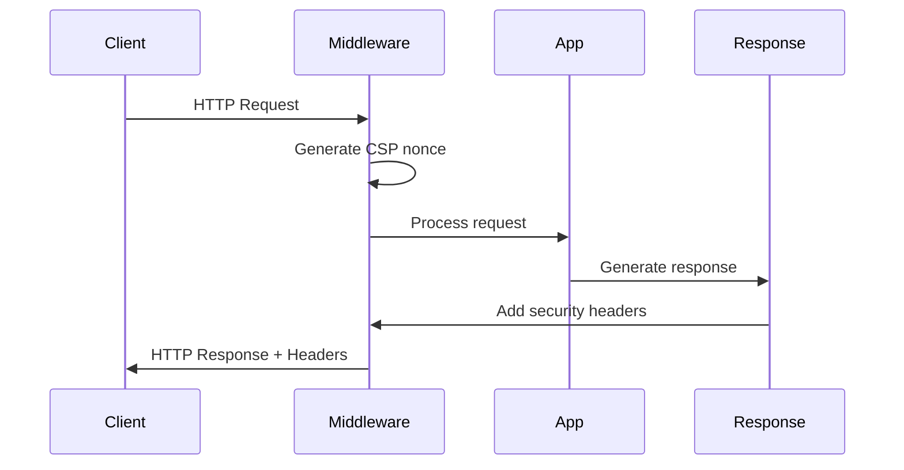

# Security Headers Implementation Guide

## Overview

This document provides comprehensive guidance on the security headers implementation for the AI Enhanced PDF Scholar application. The security headers middleware provides defense-in-depth protection against common web vulnerabilities.

## Table of Contents

- [Security Headers Overview](#security-headers-overview)
- [Environment-Specific Configuration](#environment-specific-configuration)
- [Content Security Policy (CSP)](#content-security-policy-csp)
- [HTTP Strict Transport Security (HSTS)](#http-strict-transport-security-hsts)
- [Other Security Headers](#other-security-headers)
- [Cookie Security](#cookie-security)
- [Implementation Details](#implementation-details)
- [Testing and Validation](#testing-and-validation)
- [Migration Guide](#migration-guide)
- [Best Practices](#best-practices)
- [Troubleshooting](#troubleshooting)

## Security Headers Overview

The security headers middleware (`backend/api/middleware/security_headers.py`) implements the following security headers:

### Core Security Headers

| Header | Purpose | Default Value |
|--------|---------|---------------|
| Content-Security-Policy | Prevents XSS, clickjacking, and other injection attacks | Environment-specific |
| Strict-Transport-Security | Forces HTTPS connections | max-age=31536000; includeSubDomains |
| X-Frame-Options | Prevents clickjacking | DENY |
| X-Content-Type-Options | Prevents MIME type sniffing | nosniff |
| X-XSS-Protection | Legacy XSS protection | 1; mode=block |
| Referrer-Policy | Controls referrer information | strict-origin-when-cross-origin |
| Permissions-Policy | Controls browser features | Restrictive by default |

### Advanced Security Headers

| Header | Purpose | Environment |
|--------|---------|-------------|
| Expect-CT | Certificate Transparency | Production only |
| Cross-Origin-Embedder-Policy | Controls cross-origin embedding | All environments |
| Cross-Origin-Opener-Policy | Controls cross-origin window references | All environments |
| Cross-Origin-Resource-Policy | Controls cross-origin resource loading | All environments |
| Clear-Site-Data | Clears browser data on logout | All environments |
| Report-To | Configures reporting endpoints | Staging/Production |

## Environment-Specific Configuration

### Development Environment

```python
# Relaxed security for development
- CSP: Report-Only mode with unsafe-inline allowed
- HSTS: Disabled
- Cookies: SameSite=Lax
- Nonce: Disabled
- Reporting: Enabled for testing
```

### Staging Environment

```python
# Production-like security with reporting
- CSP: Report-Only mode, strict policy
- HSTS: Enabled
- Cookies: SameSite=Strict, Secure flag
- Nonce: Enabled
- Reporting: Enabled
```

### Production Environment

```python
# Maximum security
- CSP: Enforcing mode, strict policy
- HSTS: Enabled with preload option
- Cookies: SameSite=Strict, Secure flag, prefixes
- Nonce: Enabled
- Reporting: Enabled with monitoring
```

## Content Security Policy (CSP)

### CSP Implementation Strategy

1. **Development Phase**: Start with Report-Only mode
2. **Testing Phase**: Monitor violations, adjust policy
3. **Staging Phase**: Test strict policy in Report-Only
4. **Production Phase**: Enable enforcing mode

### CSP Directives

```javascript
// Production CSP Example
Content-Security-Policy:
  default-src 'none';
  script-src 'self' 'nonce-{random}' 'strict-dynamic';
  style-src 'self' 'nonce-{random}';
  img-src 'self' data: https:;
  font-src 'self' https://fonts.gstatic.com;
  connect-src 'self' https: wss:;
  frame-ancestors 'none';
  base-uri 'none';
  form-action 'self';
  upgrade-insecure-requests;
  block-all-mixed-content;
```

### Nonce-Based Script Execution

The middleware generates cryptographically secure nonces for inline scripts:

```python
# In your templates
<script nonce="{{ request.state.csp_nonce }}">
  // Your inline JavaScript
</script>
```

### CSP Violation Reporting

Monitor CSP violations through the reporting endpoint:

```bash
# View CSP violations summary
GET /api/admin/security/csp-violations

# Response
{
  "total_reports": 42,
  "unique_violations": 5,
  "top_violations": [
    {
      "document_uri": "https://example.com/page",
      "violated_directive": "script-src",
      "blocked_uri": "https://cdn.example.com/script.js",
      "count": 15
    }
  ]
}
```

## HTTP Strict Transport Security (HSTS)

### HSTS Configuration

```bash
# Environment variables
HSTS_MAX_AGE=31536000        # 1 year
HSTS_INCLUDE_SUBDOMAINS=true
HSTS_PRELOAD=false           # Enable when ready for preload list
```

### HSTS Preload Requirements

Before enabling HSTS preload:

1. Serve a valid certificate
2. Redirect HTTP to HTTPS
3. Serve all subdomains over HTTPS
4. Set max-age to at least 31536000 (1 year)
5. Include the includeSubDomains directive
6. Submit to [hstspreload.org](https://hstspreload.org)

## Other Security Headers

### X-Frame-Options

Prevents clickjacking attacks:

```bash
# Options: DENY, SAMEORIGIN, ALLOW-FROM uri
X_FRAME_OPTIONS=DENY
```

### Permissions-Policy

Controls browser features:

```javascript
Permissions-Policy:
  camera=(),
  microphone=(),
  geolocation=(),
  payment=(self),
  usb=()
```

### Cross-Origin Policies

```bash
# Environment variables
COEP=require-corp         # Cross-Origin-Embedder-Policy
COOP=same-origin         # Cross-Origin-Opener-Policy
CORP=same-site           # Cross-Origin-Resource-Policy
```

## Cookie Security

### Secure Cookie Attributes

The middleware automatically adds security attributes to cookies:

```python
# Automatic cookie security
- Secure flag (HTTPS only)
- HttpOnly flag (no JavaScript access)
- SameSite attribute (CSRF protection)
- Cookie prefixes (__Secure-, __Host-)
```

### Cookie Prefixes

```python
# __Host- prefix requirements:
- Must have Secure flag
- Must have Path=/
- Must NOT have Domain attribute

# __Secure- prefix requirements:
- Must have Secure flag
```

## Implementation Details

### Middleware Integration

```python
from backend.api.middleware.security_headers import (
    SecurityHeadersConfig,
    setup_security_headers
)

# In your FastAPI app
app = FastAPI()

# Configure security headers
security_config = SecurityHeadersConfig()
setup_security_headers(app, security_config)
```

### Request Flow



## Testing and Validation

### Unit Tests

Run the comprehensive test suite:

```bash
# Run security headers tests
pytest tests/middleware/test_security_headers.py -v

# Test specific environments
pytest tests/middleware/test_security_headers.py::TestEnvironmentSpecificBehavior -v
```

### Manual Testing

Use browser developer tools to inspect headers:

```javascript
// In browser console
fetch('/api/test').then(r => {
  console.log('Security Headers:');
  for (let [key, value] of r.headers.entries()) {
    if (key.toLowerCase().includes('security') ||
        key.toLowerCase().includes('content-security') ||
        key.toLowerCase().includes('frame') ||
        key.toLowerCase().includes('strict-transport')) {
      console.log(`${key}: ${value}`);
    }
  }
});
```

### Security Header Validators

Use online tools to validate your security headers:

- [securityheaders.com](https://securityheaders.com)
- [Mozilla Observatory](https://observatory.mozilla.org)
- [SSL Labs](https://www.ssllabs.com/ssltest/)

## Migration Guide

### Phase 1: Development Testing (Week 1-2)

1. Enable security headers in development
2. Test with Report-Only CSP
3. Monitor console for violations
4. Adjust CSP policy as needed

### Phase 2: Staging Deployment (Week 3-4)

1. Deploy to staging environment
2. Enable stricter CSP in Report-Only
3. Monitor violation reports
4. Test all application features

### Phase 3: Production Rollout (Week 5-6)

1. Start with CSP in Report-Only mode
2. Monitor for 1 week
3. Switch to enforcing mode
4. Enable HSTS with short max-age
5. Gradually increase HSTS max-age

### Rollback Plan

If issues occur:

```python
# Quick disable in production
CSP_ENABLED=false
HSTS_MAX_AGE=0
PERMISSIONS_POLICY_ENABLED=false
```

## Best Practices

### 1. Start with Report-Only

Always test new CSP policies in Report-Only mode first:

```python
# Development and Staging
config.csp_report_only = True

# Production (after testing)
config.csp_report_only = False
```

### 2. Use Nonces for Inline Scripts

Avoid `unsafe-inline` by using nonces:

```html
<!-- Good -->
<script nonce="{{ csp_nonce }}">
  console.log('Secure inline script');
</script>

<!-- Bad -->
<script>
  console.log('Unsafe inline script');
</script>
```

### 3. Monitor Violations

Regularly review CSP violation reports:

```python
# Set up alerting for violations
if violation_count > threshold:
    send_alert("High CSP violation rate detected")
```

### 4. Progressive Enhancement

Gradually tighten security policies:

```python
# Week 1: Basic CSP
default-src 'self'; script-src 'self' 'unsafe-inline';

# Week 2: Remove unsafe-inline
default-src 'self'; script-src 'self' 'nonce-{random}';

# Week 3: Add strict-dynamic
default-src 'self'; script-src 'self' 'nonce-{random}' 'strict-dynamic';
```

### 5. Test Cross-Browser Compatibility

Test security headers across different browsers:

- Chrome/Edge (Chromium)
- Firefox
- Safari
- Mobile browsers

## Troubleshooting

### Common Issues and Solutions

#### Issue: Scripts blocked by CSP

**Solution**: Add script source to CSP or use nonces

```python
# Add trusted CDN
CSPDirective.SCRIPT_SRC: [
    CSPSource.SELF,
    "https://cdn.jsdelivr.net",
]
```

#### Issue: Fonts not loading

**Solution**: Add font sources to CSP

```python
CSPDirective.FONT_SRC: [
    CSPSource.SELF,
    "https://fonts.gstatic.com",
]
```

#### Issue: WebSocket connections blocked

**Solution**: Add WebSocket sources to connect-src

```python
CSPDirective.CONNECT_SRC: [
    CSPSource.SELF,
    CSPSource.WSS,
    "wss://your-domain.com",
]
```

#### Issue: Images not displaying

**Solution**: Add image sources to CSP

```python
CSPDirective.IMG_SRC: [
    CSPSource.SELF,
    CSPSource.DATA,  # For data: URIs
    CSPSource.HTTPS,  # For external HTTPS images
]
```

### Debug Mode

Enable debug logging for security headers:

```python
import logging

# Enable debug logging
logging.getLogger("security.headers").setLevel(logging.DEBUG)
logging.getLogger("security.validation").setLevel(logging.DEBUG)
```

### Performance Considerations

Security headers have minimal performance impact:

- Nonce generation: ~0.1ms per request
- Header addition: ~0.05ms per request
- Total overhead: < 1ms per request

## Security Checklist

- [ ] CSP enabled and tested
- [ ] HSTS configured for production
- [ ] X-Frame-Options set to DENY or SAMEORIGIN
- [ ] X-Content-Type-Options set to nosniff
- [ ] Referrer-Policy configured
- [ ] Permissions-Policy restrictive
- [ ] Cookie security attributes enabled
- [ ] CSP violation reporting configured
- [ ] Security.txt file available
- [ ] Cross-Origin policies configured
- [ ] Clear-Site-Data on logout
- [ ] Report-To header configured
- [ ] Expect-CT for production
- [ ] All headers tested cross-browser
- [ ] Monitoring and alerting setup

## References

- [MDN Web Security](https://developer.mozilla.org/en-US/docs/Web/Security)
- [OWASP Secure Headers Project](https://owasp.org/www-project-secure-headers/)
- [Content Security Policy Reference](https://content-security-policy.com/)
- [RFC 6797 - HTTP Strict Transport Security](https://tools.ietf.org/html/rfc6797)
- [RFC 9116 - Security.txt](https://www.rfc-editor.org/rfc/rfc9116.html)
- [W3C Permissions Policy](https://w3c.github.io/webappsec-permissions-policy/)
- [Google Web Fundamentals - Security](https://developers.google.com/web/fundamentals/security/)

---

**Last Updated**: 2025-01-08
**Version**: 1.0.0
**Maintainer**: Security Team