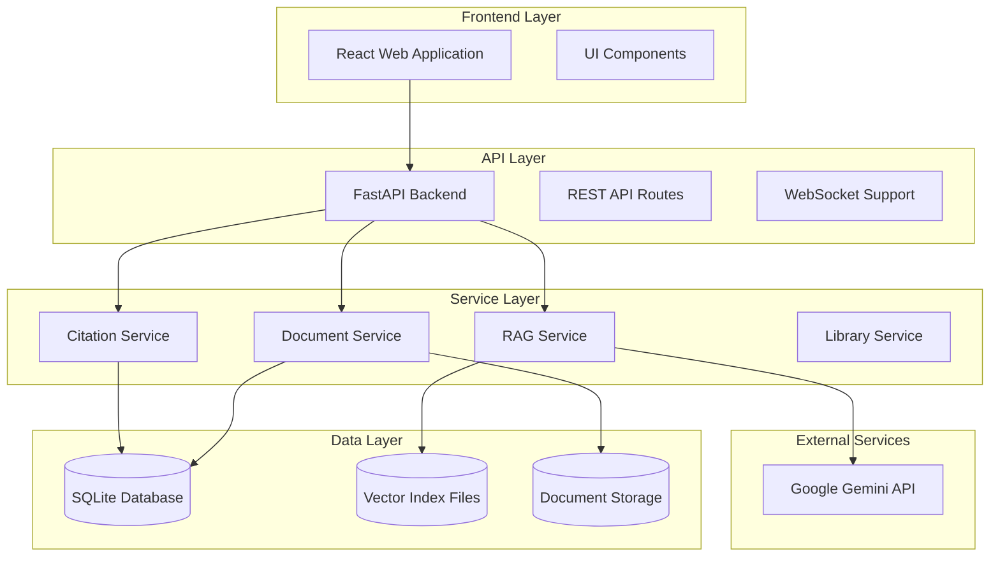

# AI Enhanced PDF Scholar - System Product Requirements Document

**Version**: 2.1.0  
**Last Updated**: 2025-01-19  
**Status**: Definitive Source of Truth  
**Document Owner**: System Architecture Team

---

## 1. Executive Summary

AI Enhanced PDF Scholar is an intelligent document management and analysis platform designed specifically for academic researchers. The system addresses the fragmented workflow researchers face when managing literature by providing a unified platform that combines document management, AI-powered analysis, citation extraction, and intelligent question-answering capabilities.

### Key Value Proposition
- **Unified Workflow**: Replace multiple fragmented tools with a single, intelligent platform
- **AI-Enhanced Analysis**: Leverage RAG (Retrieval-Augmented Generation) for document understanding
- **Citation Intelligence**: Automated citation extraction and network analysis
- **Private & Secure**: Local-first architecture with no data leakage to external AI training

---

## 2. Project Background & Context

Academic researchers, from PhD students to tenured professors, face significant challenges in managing the overwhelming volume of research literature. Their current workflow is fragmented and inefficient, involving multiple tools:

- **PDF readers** for document viewing
- **Reference managers** for citation tracking  
- **Generic AI chatbots** for summarization (with context loss)
- **Manual processes** for literature organization

This constant context-switching wastes valuable time and hinders deep, connected understanding of subject matter. AI Enhanced PDF Scholar addresses this by creating a single, intelligent platform that unifies these capabilities.

---

## 3. Goals & Success Metrics

### Primary Objectives

**Objective 1: Revolutionize Individual Researcher Workflow**
- **Key Result 1**: Reduce average time spent on literature review tasks by 30%
- **Key Result 2**: Achieve user satisfaction (CSAT) score >90% for core AI Q&A functionality
- **Key Result 3**: Increase daily active usage by 15% in first quarter post-launch

**Objective 2: Establish Platform as Credible Academic Tool**
- **Key Result 1**: Successfully pass third-party security audit with zero critical vulnerabilities
- **Key Result 2**: Secure pilot programs with ≥2 university departments within 6 months

### Current Achievement Status (v2.1.0)
- ✅ **Core RAG System**: Fully functional with Google Gemini integration
- ✅ **Citation Extraction**: Multi-format support (APA, MLA, Chicago, IEEE) with confidence scoring
- ✅ **Document Management**: Complete database-driven system with SQLite backend
- ✅ **Security Foundation**: Local-first architecture with no external data training
- ✅ **Test Coverage**: 63 test cases covering all critical paths

---

## 4. User Personas & Use Cases

### Primary Persona: Alex - The PhD Candidate
- **Demographics**: 26-year-old Computer Science PhD candidate
- **Context**: Tech-savvy but extremely time-constrained, working on dissertation
- **Core Needs**: 
  - Rapidly digest dozens of research papers for literature reviews
  - Find specific information across multiple documents
  - Manage citations without manual processes
- **Pain Points**: "I waste hours searching through PDFs. I need context-aware AI that remembers my documents."

### Secondary Persona: Dr. Chen - The Professor & Lab Lead
- **Demographics**: 45-year-old tenured professor leading university research lab
- **Context**: Oversees student research, publishes high-impact work, values data security
- **Core Needs**:
  - Stay current with latest research findings
  - Guide student research with comprehensive literature understanding
  - Ensure data privacy and intellectual property protection
- **Pain Points**: "I need trustworthy tools that respect privacy while helping track the citation landscape."

---

## 5. Functional Requirements

### 5.1 Core Document Management
**Status**: ✅ Implemented (v2.1.0)

- **Document Upload & Storage**
  - Support for PDF files up to 100MB
  - Intelligent duplicate detection using content hashing
  - Automatic metadata extraction (title, page count, file info)
  - Secure local file storage with database indexing

- **Document Organization**
  - Title-based search and filtering
  - Creation date and last accessed tracking
  - Document library management with pagination
  - Tag-based categorization (future enhancement)

### 5.2 AI-Powered Question Answering (RAG)
**Status**: ✅ Implemented (v2.1.0)

- **Query Processing**
  - Natural language question input
  - Context-aware answers grounded in uploaded documents
  - Source citation with page number references
  - Multi-document query support

- **RAG Infrastructure**
  - Google Gemini API integration for generation
  - LlamaIndex for vector indexing and retrieval
  - Persistent vector storage with document linking
  - Query caching for performance optimization

### 5.3 Citation Extraction & Analysis
**Status**: ✅ Implemented (v2.1.0)

- **Multi-Format Citation Support**
  - APA, MLA, Chicago, IEEE format recognition
  - Structured data extraction (authors, title, journal, year, DOI)
  - Confidence scoring (0.0-1.0) for extracted citations
  - Raw text preservation for manual review

- **Citation Intelligence**
  - Document-to-document relationship mapping
  - Citation network analysis foundations
  - Duplicate citation detection and consolidation
  - Export capabilities (BibTeX, EndNote) - planned

### 5.4 User Interface & Experience
**Status**: 🔄 In Development

- **Web-Based Interface**
  - React + TypeScript frontend
  - Responsive design for desktop and tablet use
  - Dark/light theme support
  - Real-time WebSocket updates for long-running operations

- **Document Interaction**
  - PDF viewer integration
  - Side-by-side document and chat interface  
  - Search result highlighting
  - Citation visualization (network graphs) - planned

### 5.5 Data Management & Security
**Status**: ✅ Implemented (v2.1.0)

- **Local-First Architecture**
  - All data processing occurs locally
  - No document content sent to external AI training
  - SQLite database for metadata and relationships
  - Encrypted storage for sensitive information

- **Data Integrity**
  - Automatic database migrations
  - Content hash verification
  - Backup and recovery capabilities
  - Transaction-safe operations

---

## 6. Non-Functional Requirements

### 6.1 Performance Requirements
- **API Response Time**: 95th percentile <250ms for core endpoints
- **Frontend Load Time**: Initial page load <2 seconds (Largest Contentful Paint)
- **RAG Query Performance**: Average end-to-end query time <5 seconds
- **Concurrent Users**: Support ≥1,000 concurrent users without degradation
- **Document Library Scale**: Single user library supporting up to 10,000 documents

### 6.2 Reliability Requirements  
- **Service Availability**: 99.9% uptime for core services
- **Data Integrity**: No more than 5 minutes of data loss in disaster scenarios
- **Error Recovery**: Graceful degradation when external AI services unavailable
- **Backup Strategy**: Regular automated backups with point-in-time recovery

### 6.3 Security Requirements
- **Authentication**: Secure user authentication with session management
- **Authorization**: Role-based access control for multi-user scenarios
- **Data Protection**: 
  - Password hashing using Argon2
  - Data at rest encryption
  - Protection against OWASP Top 10 vulnerabilities
- **Privacy**: Zero data leakage to external AI model training

### 6.4 Usability Requirements
- **Learning Curve**: New users productive within 15 minutes
- **Accessibility**: WCAG 2.1 AA compliance for web interface
- **Documentation**: Comprehensive user guides and API documentation
- **Internationalization**: English primary, with expansion capabilities

---

## 7. Technical Architecture Overview

### 7.1 System Architecture


### 7.2 Technology Stack Rationale
- **Backend**: FastAPI chosen for async performance and automatic OpenAPI documentation
- **Database**: SQLite for development/single-user, PostgreSQL migration path for enterprise
- **Frontend**: React + TypeScript for modern, maintainable user interfaces  
- **AI Integration**: Google Gemini API for state-of-the-art language model capabilities
- **Vector Storage**: LlamaIndex for efficient similarity search and retrieval

---

## 8. API Specifications

### 8.1 Core API Endpoints

#### Document Management
```
POST /api/documents/upload          # Upload new document
GET  /api/documents                 # List documents with pagination
GET  /api/documents/{id}            # Get specific document
PUT  /api/documents/{id}            # Update document metadata
DELETE /api/documents/{id}          # Delete document and related data
```

#### RAG Query Interface  
```
POST /api/rag/query                 # Submit question to RAG system
GET  /api/rag/history              # Get query history
POST /api/rag/build-index          # Build/rebuild document index
GET  /api/rag/index-status         # Check indexing status
```

#### Citation Management
```
GET  /api/citations/{document_id}   # Get citations for document
POST /api/citations/extract        # Extract citations from document
GET  /api/citations/network        # Get citation network data
POST /api/citations/export         # Export citations (BibTeX, etc.)
```

#### System Status
```
GET  /api/system/health            # System health check
GET  /api/system/stats             # System statistics
GET  /api/system/status            # Detailed system status
```

### 8.2 Response Format Standard
```json
{
    "success": true,
    "message": "Operation completed successfully", 
    "data": {
        // Actual response data
    },
    "pagination": {
        "page": 1,
        "per_page": 50, 
        "total": 150,
        "pages": 3
    },
    "timestamp": "2025-01-19T10:30:00Z",
    "request_id": "req_1234567890"
}
```

---

## 9. Development Roadmap

### ✅ Phase 1: Foundation (Completed - v2.1.0)
- Core document management with SQLite backend
- RAG system with Google Gemini integration
- Citation extraction with multi-format support
- Database-driven architecture with Repository pattern
- Comprehensive test suite (63 test cases)

### 🔄 Phase 2: User Interface (In Progress - v2.2.0)
- React frontend implementation
- Document library management interface
- RAG chat interface with source highlighting
- Real-time WebSocket updates
- Responsive design optimization

### 📋 Phase 3: Enhancement (Planned - v2.3.0)  
- Citation network visualization
- Advanced search and filtering
- Document tagging and categorization
- Export functionality (BibTeX, EndNote)
- Performance optimization and caching

### 🚀 Phase 4: Scale & Polish (Future - v3.0.0)
- Multi-user support with authentication
- API rate limiting and monitoring
- Advanced analytics and insights
- Mobile-responsive enhancements
- Integration with academic databases

---

## 10. Success Criteria & Acceptance

### Minimum Viable Product (MVP) Criteria
- ✅ Upload and manage PDF documents with duplicate detection
- ✅ AI-powered question answering with source attribution  
- ✅ Citation extraction with >33% accuracy (current benchmark)
- ✅ Secure local data storage with no external leakage
- 🔄 Web interface for core functionality (in development)

### Quality Gates
- **Functionality**: All core features operational with happy path testing
- **Performance**: Sub-3 second RAG query response times 95% of cases
- **Reliability**: Zero critical bugs in production deployment
- **Security**: Pass automated security scanning with no high-severity issues
- **Usability**: User testing shows <15 minute time-to-productivity

### Launch Readiness Checklist
- [ ] Complete web interface implementation
- [ ] End-to-end user workflow testing
- [ ] Performance benchmarking and optimization  
- [ ] Security audit and penetration testing
- [ ] Documentation and user guides
- [ ] Deployment automation and monitoring

---

## 11. Risk Management

### Technical Risks
- **AI Service Dependency**: Google Gemini API availability/rate limiting
  - *Mitigation*: Implement graceful degradation and caching
- **Scalability Concerns**: SQLite limitations for large document collections
  - *Mitigation*: PostgreSQL migration path established
- **Vector Index Performance**: Large document sets may impact query speed
  - *Mitigation*: Incremental indexing and optimization strategies

### Business Risks  
- **User Adoption**: Academic researchers may resist workflow changes
  - *Mitigation*: Pilot programs and user feedback integration
- **Competition**: Existing tools (Zotero, Mendeley) adding AI features
  - *Mitigation*: Focus on superior AI integration and user experience
- **Privacy Concerns**: Academic institutions may have strict data policies
  - *Mitigation*: Local-first architecture and transparent privacy practices

### Operational Risks
- **Maintenance Overhead**: Complex AI integration requires ongoing attention
  - *Mitigation*: Robust monitoring, logging, and automated testing
- **Support Burden**: Academic users may need significant onboarding support  
  - *Mitigation*: Comprehensive documentation and self-service resources

---

## 12. Appendices

### A. Glossary
- **RAG**: Retrieval-Augmented Generation - AI technique combining document search with language generation
- **Vector Index**: High-dimensional representation of document content for similarity search
- **Citation Confidence Score**: 0.0-1.0 metric indicating reliability of extracted citation data
- **Content Hash**: Unique identifier for document content, enabling duplicate detection

### B. References
- [FastAPI Framework Documentation](https://fastapi.tiangolo.com/)
- [Google Gemini API Reference](https://ai.google.dev/docs)
- [LlamaIndex Documentation](https://docs.llamaindex.ai/)
- [SQLite Documentation](https://sqlite.org/docs.html)

### C. Change History
| Version | Date | Changes | Author |
|---------|------|---------|--------|
| 2.1.0 | 2025-01-19 | Unified PRD consolidating all source documentation | System Architecture Team |
| 2.0.0 | 2025-01-15 | Major citation system implementation | Development Team |
| 1.5.0 | 2024-12-01 | RAG system implementation | Development Team |
| 1.0.0 | 2024-08-15 | Initial product definition | Product Team |

---

**Document Classification**: Internal - Product Requirements  
**Next Review Date**: 2025-04-19  
**Approval Required**: Product Owner, Technical Lead, QA Lead