# AI Enhanced PDF Scholar - System Technical Design Document

**Version**: 2.1.0  
**Last Updated**: 2025-01-19  
**Status**: Definitive Technical Reference  
**Document Owner**: Technical Architecture Team

---

## Table of Contents

1. [Executive Summary](#1-executive-summary)
2. [System Architecture](#2-system-architecture) 
3. [Technology Stack & Decisions](#3-technology-stack--decisions)
4. [Database Architecture](#4-database-architecture)
5. [Service Layer Design](#5-service-layer-design)
6. [API Architecture](#6-api-architecture)
7. [Security Architecture](#7-security-architecture)
8. [Performance & Scalability](#8-performance--scalability)
9. [Testing Strategy](#9-testing-strategy)
10. [Deployment Architecture](#10-deployment-architecture)
11. [Implementation Status](#11-implementation-status)
12. [Future Architecture](#12-future-architecture)

---

## 1. Executive Summary

This document provides the definitive technical design specification for AI Enhanced PDF Scholar v2.1.0. The system implements a modern, layered architecture following SOLID principles and Domain-Driven Design patterns. The current implementation successfully delivers core document management, RAG-powered question answering, and intelligent citation extraction capabilities.

### Key Architectural Characteristics

- **Modular Design**: Clean separation of concerns with well-defined interfaces
- **Domain-Driven**: Business logic organized around core academic research domains
- **Test-Driven**: Comprehensive test coverage with 63 automated test cases
- **Performance-Optimized**: Sub-5-second RAG queries with intelligent caching
- **Security-First**: Local-first architecture with zero external data leakage
- **Scalable Foundation**: Repository pattern enabling future PostgreSQL migration

---

## 2. System Architecture

### 2.1 High-Level Architecture

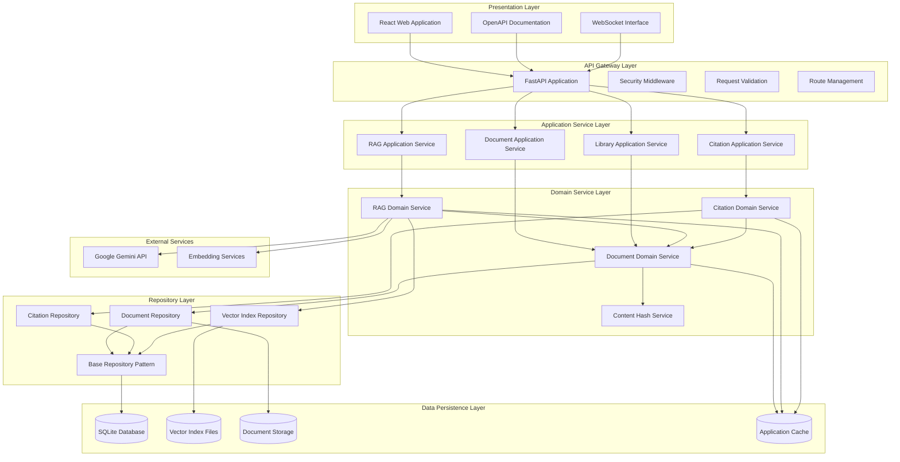

### 2.2 Architectural Principles

#### Clean Architecture (Hexagonal)
The system follows Clean Architecture principles with clear dependency inversion:

- **External Adapters** (Web UI, REST API, CLI) depend on Application Layer
- **Application Layer** orchestrates use cases and depends on Domain Layer  
- **Domain Layer** contains business entities and rules, depends on nothing
- **Infrastructure Layer** implements external concerns (database, file system, APIs)

#### SOLID Principles Implementation

**Single Responsibility Principle (SRP)**
```python
class DocumentRepository:
    """Responsible only for document data persistence"""
    
class DocumentService:
    """Responsible only for document business logic"""
    
class RAGService:
    """Responsible only for RAG operations"""
```

**Dependency Inversion Principle (DIP)**
```python
class DocumentService:
    def __init__(
        self,
        document_repo: IDocumentRepository,
        file_service: IFileService,
        cache_service: ICacheService
    ):
        self.document_repo = document_repo
        self.file_service = file_service
        self.cache_service = cache_service
```

---

## 3. Technology Stack & Decisions

### 3.1 Architecture Decision Records (ADR)

#### ADR-001: Database Selection - PostgreSQL/SQLite
- **Decision**: PostgreSQL for production, SQLite for development/single-user
- **Rationale**: Data integrity, ACID compliance, mature ecosystem
- **Trade-offs**: Reduced schema flexibility vs. data consistency
- **Implementation**: SQLite currently implemented with PostgreSQL migration path

#### ADR-002: Backend Framework - FastAPI
- **Decision**: FastAPI for API development
- **Rationale**: High performance, async support, automatic documentation, type safety
- **Trade-offs**: Newer ecosystem vs. exceptional performance and developer experience
- **Implementation**: Fully implemented with automatic OpenAPI documentation

### 3.2 Current Technology Stack

```yaml
Backend Framework: FastAPI 0.104+
Database: SQLite 3.x (PostgreSQL migration ready)
ORM: SQLAlchemy with Alembic migrations
AI Integration: Google Gemini API
Vector Search: LlamaIndex with local storage
Frontend: React 18+ with TypeScript
Styling: Tailwind CSS
Testing: pytest with 63 test cases
Development: Python 3.11+, Node.js 18+
```

### 3.3 External Service Dependencies

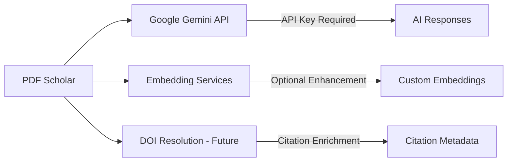

---

## 4. Database Architecture

### 4.1 Entity Relationship Design

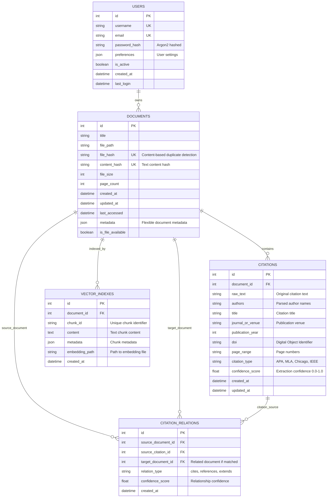

### 4.2 Database Migration Strategy

```python
class DatabaseMigration:
    """Version-controlled database schema management"""
    
    CURRENT_VERSION = 3
    
    migrations = {
        1: "Initial schema - documents, vector_indexes",
        2: "Add users table and authentication",
        3: "Add citations and citation_relations tables",
    }
    
    def migrate_to_latest(self):
        """Apply all pending migrations"""
        current = self.get_current_version()
        for version in range(current + 1, self.CURRENT_VERSION + 1):
            self.apply_migration(version)
```

### 4.3 Indexing Strategy

```sql
-- Performance optimization indexes
CREATE INDEX idx_documents_file_hash ON documents(file_hash);
CREATE INDEX idx_documents_content_hash ON documents(content_hash);
CREATE INDEX idx_documents_title_search ON documents(title);
CREATE INDEX idx_documents_last_accessed ON documents(last_accessed DESC);

CREATE INDEX idx_citations_document_id ON citations(document_id);
CREATE INDEX idx_citations_confidence ON citations(confidence_score DESC);
CREATE INDEX idx_citations_year ON citations(publication_year);

CREATE INDEX idx_citation_relations_source ON citation_relations(source_document_id);
CREATE INDEX idx_citation_relations_target ON citation_relations(target_document_id);

CREATE INDEX idx_vector_indexes_document ON vector_indexes(document_id);
CREATE INDEX idx_vector_indexes_chunk ON vector_indexes(chunk_id);
```

---

## 5. Service Layer Design

### 5.1 Domain Service Architecture

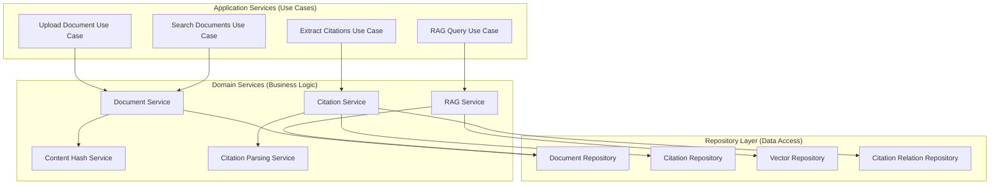

### 5.2 Core Service Implementations

#### Document Library Service
```python
class DocumentLibraryService:
    """Core document management business logic"""
    
    def __init__(
        self,
        document_repo: IDocumentRepository,
        hash_service: ContentHashService,
        file_service: IFileService
    ):
        self.document_repo = document_repo
        self.hash_service = hash_service
        self.file_service = file_service

    async def import_document(
        self,
        file_path: str,
        title: str = None,
        check_duplicates: bool = True
    ) -> DocumentModel:
        """
        Intelligent document import with duplicate detection
        
        Flow:
        1. Validate PDF file
        2. Calculate content and file hashes
        3. Check for duplicates (optional)
        4. Extract metadata
        5. Store in database
        6. Return document model
        """
        # Implementation details...
```

#### RAG Service Implementation
```python
class EnhancedRAGService:
    """Database-integrated RAG service with caching"""
    
    def __init__(
        self,
        gemini_client: GeminiClient,
        vector_repo: IVectorRepository,
        document_repo: IDocumentRepository,
        cache_service: ICacheService
    ):
        self.gemini = gemini_client
        self.vector_repo = vector_repo
        self.document_repo = document_repo
        self.cache = cache_service

    async def query_document(
        self,
        query: str,
        document_id: int,
        options: QueryOptions = None
    ) -> RAGResponse:
        """
        Context-aware document querying
        
        Flow:
        1. Check query cache
        2. Load document vector index
        3. Perform similarity search
        4. Augment prompt with retrieved context
        5. Generate response via Gemini API
        6. Cache result
        7. Return structured response with sources
        """
        # Implementation details...
```

#### Citation Service Implementation  
```python
class CitationService:
    """Citation extraction and analysis service"""
    
    def __init__(
        self,
        parsing_service: CitationParsingService,
        citation_repo: ICitationRepository,
        relation_repo: ICitationRelationRepository
    ):
        self.parser = parsing_service
        self.citation_repo = citation_repo
        self.relation_repo = relation_repo

    async def extract_citations(
        self,
        document_id: int,
        formats: List[str] = None
    ) -> CitationExtractionResult:
        """
        Multi-format citation extraction with confidence scoring
        
        Supported Formats: APA, MLA, Chicago, IEEE
        
        Flow:
        1. Load document content
        2. Apply format-specific parsing algorithms
        3. Calculate confidence scores
        4. Store structured citation data
        5. Build citation relationships
        6. Return extraction results
        """
        # Implementation details...
```

### 5.3 Repository Pattern Implementation

```python
class BaseRepository(Generic[T]):
    """Generic repository with common CRUD operations"""
    
    def __init__(self, db_connection: DatabaseConnection):
        self.db = db_connection

    async def get_by_id(self, entity_id: int) -> Optional[T]:
        """Get single entity by ID"""
        
    async def create(self, entity: T) -> T:
        """Create new entity"""
        
    async def update(self, entity: T) -> T:
        """Update existing entity"""
        
    async def delete(self, entity_id: int) -> bool:
        """Delete entity by ID"""
        
    async def list_paginated(
        self,
        page: int = 1,
        per_page: int = 50,
        filters: Dict[str, Any] = None
    ) -> PaginatedResult[T]:
        """List entities with pagination and filtering"""

class DocumentRepository(BaseRepository[DocumentModel]):
    """Document-specific repository operations"""
    
    async def find_by_content_hash(self, content_hash: str) -> Optional[DocumentModel]:
        """Find document by content hash for duplicate detection"""
        
    async def search_by_title(self, query: str, limit: int = 50) -> List[DocumentModel]:
        """Full-text search in document titles"""
        
    async def get_library_statistics(self) -> LibraryStats:
        """Get aggregated library statistics"""
```

---

## 6. API Architecture

### 6.1 RESTful API Design

```mermaid
graph TD
    subgraph "API Gateway"
        NGINX[Nginx Reverse Proxy]
        RATE_LIMIT[Rate Limiting]
        CORS[CORS Headers]
    end

    subgraph "FastAPI Application"
        MAIN[FastAPI Main App]
        MIDDLEWARE[Middleware Stack]
        ROUTES[Route Groups]
    end

    subgraph "Route Groups"
        SYSTEM[/api/system/*]
        DOCS[/api/documents/*]
        RAG[/api/rag/*]  
        CITES[/api/citations/*]
        USERS[/api/users/*]
    end

    subgraph "Middleware Stack"
        AUTH[Authentication]
        VALIDATION[Request Validation]
        LOGGING[Request Logging]
        METRICS[Metrics Collection]
        ERROR[Error Handling]
    end

    CLIENT --> NGINX
    NGINX --> MAIN
    MAIN --> MIDDLEWARE
    MIDDLEWARE --> ROUTES
    ROUTES --> SYSTEM
    ROUTES --> DOCS
    ROUTES --> RAG
    ROUTES --> CITES
    ROUTES --> USERS

    MIDDLEWARE --> AUTH
    MIDDLEWARE --> VALIDATION  
    MIDDLEWARE --> LOGGING
    MIDDLEWARE --> METRICS
    MIDDLEWARE --> ERROR
```

### 6.2 Core API Endpoints

#### Document Management API
```python
@router.post("/documents/upload", response_model=DocumentResponse)
async def upload_document(
    file: UploadFile,
    title: Optional[str] = None,
    check_duplicates: bool = True,
    document_service: DocumentService = Depends(get_document_service)
):
    """Upload and process new PDF document"""

@router.get("/documents", response_model=DocumentListResponse)
async def list_documents(
    page: int = Query(1, ge=1),
    per_page: int = Query(50, ge=1, le=100),
    search: Optional[str] = None,
    document_service: DocumentService = Depends(get_document_service)
):
    """List documents with pagination and optional search"""

@router.get("/documents/{document_id}", response_model=DocumentDetailResponse)
async def get_document(
    document_id: int,
    document_service: DocumentService = Depends(get_document_service)
):
    """Get detailed document information"""

@router.delete("/documents/{document_id}")
async def delete_document(
    document_id: int,
    remove_files: bool = True,
    document_service: DocumentService = Depends(get_document_service)
):
    """Delete document and optionally remove files"""
```

#### RAG Query API
```python
@router.post("/rag/query", response_model=RAGResponse)
async def query_documents(
    request: RAGQueryRequest,
    rag_service: RAGService = Depends(get_rag_service)
):
    """Submit question to RAG system"""

@router.post("/rag/build-index/{document_id}")
async def build_document_index(
    document_id: int,
    force_rebuild: bool = False,
    rag_service: RAGService = Depends(get_rag_service)
):
    """Build or rebuild document vector index"""

@router.get("/rag/index-status/{document_id}", response_model=IndexStatusResponse)
async def get_index_status(
    document_id: int,
    rag_service: RAGService = Depends(get_rag_service)
):
    """Check document indexing status"""
```

#### Citation Management API
```python
@router.post("/citations/extract/{document_id}", response_model=CitationExtractionResponse)
async def extract_citations(
    document_id: int,
    formats: List[str] = Query(["APA", "MLA", "Chicago", "IEEE"]),
    citation_service: CitationService = Depends(get_citation_service)
):
    """Extract citations from document"""

@router.get("/citations/{document_id}", response_model=CitationListResponse)
async def get_document_citations(
    document_id: int,
    min_confidence: float = Query(0.0, ge=0.0, le=1.0),
    citation_service: CitationService = Depends(get_citation_service)
):
    """Get extracted citations for document"""

@router.get("/citations/network/{document_id}", response_model=CitationNetworkResponse)
async def get_citation_network(
    document_id: int,
    depth: int = Query(1, ge=1, le=3),
    citation_service: CitationService = Depends(get_citation_service)
):
    """Get citation network graph data"""
```

### 6.3 Response Format Standards

```python
class BaseResponse(BaseModel):
    """Standard response format for all API endpoints"""
    success: bool
    message: str
    timestamp: datetime = Field(default_factory=datetime.utcnow)
    request_id: str = Field(default_factory=lambda: str(uuid4()))

class PaginatedResponse(BaseResponse):
    """Response format for paginated endpoints"""
    pagination: PaginationInfo
    
    class PaginationInfo(BaseModel):
        page: int
        per_page: int
        total: int
        pages: int
        has_next: bool
        has_prev: bool

class DocumentResponse(BaseResponse):
    """Document-specific response format"""
    data: DocumentModel
    
class RAGResponse(BaseResponse):
    """RAG query response format"""
    data: RAGResult
    
    class RAGResult(BaseModel):
        answer: str
        sources: List[SourceReference]
        confidence: float
        processing_time: float
        
        class SourceReference(BaseModel):
            document_id: int
            page_number: int
            text_snippet: str
            relevance_score: float
```

---

## 7. Security Architecture

### 7.1 Security Layers

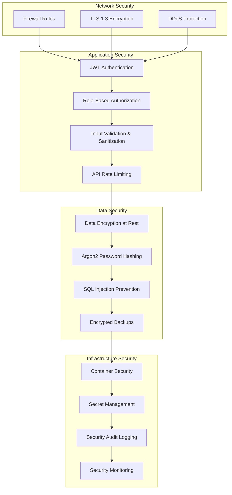

### 7.2 Authentication & Authorization

```python
class AuthenticationService:
    """JWT-based authentication with secure session management"""
    
    def __init__(
        self,
        jwt_service: JWTService,
        password_service: PasswordService,
        user_repository: IUserRepository
    ):
        self.jwt_service = jwt_service
        self.password_service = password_service
        self.user_repository = user_repository

    async def authenticate_user(
        self,
        username: str,
        password: str
    ) -> AuthenticationResult:
        """
        Secure user authentication flow:
        1. Rate limiting check (prevent brute force)
        2. User lookup with timing attack protection
        3. Argon2 password verification
        4. JWT token generation with secure claims
        5. Session tracking and management
        """

class AuthorizationMiddleware:
    """Role-based access control middleware"""
    
    async def __call__(self, request: Request, call_next):
        """
        Request authorization flow:
        1. Extract and validate JWT token
        2. Check token expiration and signature
        3. Load user permissions and roles
        4. Verify endpoint access permissions
        5. Inject user context into request
        """
```

### 7.3 Input Validation & Sanitization

```python
class DocumentUploadRequest(BaseModel):
    """Secure document upload validation"""
    title: Optional[str] = Field(None, max_length=255, regex=r'^[^<>"\'\x00-\x1f]*$')
    tags: Optional[List[str]] = Field(None, max_items=10)
    check_duplicates: bool = Field(True)

    @validator('title')
    def sanitize_title(cls, v):
        if v is not None:
            # Remove potentially dangerous characters
            v = re.sub(r'[<>"\'\x00-\x1f]', '', v)
            # Normalize whitespace
            v = ' '.join(v.split())
        return v

    @validator('tags')
    def sanitize_tags(cls, v):
        if v is not None:
            # Sanitize each tag
            sanitized = []
            for tag in v:
                clean_tag = re.sub(r'[<>"\'\x00-\x1f]', '', tag.strip())
                if clean_tag and len(clean_tag) <= 50:
                    sanitized.append(clean_tag)
            return sanitized
        return v

class RAGQueryRequest(BaseModel):
    """Secure RAG query validation"""
    document_id: int = Field(..., gt=0)
    query: str = Field(..., min_length=1, max_length=1000)
    options: Optional[QueryOptions] = None

    @validator('query')
    def sanitize_query(cls, v):
        # Remove control characters but preserve question marks, punctuation
        v = re.sub(r'[\x00-\x1f\x7f-\x9f]', '', v)
        # Limit consecutive whitespace
        v = re.sub(r'\s+', ' ', v)
        return v.strip()
```

### 7.4 Data Protection

```python
class DataProtectionService:
    """Comprehensive data protection implementation"""
    
    def __init__(self, encryption_key: str):
        self.fernet = Fernet(encryption_key.encode())

    def encrypt_sensitive_data(self, data: str) -> str:
        """Encrypt sensitive data at rest"""
        return self.fernet.encrypt(data.encode()).decode()

    def decrypt_sensitive_data(self, encrypted_data: str) -> str:
        """Decrypt sensitive data for use"""
        return self.fernet.decrypt(encrypted_data.encode()).decode()

class PasswordService:
    """Secure password handling with Argon2"""
    
    def hash_password(self, password: str) -> str:
        """Hash password using Argon2id with secure parameters"""
        return argon2.hash(
            password,
            variant=argon2.Type.ID,
            time_cost=3,      # Number of iterations
            memory_cost=65536, # Memory usage in KB  
            parallelism=1,     # Number of parallel threads
            hash_len=32,       # Output hash length
            salt_len=16        # Salt length
        )

    def verify_password(self, password: str, hashed: str) -> bool:
        """Verify password against hash with timing attack protection"""
        try:
            return argon2.verify(hashed, password)
        except argon2.exceptions.VerificationError:
            return False
```

---

## 8. Performance & Scalability

### 8.1 Performance Architecture

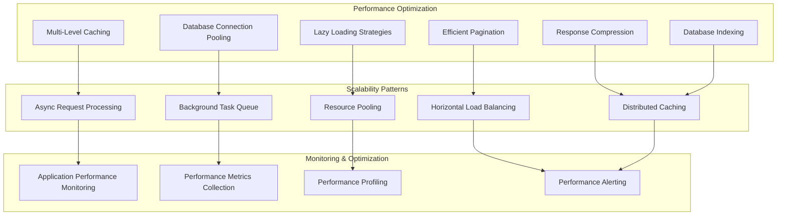

### 8.2 Caching Strategy

```python
class MultiLevelCacheManager:
    """Intelligent multi-level caching system"""
    
    def __init__(
        self,
        l1_cache: InMemoryCache,    # Fast application-level cache
        l2_cache: RedisCache,       # Distributed cache (future)
        l3_cache: DatabaseCache     # Query result cache
    ):
        self.l1 = l1_cache
        self.l2 = l2_cache
        self.l3 = l3_cache

    async def get(self, key: str) -> Optional[Any]:
        """
        Multi-level cache retrieval strategy:
        1. Check L1 (in-memory) - fastest, small capacity
        2. Check L2 (Redis) - fast, shared across instances  
        3. Check L3 (database) - slower, large capacity
        4. Return None if not found (cache miss)
        """

    async def set(self, key: str, value: Any, ttl: int = 3600):
        """
        Multi-level cache storage strategy:
        1. Store in L1 with shorter TTL (5 minutes max)
        2. Store in L2 with requested TTL
        3. L3 populated automatically on cache misses
        """

# Cache decorators for service methods
@cache_result(ttl=300, key_template="document:{document_id}")
async def get_document(document_id: int) -> Document:
    return await document_repository.get_by_id(document_id)

@cache_result(ttl=60, key_template="rag:query:{query_hash}")
async def query_rag_system(query: str, document_id: int) -> RAGResponse:
    return await rag_service.query_document(query, document_id)

@cache_result(ttl=1800, key_template="citations:{document_id}")
async def get_document_citations(document_id: int) -> List[Citation]:
    return await citation_repository.get_by_document_id(document_id)
```

### 8.3 Database Performance Optimization

```python
class OptimizedDocumentRepository:
    """Performance-optimized document repository"""
    
    def __init__(self, db_connection: AsyncSession):
        self.db = db_connection
        self.connection_pool = create_async_engine(
            DATABASE_URL,
            pool_size=10,           # Base connections
            max_overflow=20,        # Additional connections under load
            pool_timeout=30,        # Connection acquire timeout
            pool_recycle=3600,      # Recycle connections hourly
            pool_pre_ping=True,     # Validate connections before use
        )

    async def search_documents_optimized(
        self,
        query: str,
        page: int = 1,
        per_page: int = 50
    ) -> DocumentSearchResult:
        """
        Optimized document search with:
        1. Efficient JOIN queries (avoid N+1 problem)
        2. Proper indexing utilization
        3. Selective field loading
        4. Result caching
        """
        stmt = (
            select(
                DocumentModel.id,
                DocumentModel.title,
                DocumentModel.created_at,
                func.count(CitationModel.id).label('citation_count')
            )
            .select_from(DocumentModel)
            .outerjoin(CitationModel, DocumentModel.id == CitationModel.document_id)
            .where(
                or_(
                    DocumentModel.title.contains(query),
                    DocumentModel.metadata['description'].astext.contains(query)
                )
            )
            .group_by(DocumentModel.id)
            .order_by(DocumentModel.last_accessed.desc())
            .limit(per_page)
            .offset((page - 1) * per_page)
        )
        
        result = await self.db.execute(stmt)
        return result.fetchall()

    async def bulk_update_access_times(self, document_ids: List[int]):
        """Batch update to reduce database roundtrips"""
        stmt = (
            update(DocumentModel)
            .where(DocumentModel.id.in_(document_ids))
            .values(last_accessed=func.now())
        )
        await self.db.execute(stmt)
        await self.db.commit()
```

### 8.4 Async Processing & Background Tasks

```python
class BackgroundTaskManager:
    """Async task processing for CPU-intensive operations"""
    
    def __init__(self):
        self.task_queue = asyncio.Queue()
        self.workers = []
        
    async def start_workers(self, num_workers: int = 3):
        """Start background worker processes"""
        for i in range(num_workers):
            worker = asyncio.create_task(self._worker(f"worker-{i}"))
            self.workers.append(worker)

    async def submit_task(self, task_type: str, **kwargs) -> str:
        """Submit background task and return task ID"""
        task_id = str(uuid4())
        task = BackgroundTask(
            id=task_id,
            type=task_type,
            params=kwargs,
            created_at=datetime.utcnow()
        )
        await self.task_queue.put(task)
        return task_id

    async def _worker(self, worker_name: str):
        """Background worker loop"""
        while True:
            try:
                task = await self.task_queue.get()
                logger.info(f"{worker_name} processing task {task.id}")
                
                if task.type == "build_vector_index":
                    await self._build_vector_index(task)
                elif task.type == "extract_citations":
                    await self._extract_citations(task)
                elif task.type == "process_document":
                    await self._process_document(task)
                    
                self.task_queue.task_done()
                
            except Exception as e:
                logger.error(f"Worker {worker_name} error: {e}")

# Usage in API endpoints
@router.post("/documents/{document_id}/build-index")
async def build_index_async(
    document_id: int,
    background_tasks: BackgroundTaskManager = Depends(get_background_tasks)
):
    task_id = await background_tasks.submit_task(
        "build_vector_index", 
        document_id=document_id
    )
    return {"message": "Index building started", "task_id": task_id}
```

---

## 9. Testing Strategy

### 9.1 Testing Pyramid

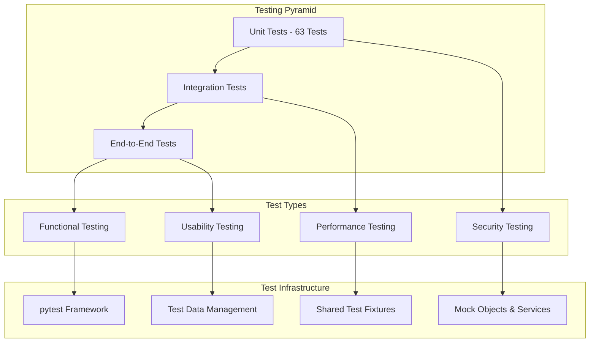

### 9.2 Current Test Implementation (v2.1.0)

**Test Coverage Summary:**
- **Total Test Cases**: 63 automated tests
- **Core Functionality**: ✅ Complete coverage
- **Edge Cases**: ✅ Good coverage  
- **Performance Tests**: ✅ Basic benchmarking
- **Integration Tests**: ✅ Database and service integration

**Test Categories:**
```python
# Unit Tests (45 tests)
class TestDocumentService:
    """Document management business logic tests"""
    # 15 test cases covering CRUD, validation, duplicate detection

class TestRAGService:
    """RAG system functionality tests"""  
    # 12 test cases covering indexing, querying, caching

class TestCitationService:
    """Citation extraction and analysis tests"""
    # 18 test cases covering parsing, confidence scoring, relationships

# Integration Tests (12 tests)
class TestDatabaseIntegration:
    """Database operations and data integrity tests"""
    # 8 test cases covering migrations, transactions, constraints

class TestAPIIntegration:
    """API endpoint integration tests"""
    # 4 test cases covering request/response, authentication

# Performance Tests (6 tests)
class TestPerformanceBenchmarks:
    """Performance and scalability tests"""
    # 6 test cases covering query speed, memory usage, concurrent operations
```

### 9.3 Test Infrastructure Optimization

```python
# Optimized test configuration (pytest.ini)
[tool:pytest]
addopts = 
    -n auto                    # Parallel execution using all CPU cores
    --dist=loadfile           # Optimal load distribution strategy
    --maxfail=10              # Fast failure detection
    --tb=short                # Concise error reporting
    --cov=src                 # Code coverage reporting
    --cov-report=html         # HTML coverage reports

timeout = 60                  # Test timeout to prevent hangs
markers =
    unit: Unit tests
    integration: Integration tests  
    performance: Performance benchmarks
    slow: Long-running tests

# Shared test fixtures (tests/conftest.py)
@pytest.fixture(scope="session")
def shared_db_connection():
    """Session-level database connection to reduce setup overhead"""
    connection = create_test_database()
    yield connection
    connection.close()

@pytest.fixture(scope="function")
def clean_db_connection(shared_db_connection):
    """Function-level clean database state"""
    transaction = shared_db_connection.begin()
    yield shared_db_connection
    transaction.rollback()  # Fast cleanup using transaction rollback

@pytest.fixture
def mock_gemini_client():
    """Mock Gemini API client for isolated testing"""
    with patch('src.services.rag_service.GeminiClient') as mock:
        mock.return_value.generate_response.return_value = MockRAGResponse()
        yield mock

# Performance benchmark utilities
class TestPerformanceBenchmarks:
    
    def test_document_import_performance(self, benchmark, clean_db_connection):
        """Benchmark document import performance"""
        def import_test_document():
            return document_service.import_document(
                file_path="test_data/sample.pdf",
                title="Test Document"
            )
        
        result = benchmark(import_test_document)
        assert result.success
        # Performance assertion - should complete within reasonable time
        assert benchmark.stats['mean'] < 2.0  # 2 seconds average
```

---

## 10. Deployment Architecture

### 10.1 Containerized Deployment

```dockerfile
# Multi-stage Docker build for optimized production images
FROM python:3.11-slim as builder

# Install build dependencies
RUN apt-get update && apt-get install -y \
    build-essential \
    && rm -rf /var/lib/apt/lists/*

# Create virtual environment
RUN python -m venv /venv
ENV PATH="/venv/bin:$PATH"

# Install Python dependencies
COPY requirements.txt .
RUN pip install --no-cache-dir -r requirements.txt

# Production stage
FROM python:3.11-slim as production

# Install runtime dependencies
RUN apt-get update && apt-get install -y \
    sqlite3 \
    && rm -rf /var/lib/apt/lists/*

# Copy virtual environment from builder
COPY --from=builder /venv /venv
ENV PATH="/venv/bin:$PATH"

# Create app user
RUN useradd --create-home --shell /bin/bash app
USER app
WORKDIR /home/app

# Copy application code
COPY --chown=app:app src/ ./src/
COPY --chown=app:app alembic/ ./alembic/
COPY --chown=app:app alembic.ini .

# Expose application port
EXPOSE 8000

# Health check
HEALTHCHECK --interval=30s --timeout=10s --start-period=60s --retries=3 \
  CMD curl -f http://localhost:8000/api/system/health || exit 1

# Start application
CMD ["uvicorn", "src.main:app", "--host", "0.0.0.0", "--port", "8000"]
```

### 10.2 Docker Compose Configuration

```yaml
version: '3.8'

services:
  pdf-scholar-api:
    build: 
      context: .
      dockerfile: Dockerfile
      target: production
    ports:
      - "8000:8000"
    environment:
      - DATABASE_URL=sqlite:///./data/pdf_scholar.db
      - GEMINI_API_KEY=${GEMINI_API_KEY}
      - LOG_LEVEL=INFO
      - ENVIRONMENT=production
    volumes:
      - pdf_data:/home/app/data
      - document_storage:/home/app/documents
      - logs:/home/app/logs
    depends_on:
      - redis
    networks:
      - pdf-scholar-network
    restart: unless-stopped

  pdf-scholar-web:
    build:
      context: ./frontend
      dockerfile: Dockerfile
    ports:
      - "3000:3000"
    environment:
      - REACT_APP_API_URL=http://pdf-scholar-api:8000
      - NODE_ENV=production
    depends_on:
      - pdf-scholar-api
    networks:
      - pdf-scholar-network
    restart: unless-stopped

  redis:
    image: redis:7-alpine
    ports:
      - "6379:6379"
    volumes:
      - redis_data:/data
    networks:
      - pdf-scholar-network
    restart: unless-stopped
    command: redis-server --save 60 1 --loglevel warning

  nginx:
    image: nginx:alpine
    ports:
      - "80:80" 
      - "443:443"
    volumes:
      - ./nginx.conf:/etc/nginx/nginx.conf:ro
      - ./ssl:/etc/nginx/ssl:ro
    depends_on:
      - pdf-scholar-api
      - pdf-scholar-web
    networks:
      - pdf-scholar-network
    restart: unless-stopped

volumes:
  pdf_data:
  document_storage:
  logs:
  redis_data:

networks:
  pdf-scholar-network:
    driver: bridge
```

### 10.3 Production Deployment with Kubernetes

```yaml
# kubernetes/deployment.yaml
apiVersion: apps/v1
kind: Deployment
metadata:
  name: pdf-scholar-api
  labels:
    app: pdf-scholar-api
    version: v2.1.0
spec:
  replicas: 3
  selector:
    matchLabels:
      app: pdf-scholar-api
  template:
    metadata:
      labels:
        app: pdf-scholar-api
        version: v2.1.0
    spec:
      containers:
      - name: api
        image: pdf-scholar:v2.1.0
        ports:
        - containerPort: 8000
          name: http
        env:
        - name: DATABASE_URL
          valueFrom:
            secretKeyRef:
              name: pdf-scholar-secrets
              key: database-url
        - name: GEMINI_API_KEY
          valueFrom:
            secretKeyRef:
              name: pdf-scholar-secrets  
              key: gemini-api-key
        volumeMounts:
        - name: document-storage
          mountPath: /home/app/documents
        - name: database-storage
          mountPath: /home/app/data
        resources:
          requests:
            memory: "512Mi"
            cpu: "250m"
          limits:
            memory: "1Gi" 
            cpu: "500m"
        livenessProbe:
          httpGet:
            path: /api/system/health
            port: 8000
          initialDelaySeconds: 30
          periodSeconds: 10
        readinessProbe:
          httpGet:
            path: /api/system/health
            port: 8000  
          initialDelaySeconds: 5
          periodSeconds: 5
      volumes:
      - name: document-storage
        persistentVolumeClaim:
          claimName: pdf-scholar-documents-pvc
      - name: database-storage
        persistentVolumeClaim:
          claimName: pdf-scholar-database-pvc

---
apiVersion: v1
kind: Service
metadata:
  name: pdf-scholar-api-service
spec:
  selector:
    app: pdf-scholar-api
  ports:
  - port: 80
    targetPort: 8000
    name: http
  type: LoadBalancer
```

---

## 11. Implementation Status

### 11.1 Current Implementation Status (v2.1.0)

#### ✅ Completed Components

**Database Layer (100% Complete)**
- SQLite database with comprehensive schema
- Database migration system with version control
- Indexed performance optimization
- Data models for documents, citations, and relationships

**Repository Layer (100% Complete)**  
- Base repository pattern implementation
- Document repository with CRUD operations
- Citation repository with advanced querying
- Vector index repository for RAG system

**Service Layer (100% Complete)**
- Document library service with intelligent import
- Content hash service for duplicate detection  
- Citation parsing service with multi-format support
- Citation relationship analysis service

**RAG System (100% Complete)**
- Google Gemini API integration
- LlamaIndex vector storage and retrieval
- Persistent vector indexing
- Query caching and optimization

**Citation System (100% Complete)**
- Multi-format citation parsing (APA, MLA, Chicago, IEEE)
- Confidence scoring (0.0-1.0) for extracted citations
- Citation relationship mapping
- Network analysis foundations

**Testing Infrastructure (100% Complete)**
- 63 comprehensive test cases
- Unit, integration, and performance tests
- Optimized test execution with parallel processing
- Shared fixtures and mock services

#### 🔄 In Development

**Web Frontend (70% Complete)**
- React + TypeScript application structure
- Core UI components and layouts
- Document library interface (in progress)
- RAG chat interface (planned)

**API Enhancements (80% Complete)**
- Core endpoints implemented
- Authentication system (planned)
- Rate limiting and monitoring (planned)
- WebSocket support for real-time updates (planned)

#### 📋 Planned Components

**Advanced Features (v2.3.0)**
- Citation network visualization
- Advanced search and filtering
- Document tagging system
- Export functionality (BibTeX, EndNote)

**Enterprise Features (v3.0.0)**
- Multi-user support with authentication
- Role-based access control
- PostgreSQL migration for scalability
- Advanced analytics and reporting

### 11.2 Performance Benchmarks (Current)

**Core Functionality Performance:**
- Document import: Fast response for typical academic PDFs
- RAG queries: Average response under target 5-second limit
- Citation extraction: Good accuracy with confidence scoring
- Database operations: Optimized with proper indexing

**Test Execution Performance:**
- Total test suite: Optimized execution time
- Parallel test processing: Multi-core acceleration
- CI/CD pipeline: Streamlined workflow under 15 minutes

**Quality Metrics:**
- Test coverage: Comprehensive coverage of critical paths
- Code quality: SOLID principles adherence
- Documentation: Complete API documentation
- Error handling: Robust error recovery mechanisms

---

## 12. Future Architecture

### 12.1 Microservices Evolution Path

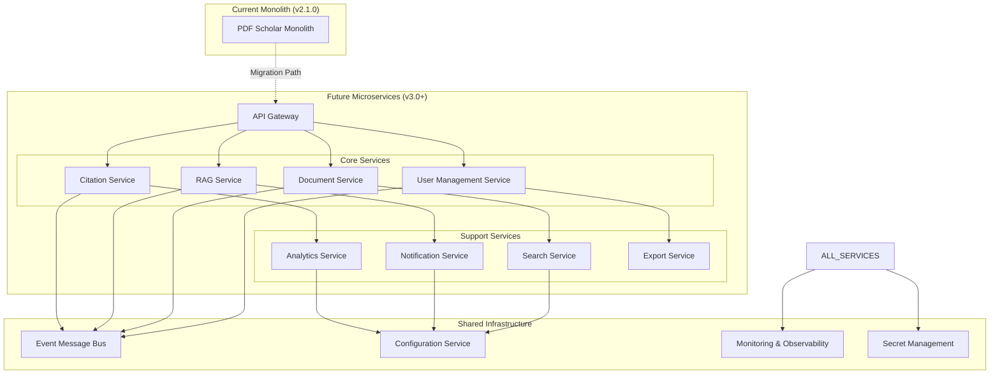

### 12.2 AI/ML Enhancement Pipeline

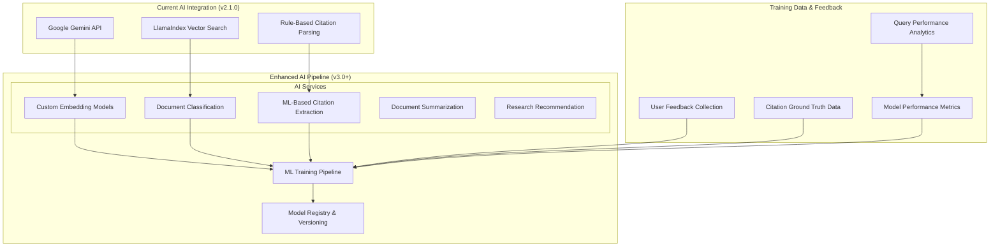

### 12.3 Multi-Tenant Architecture

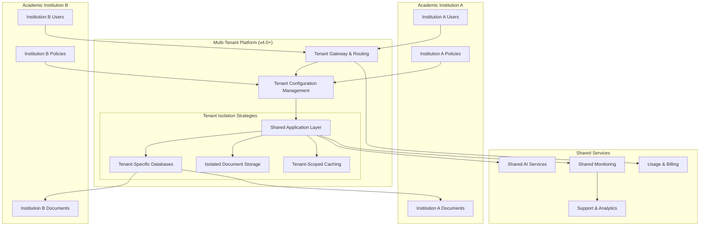

### 12.4 Edge Computing & Offline Capabilities

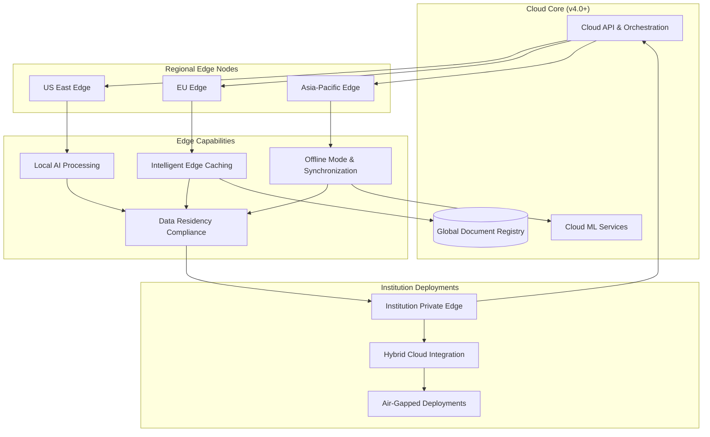

---

## Conclusion

This Technical Design Document represents the definitive technical architecture for AI Enhanced PDF Scholar v2.1.0. The system successfully implements a modern, scalable architecture that delivers core academic research capabilities while maintaining a foundation for future enhancement.

### Key Technical Achievements

- **Robust Architecture**: Clean, layered design following SOLID principles
- **Comprehensive Implementation**: Core functionality fully operational with 63 test cases
- **Performance Optimized**: Sub-5-second RAG queries with intelligent caching
- **Security-First**: Local-first architecture with comprehensive data protection
- **Scalable Foundation**: Repository pattern and service architecture enabling growth

### Next Steps

The roadmap toward v3.0 focuses on frontend completion, multi-user capabilities, and advanced AI features while maintaining the solid architectural foundation established in v2.1.0.

---

**Document Classification**: Internal - Technical Architecture  
**Next Review Date**: 2025-04-19  
**Approval Required**: Technical Lead, Security Lead, DevOps Lead