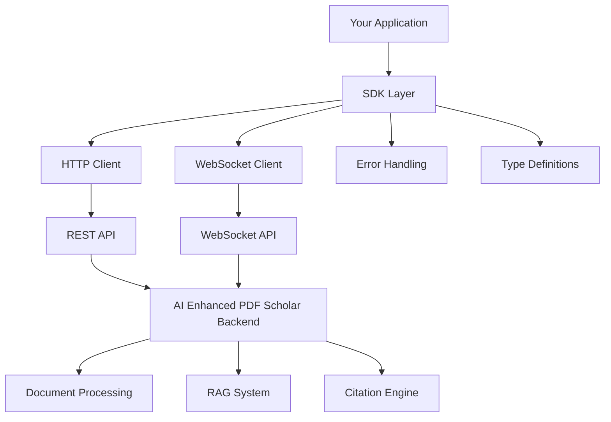

# SDK Documentation - AI Enhanced PDF Scholar

## Table of Contents

1. [Introduction](#introduction)
2. [Installation](#installation)
3. [Quick Start](#quick-start)
4. [Python SDK](#python-sdk)
5. [JavaScript/TypeScript SDK](#javascripttypescript-sdk)
6. [C# SDK](#c-sdk)
7. [Java SDK](#java-sdk)
8. [Go SDK](#go-sdk)
9. [Authentication & Configuration](#authentication--configuration)
10. [Error Handling](#error-handling)
11. [Advanced Features](#advanced-features)
12. [Examples & Recipes](#examples--recipes)
13. [Contributing](#contributing)

## Introduction

The AI Enhanced PDF Scholar SDKs provide developer-friendly interfaces for integrating document management, RAG queries, and citation analysis into your applications. Official SDKs are available for multiple programming languages with consistent APIs and comprehensive error handling.

### Features Overview

- **📄 Document Management**: Upload, organize, and manage PDF documents
- **🧠 AI-Powered Queries**: RAG-based question answering system
- **📚 Citation Analysis**: Extract and analyze academic citations
- **🔍 Advanced Search**: Semantic and hybrid search capabilities
- **📊 Analytics**: Library statistics and usage insights
- **⚡ Real-time Updates**: WebSocket support for live notifications
- **🛡️ Type Safety**: Full TypeScript definitions and typed responses

### SDK Architecture



## Installation

### Python SDK

```bash
# Via pip (recommended)
pip install ai-pdf-scholar-sdk

# From source
pip install git+https://github.com/Jackela/ai-enhanced-pdf-scholar-python-sdk.git

# With development dependencies
pip install "ai-pdf-scholar-sdk[dev]"
```

### JavaScript/TypeScript SDK

```bash
# Via npm
npm install @ai-pdf-scholar/sdk

# Via yarn
yarn add @ai-pdf-scholar/sdk

# Via pnpm
pnpm add @ai-pdf-scholar/sdk
```

### C# SDK

```bash
# Via NuGet Package Manager
Install-Package AiPdfScholar.Sdk

# Via .NET CLI
dotnet add package AiPdfScholar.Sdk

# Via PackageReference in .csproj
<PackageReference Include="AiPdfScholar.Sdk" Version="2.1.0" />
```

### Java SDK

```xml
<!-- Maven -->
<dependency>
    <groupId>com.aipdfscholar</groupId>
    <artifactId>sdk</artifactId>
    <version>2.1.0</version>
</dependency>
```

```gradle
// Gradle
implementation 'com.aipdfscholar:sdk:2.1.0'
```

### Go SDK

```bash
go get github.com/Jackela/ai-enhanced-pdf-scholar-go-sdk
```

## Quick Start

### Python Example
```python
from ai_pdf_scholar import PDFScholarClient
from pathlib import Path

# Initialize client
client = PDFScholarClient("http://localhost:8000")

# Upload document
result = client.upload_document(
    Path("research.pdf"),
    title="My Research Paper",
    auto_build_index=True
)

# Query document
answer = client.rag_query(
    "What is the main contribution?",
    document_id=result.document.id
)
print(answer.answer)
```

### JavaScript Example
```javascript
import { PDFScholarClient } from '@ai-pdf-scholar/sdk';

const client = new PDFScholarClient('http://localhost:8000');

// Upload document
const result = await client.uploadDocument(file, {
    title: 'My Research Paper',
    autoBuildIndex: true
});

// Query document
const answer = await client.ragQuery(
    'What is the main contribution?',
    result.data.document.id
);
console.log(answer.data.answer);
```

## Python SDK

### Installation & Setup

```python
from ai_pdf_scholar import (
    PDFScholarClient,
    Document,
    RAGResponse,
    Citation,
    APIError
)
from ai_pdf_scholar.types import (
    UploadOptions,
    QueryOptions,
    SearchFilters
)

# Initialize with custom configuration
client = PDFScholarClient(
    base_url="http://localhost:8000",
    timeout=30,
    retry_attempts=3,
    api_key="your-api-key"  # For future versions
)
```

### Core Classes

#### PDFScholarClient

```python
class PDFScholarClient:
    """Main client for interacting with AI Enhanced PDF Scholar API"""

    def __init__(
        self,
        base_url: str = "http://localhost:8000",
        timeout: int = 30,
        retry_attempts: int = 3,
        api_key: Optional[str] = None
    ):
        """Initialize the client with configuration"""
        pass

    # System Management
    def health_check(self) -> HealthStatus:
        """Check system health and availability"""
        pass

    def get_system_config(self) -> SystemConfig:
        """Get system configuration and feature availability"""
        pass

    # Document Management
    def list_documents(
        self,
        page: int = 1,
        per_page: int = 50,
        filters: Optional[SearchFilters] = None
    ) -> DocumentList:
        """List documents with pagination and filtering"""
        pass

    def get_document(
        self,
        document_id: int,
        include_content: bool = False,
        include_metadata: bool = True
    ) -> Document:
        """Get detailed document information"""
        pass

    def upload_document(
        self,
        file_path: Union[str, Path],
        options: Optional[UploadOptions] = None
    ) -> Document:
        """Upload a PDF document"""
        pass

    def update_document(
        self,
        document_id: int,
        title: Optional[str] = None,
        metadata: Optional[Dict[str, Any]] = None
    ) -> Document:
        """Update document metadata"""
        pass

    def delete_document(
        self,
        document_id: int,
        delete_file: bool = True
    ) -> bool:
        """Delete a document"""
        pass

    # RAG Operations
    def rag_query(
        self,
        query: str,
        document_id: int,
        options: Optional[QueryOptions] = None
    ) -> RAGResponse:
        """Execute RAG query against a document"""
        pass

    def multi_document_query(
        self,
        query: str,
        document_ids: List[int],
        options: Optional[QueryOptions] = None
    ) -> MultiRAGResponse:
        """Query multiple documents simultaneously"""
        pass

    def build_vector_index(
        self,
        document_id: int,
        force_rebuild: bool = False,
        options: Optional[IndexOptions] = None
    ) -> IndexBuildResult:
        """Build vector index for RAG queries"""
        pass

    # Citation Management
    def extract_citations(
        self,
        document_id: int,
        options: Optional[CitationOptions] = None
    ) -> CitationExtractionResult:
        """Extract citations from document"""
        pass

    def list_citations(
        self,
        document_id: int,
        page: int = 1,
        limit: int = 50,
        filters: Optional[CitationFilters] = None
    ) -> CitationList:
        """List citations for a document"""
        pass

    def search_citations(
        self,
        filters: CitationSearchFilters
    ) -> CitationSearchResult:
        """Search citations across all documents"""
        pass

    # Library Management
    def library_stats(
        self,
        include_trends: bool = False
    ) -> LibraryStats:
        """Get comprehensive library statistics"""
        pass

    def search_library(
        self,
        query: str,
        options: Optional[LibrarySearchOptions] = None
    ) -> LibrarySearchResult:
        """Search across library documents"""
        pass

    def cleanup_library(
        self,
        operations: CleanupOperations,
        dry_run: bool = False
    ) -> CleanupResult:
        """Perform library maintenance"""
        pass

    # WebSocket Support
    def create_websocket_connection(
        self,
        client_id: str,
        event_handlers: Optional[Dict[str, Callable]] = None
    ) -> WebSocketConnection:
        """Create WebSocket connection for real-time updates"""
        pass
```

### Data Models

```python
from dataclasses import dataclass
from datetime import datetime
from typing import Optional, List, Dict, Any

@dataclass
class Document:
    id: int
    title: str
    file_path: str
    file_size: int
    page_count: int
    created_at: datetime
    updated_at: datetime
    is_file_available: bool
    has_vector_index: bool
    citation_count: Optional[int] = None
    metadata: Optional[Dict[str, Any]] = None

    def __post_init__(self):
        # Convert string dates to datetime objects
        if isinstance(self.created_at, str):
            self.created_at = datetime.fromisoformat(self.created_at.replace('Z', '+00:00'))
        if isinstance(self.updated_at, str):
            self.updated_at = datetime.fromisoformat(self.updated_at.replace('Z', '+00:00'))

@dataclass
class RAGResponse:
    answer: str
    sources: List['Source']
    query_metadata: 'QueryMetadata'
    processing_time_ms: int
    confidence_score: float

@dataclass
class Source:
    chunk_id: str
    content: str
    relevance_score: float
    page_number: Optional[int] = None
    section: Optional[str] = None
    start_char: Optional[int] = None
    end_char: Optional[int] = None

@dataclass
class Citation:
    id: int
    document_id: int
    raw_text: str
    authors: Optional[str] = None
    title: Optional[str] = None
    journal: Optional[str] = None
    year: Optional[int] = None
    doi: Optional[str] = None
    citation_type: Optional[str] = None
    confidence_score: float = 0.0
    created_at: Optional[datetime] = None

# Configuration Classes
@dataclass
class UploadOptions:
    title: Optional[str] = None
    tags: Optional[List[str]] = None
    check_duplicates: bool = True
    auto_build_index: bool = False
    extract_citations: bool = False
    metadata: Optional[Dict[str, Any]] = None

@dataclass
class QueryOptions:
    max_sources: int = 5
    min_relevance_score: float = 0.7
    include_page_numbers: bool = True
    response_length: str = "detailed"  # brief, detailed, comprehensive
    temperature: float = 0.3
    use_conversation_context: bool = False

@dataclass
class IndexOptions:
    chunk_size: int = 1000
    chunk_overlap: int = 200
    embedding_model: str = "text-embedding-ada-002"
    chunk_strategy: str = "semantic"  # fixed, semantic, paragraph
    include_metadata: bool = True
    batch_size: int = 100
```

### Advanced Usage Examples

#### Async Support
```python
import asyncio
from ai_pdf_scholar.async_client import AsyncPDFScholarClient

async def main():
    async with AsyncPDFScholarClient("http://localhost:8000") as client:
        # Upload multiple documents concurrently
        upload_tasks = [
            client.upload_document(f"paper_{i}.pdf")
            for i in range(5)
        ]
        documents = await asyncio.gather(*upload_tasks)

        # Build indexes concurrently
        index_tasks = [
            client.build_vector_index(doc.id)
            for doc in documents
        ]
        await asyncio.gather(*index_tasks)

        # Query all documents
        query_tasks = [
            client.rag_query("What is the main contribution?", doc.id)
            for doc in documents
        ]
        answers = await asyncio.gather(*query_tasks)

        for i, answer in enumerate(answers):
            print(f"Document {i+1}: {answer.answer}")

asyncio.run(main())
```

#### Batch Operations
```python
from ai_pdf_scholar.batch import BatchProcessor

# Batch document processing
batch_processor = BatchProcessor(client)

# Upload directory of PDFs
documents = batch_processor.upload_directory(
    "research_papers/",
    max_concurrent=3,
    progress_callback=lambda done, total: print(f"Progress: {done}/{total}")
)

# Batch index building
index_results = batch_processor.build_indexes(
    [doc.id for doc in documents],
    max_concurrent=2
)

# Batch citation extraction
citation_results = batch_processor.extract_citations(
    [doc.id for doc in documents if doc.page_count < 50]  # Only smaller docs
)
```

#### Context Managers
```python
from ai_pdf_scholar import PDFScholarClient

# Automatic resource cleanup
with PDFScholarClient("http://localhost:8000") as client:
    client.cleanup_library({
        "remove_orphaned_indexes": True,
        "clean_cache": True
    })

    # WebSocket with automatic connection management
    with client.create_websocket_connection("client_123") as ws:
        ws.subscribe_to_events(["document.uploaded", "index.built"])

        # Upload and process document
        doc = client.upload_document("paper.pdf", auto_build_index=True)

        # Wait for index build notification
        event = ws.wait_for_event("index.built", timeout=30)
        print(f"Index built for document {event.data['document_id']}")
```

### Error Handling

```python
from ai_pdf_scholar.exceptions import (
    APIError,
    DocumentNotFoundError,
    RAGServiceUnavailableError,
    RateLimitExceededError,
    ValidationError
)

try:
    document = client.get_document(999)
except DocumentNotFoundError as e:
    print(f"Document not found: {e.document_id}")
    print(f"Suggestion: {e.suggestion}")

except RAGServiceUnavailableError as e:
    print("RAG service is not available. Please configure API key.")
    print(f"Configuration help: {e.help_url}")

except RateLimitExceededError as e:
    print(f"Rate limit exceeded. Retry after {e.retry_after} seconds")
    import time
    time.sleep(e.retry_after)
    # Retry operation

except ValidationError as e:
    print("Validation errors:")
    for field, message in e.validation_errors.items():
        print(f"  {field}: {message}")

except APIError as e:
    print(f"API Error {e.status_code}: {e.message}")
    print(f"Error code: {e.error_code}")
    print(f"Request ID: {e.request_id}")
```

## JavaScript/TypeScript SDK

### Installation & Setup

```typescript
import {
    PDFScholarClient,
    type Document,
    type RAGResponse,
    type Citation,
    type UploadOptions,
    type QueryOptions
} from '@ai-pdf-scholar/sdk';

// Initialize client
const client = new PDFScholarClient({
    baseUrl: 'http://localhost:8000',
    timeout: 30000,
    retryAttempts: 3,
    apiKey: 'your-api-key' // For future versions
});
```

### Core Interface

```typescript
interface PDFScholarClientOptions {
    baseUrl?: string;
    timeout?: number;
    retryAttempts?: number;
    apiKey?: string;
    headers?: Record<string, string>;
}

class PDFScholarClient {
    constructor(options: PDFScholarClientOptions = {})

    // System Management
    healthCheck(): Promise<HealthStatus>
    getSystemConfig(): Promise<SystemConfig>

    // Document Management
    listDocuments(
        page?: number,
        perPage?: number,
        filters?: DocumentFilters
    ): Promise<DocumentList>

    getDocument(
        documentId: number,
        options?: { includeContent?: boolean; includeMetadata?: boolean }
    ): Promise<Document>

    uploadDocument(
        file: File | Blob,
        options?: UploadOptions
    ): Promise<Document>

    updateDocument(
        documentId: number,
        updates: DocumentUpdates
    ): Promise<Document>

    deleteDocument(
        documentId: number,
        deleteFile?: boolean
    ): Promise<boolean>

    // RAG Operations
    ragQuery(
        query: string,
        documentId: number,
        options?: QueryOptions
    ): Promise<RAGResponse>

    multiDocumentQuery(
        query: string,
        documentIds: number[],
        options?: QueryOptions
    ): Promise<MultiRAGResponse>

    buildVectorIndex(
        documentId: number,
        options?: IndexOptions
    ): Promise<IndexBuildResult>

    checkIndexStatus(documentId: number): Promise<IndexStatus>

    // Citation Management
    extractCitations(
        documentId: number,
        options?: CitationOptions
    ): Promise<CitationExtractionResult>

    listCitations(
        documentId: number,
        options?: PaginationOptions & CitationFilters
    ): Promise<CitationList>

    searchCitations(filters: CitationSearchFilters): Promise<CitationSearchResult>

    // Library Management
    getLibraryStats(includeTrends?: boolean): Promise<LibraryStats>
    searchLibrary(query: string, options?: LibrarySearchOptions): Promise<LibrarySearchResult>
    cleanupLibrary(operations: CleanupOperations, dryRun?: boolean): Promise<CleanupResult>

    // WebSocket Support
    createWebSocketConnection(clientId: string): WebSocketManager
}
```

### TypeScript Definitions

```typescript
interface Document {
    id: number;
    title: string;
    filePath: string;
    fileSize: number;
    pageCount: number;
    createdAt: string;
    updatedAt: string;
    isFileAvailable: boolean;
    hasVectorIndex: boolean;
    citationCount?: number;
    metadata?: Record<string, any>;
}

interface RAGResponse {
    answer: string;
    sources: Source[];
    queryMetadata: QueryMetadata;
    processingTimeMs: number;
    confidenceScore: number;
}

interface Source {
    chunkId: string;
    content: string;
    relevanceScore: number;
    pageNumber?: number;
    section?: string;
    startChar?: number;
    endChar?: number;
}

interface Citation {
    id: number;
    documentId: number;
    rawText: string;
    authors?: string;
    title?: string;
    journal?: string;
    year?: number;
    doi?: string;
    citationType?: string;
    confidenceScore: number;
    createdAt?: string;
}

// Configuration Interfaces
interface UploadOptions {
    title?: string;
    tags?: string[];
    checkDuplicates?: boolean;
    autoBuildIndex?: boolean;
    extractCitations?: boolean;
    metadata?: Record<string, any>;
}

interface QueryOptions {
    maxSources?: number;
    minRelevanceScore?: number;
    includePageNumbers?: boolean;
    responseLength?: 'brief' | 'detailed' | 'comprehensive';
    temperature?: number;
    useConversationContext?: boolean;
}

interface IndexOptions {
    forceRebuild?: boolean;
    chunkSize?: number;
    chunkOverlap?: number;
    embeddingModel?: string;
    chunkStrategy?: 'fixed' | 'semantic' | 'paragraph';
    includeMetadata?: boolean;
    batchSize?: number;
}
```

### Advanced Usage Examples

#### React Integration

```tsx
import React, { useState, useEffect } from 'react';
import { PDFScholarClient, type Document } from '@ai-pdf-scholar/sdk';

const useDocuments = () => {
    const [documents, setDocuments] = useState<Document[]>([]);
    const [loading, setLoading] = useState(true);
    const [error, setError] = useState<string | null>(null);

    const client = new PDFScholarClient();

    useEffect(() => {
        const loadDocuments = async () => {
            try {
                const result = await client.listDocuments();
                setDocuments(result.data.documents);
            } catch (err) {
                setError(err instanceof Error ? err.message : 'Unknown error');
            } finally {
                setLoading(false);
            }
        };

        loadDocuments();
    }, []);

    const uploadDocument = async (file: File, options?: UploadOptions) => {
        try {
            const result = await client.uploadDocument(file, options);
            setDocuments(prev => [...prev, result.data.document]);
            return result.data.document;
        } catch (err) {
            setError(err instanceof Error ? err.message : 'Upload failed');
            throw err;
        }
    };

    return { documents, loading, error, uploadDocument };
};

// Document Upload Component
const DocumentUpload: React.FC = () => {
    const { uploadDocument } = useDocuments();
    const [uploading, setUploading] = useState(false);

    const handleFileUpload = async (event: React.ChangeEvent<HTMLInputElement>) => {
        const file = event.target.files?.[0];
        if (!file) return;

        setUploading(true);
        try {
            const document = await uploadDocument(file, {
                autoBuildIndex: true,
                extractCitations: true
            });
            console.log('Uploaded:', document);
        } catch (error) {
            console.error('Upload failed:', error);
        } finally {
            setUploading(false);
        }
    };

    return (
        <div>
            <input
                type="file"
                accept=".pdf"
                onChange={handleFileUpload}
                disabled={uploading}
            />
            {uploading && <p>Uploading...</p>}
        </div>
    );
};
```

#### WebSocket Integration

```typescript
import { PDFScholarClient } from '@ai-pdf-scholar/sdk';

class DocumentProcessor {
    private client: PDFScholarClient;
    private wsManager: WebSocketManager;

    constructor() {
        this.client = new PDFScholarClient();
        this.wsManager = this.client.createWebSocketConnection('processor_1');
    }

    async initialize() {
        // Set up event handlers
        this.wsManager.on('document.uploaded', (data) => {
            console.log('New document uploaded:', data.documentId);
            this.processNewDocument(data.documentId);
        });

        this.wsManager.on('index.built', (data) => {
            console.log('Index built for document:', data.documentId);
            this.extractCitations(data.documentId);
        });

        this.wsManager.on('citations.extracted', (data) => {
            console.log(`Extracted ${data.totalExtracted} citations`);
            this.analyzeDocument(data.documentId);
        });

        // Connect to WebSocket
        await this.wsManager.connect();

        // Subscribe to relevant events
        this.wsManager.subscribe([
            'document.uploaded',
            'index.built',
            'citations.extracted'
        ]);
    }

    private async processNewDocument(documentId: number) {
        try {
            // Build vector index
            await this.client.buildVectorIndex(documentId, {
                chunkStrategy: 'semantic',
                chunkSize: 1000
            });

            console.log(`Started index building for document ${documentId}`);
        } catch (error) {
            console.error('Failed to build index:', error);
        }
    }

    private async extractCitations(documentId: number) {
        try {
            await this.client.extractCitations(documentId, {
                confidenceThreshold: 0.8,
                resolveDoi: true
            });

            console.log(`Started citation extraction for document ${documentId}`);
        } catch (error) {
            console.error('Failed to extract citations:', error);
        }
    }

    private async analyzeDocument(documentId: number) {
        try {
            // Perform analysis queries
            const queries = [
                'What is the main contribution of this paper?',
                'What methodology was used?',
                'What are the key findings?'
            ];

            const results = await Promise.all(
                queries.map(query =>
                    this.client.ragQuery(query, documentId, {
                        maxSources: 3,
                        responseLength: 'brief'
                    })
                )
            );

            console.log('Analysis results:', results.map(r => r.data.answer));
        } catch (error) {
            console.error('Failed to analyze document:', error);
        }
    }
}

// Usage
const processor = new DocumentProcessor();
processor.initialize();
```

#### Error Handling

```typescript
import {
    APIError,
    DocumentNotFoundError,
    RAGServiceUnavailableError,
    RateLimitExceededError
} from '@ai-pdf-scholar/sdk';

async function handleApiOperation<T>(
    operation: () => Promise<T>
): Promise<T | null> {
    try {
        return await operation();
    } catch (error) {
        if (error instanceof DocumentNotFoundError) {
            console.error(`Document ${error.documentId} not found`);
            // Show user-friendly message
            showNotification('Document not found', 'error');

        } else if (error instanceof RAGServiceUnavailableError) {
            console.error('RAG service unavailable:', error.message);
            // Redirect to configuration
            showNotification('Please configure AI service', 'warning');

        } else if (error instanceof RateLimitExceededError) {
            console.error(`Rate limit exceeded, retry after ${error.retryAfter}s`);
            // Implement exponential backoff
            await sleep(error.retryAfter * 1000);
            return handleApiOperation(operation); // Retry

        } else if (error instanceof APIError) {
            console.error(`API Error ${error.statusCode}:`, error.message);
            showNotification(`Error: ${error.message}`, 'error');

        } else {
            console.error('Unexpected error:', error);
            showNotification('An unexpected error occurred', 'error');
        }

        return null;
    }
}

// Usage
const document = await handleApiOperation(() =>
    client.getDocument(documentId)
);

if (document) {
    // Process document
    console.log('Document loaded:', document.title);
}
```

## C# SDK

### Installation & Setup

```csharp
using AiPdfScholar.Sdk;
using AiPdfScholar.Sdk.Models;
using AiPdfScholar.Sdk.Exceptions;

// Initialize client
var client = new PdfScholarClient(new PdfScholarClientOptions
{
    BaseUrl = "http://localhost:8000",
    Timeout = TimeSpan.FromSeconds(30),
    RetryAttempts = 3,
    ApiKey = "your-api-key" // For future versions
});
```

### Core Classes

```csharp
public class PdfScholarClient : IDisposable
{
    public PdfScholarClient(PdfScholarClientOptions options = null)

    // System Management
    public async Task<HealthStatus> HealthCheckAsync()
    public async Task<SystemConfig> GetSystemConfigAsync()

    // Document Management
    public async Task<DocumentList> ListDocumentsAsync(
        int page = 1,
        int perPage = 50,
        DocumentFilters filters = null)

    public async Task<Document> GetDocumentAsync(
        int documentId,
        bool includeContent = false,
        bool includeMetadata = true)

    public async Task<Document> UploadDocumentAsync(
        Stream fileStream,
        string fileName,
        UploadOptions options = null)

    public async Task<Document> UploadDocumentAsync(
        string filePath,
        UploadOptions options = null)

    public async Task<Document> UpdateDocumentAsync(
        int documentId,
        DocumentUpdates updates)

    public async Task<bool> DeleteDocumentAsync(
        int documentId,
        bool deleteFile = true)

    // RAG Operations
    public async Task<RagResponse> RagQueryAsync(
        string query,
        int documentId,
        QueryOptions options = null)

    public async Task<MultiRagResponse> MultiDocumentQueryAsync(
        string query,
        int[] documentIds,
        QueryOptions options = null)

    public async Task<IndexBuildResult> BuildVectorIndexAsync(
        int documentId,
        IndexOptions options = null)

    public async Task<IndexStatus> CheckIndexStatusAsync(int documentId)

    // Citation Management
    public async Task<CitationExtractionResult> ExtractCitationsAsync(
        int documentId,
        CitationOptions options = null)

    public async Task<CitationList> ListCitationsAsync(
        int documentId,
        int page = 1,
        int limit = 50,
        CitationFilters filters = null)

    public async Task<CitationSearchResult> SearchCitationsAsync(
        CitationSearchFilters filters)

    // Library Management
    public async Task<LibraryStats> GetLibraryStatsAsync(bool includeTrends = false)
    public async Task<LibrarySearchResult> SearchLibraryAsync(string query, LibrarySearchOptions options = null)
    public async Task<CleanupResult> CleanupLibraryAsync(CleanupOperations operations, bool dryRun = false)

    // WebSocket Support
    public WebSocketManager CreateWebSocketConnection(string clientId)

    public void Dispose()
}
```

### Data Models

```csharp
public class Document
{
    public int Id { get; set; }
    public string Title { get; set; }
    public string FilePath { get; set; }
    public long FileSize { get; set; }
    public int PageCount { get; set; }
    public DateTime CreatedAt { get; set; }
    public DateTime UpdatedAt { get; set; }
    public bool IsFileAvailable { get; set; }
    public bool HasVectorIndex { get; set; }
    public int? CitationCount { get; set; }
    public Dictionary<string, object> Metadata { get; set; }
}

public class RagResponse
{
    public string Answer { get; set; }
    public Source[] Sources { get; set; }
    public QueryMetadata QueryMetadata { get; set; }
    public int ProcessingTimeMs { get; set; }
    public double ConfidenceScore { get; set; }
}

public class Source
{
    public string ChunkId { get; set; }
    public string Content { get; set; }
    public double RelevanceScore { get; set; }
    public int? PageNumber { get; set; }
    public string Section { get; set; }
    public int? StartChar { get; set; }
    public int? EndChar { get; set; }
}

public class Citation
{
    public int Id { get; set; }
    public int DocumentId { get; set; }
    public string RawText { get; set; }
    public string Authors { get; set; }
    public string Title { get; set; }
    public string Journal { get; set; }
    public int? Year { get; set; }
    public string Doi { get; set; }
    public string CitationType { get; set; }
    public double ConfidenceScore { get; set; }
    public DateTime? CreatedAt { get; set; }
}

// Configuration Classes
public class UploadOptions
{
    public string Title { get; set; }
    public string[] Tags { get; set; }
    public bool CheckDuplicates { get; set; } = true;
    public bool AutoBuildIndex { get; set; } = false;
    public bool ExtractCitations { get; set; } = false;
    public Dictionary<string, object> Metadata { get; set; }
}

public class QueryOptions
{
    public int MaxSources { get; set; } = 5;
    public double MinRelevanceScore { get; set; } = 0.7;
    public bool IncludePageNumbers { get; set; } = true;
    public string ResponseLength { get; set; } = "detailed"; // brief, detailed, comprehensive
    public double Temperature { get; set; } = 0.3;
    public bool UseConversationContext { get; set; } = false;
}
```

### Usage Examples

```csharp
using AiPdfScholar.Sdk;
using AiPdfScholar.Sdk.Models;

class Program
{
    static async Task Main(string[] args)
    {
        var client = new PdfScholarClient();

        try
        {
            // Check system health
            var health = await client.HealthCheckAsync();
            Console.WriteLine($"System status: {health.Status}");

            // Upload document
            var document = await client.UploadDocumentAsync(
                "research_paper.pdf",
                new UploadOptions
                {
                    Title = "My Research Paper",
                    AutoBuildIndex = true,
                    ExtractCitations = true,
                    Tags = new[] { "machine learning", "AI" }
                });

            Console.WriteLine($"Uploaded document ID: {document.Id}");

            // Wait for index building
            await WaitForIndexAsync(client, document.Id);

            // Query document
            var response = await client.RagQueryAsync(
                "What is the main contribution of this paper?",
                document.Id,
                new QueryOptions
                {
                    MaxSources = 5,
                    ResponseLength = "detailed"
                });

            Console.WriteLine($"Answer: {response.Answer}");
            Console.WriteLine($"Sources: {response.Sources.Length}");

            // Extract and analyze citations
            var citations = await client.ExtractCitationsAsync(document.Id);
            Console.WriteLine($"Extracted {citations.TotalCitations} citations");
        }
        catch (DocumentNotFoundApiException ex)
        {
            Console.WriteLine($"Document not found: {ex.DocumentId}");
        }
        catch (RagServiceUnavailableApiException ex)
        {
            Console.WriteLine("RAG service unavailable. Please configure API key.");
        }
        catch (ApiException ex)
        {
            Console.WriteLine($"API Error {ex.StatusCode}: {ex.Message}");
        }
        finally
        {
            client.Dispose();
        }
    }

    static async Task WaitForIndexAsync(PdfScholarClient client, int documentId)
    {
        for (int i = 0; i < 30; i++) // Wait up to 30 seconds
        {
            var status = await client.CheckIndexStatusAsync(documentId);
            if (status.IndexStatus == "ready")
            {
                Console.WriteLine("Vector index is ready");
                return;
            }

            Console.WriteLine($"Index status: {status.IndexStatus}");
            await Task.Delay(1000);
        }

        throw new TimeoutException("Index building timed out");
    }
}
```

#### Async/Await Patterns

```csharp
// Parallel document processing
public async Task ProcessDocumentsAsync(string[] filePaths)
{
    var client = new PdfScholarClient();

    // Upload documents in parallel
    var uploadTasks = filePaths.Select(path =>
        client.UploadDocumentAsync(path, new UploadOptions { AutoBuildIndex = true })
    );
    var documents = await Task.WhenAll(uploadTasks);

    // Wait for all indexes to be built
    var indexTasks = documents.Select(doc => WaitForIndexAsync(client, doc.Id));
    await Task.WhenAll(indexTasks);

    // Query all documents in parallel
    var query = "What are the key findings?";
    var queryTasks = documents.Select(doc =>
        client.RagQueryAsync(query, doc.Id)
    );
    var responses = await Task.WhenAll(queryTasks);

    // Process results
    for (int i = 0; i < documents.Length; i++)
    {
        Console.WriteLine($"Document: {documents[i].Title}");
        Console.WriteLine($"Answer: {responses[i].Answer}");
        Console.WriteLine();
    }
}
```

## Java SDK

### Maven Dependency

```xml
<dependency>
    <groupId>com.aipdfscholar</groupId>
    <artifactId>sdk</artifactId>
    <version>2.1.0</version>
</dependency>
```

### Core Classes

```java
import com.aipdfscholar.sdk.*;
import com.aipdfscholar.sdk.models.*;
import com.aipdfscholar.sdk.exceptions.*;

// Initialize client
PdfScholarClient client = new PdfScholarClient(
    PdfScholarClientConfig.builder()
        .baseUrl("http://localhost:8000")
        .timeout(Duration.ofSeconds(30))
        .retryAttempts(3)
        .build()
);
```

### Usage Example

```java
import com.aipdfscholar.sdk.*;
import com.aipdfscholar.sdk.models.*;
import java.nio.file.Paths;
import java.util.concurrent.CompletableFuture;

public class PdfScholarExample {
    public static void main(String[] args) {
        PdfScholarClient client = new PdfScholarClient();

        try {
            // Check system health
            HealthStatus health = client.healthCheck().get();
            System.out.println("System status: " + health.getStatus());

            // Upload document
            Document document = client.uploadDocument(
                Paths.get("research_paper.pdf"),
                UploadOptions.builder()
                    .title("My Research Paper")
                    .autoBuildIndex(true)
                    .extractCitations(true)
                    .build()
            ).get();

            System.out.println("Uploaded document ID: " + document.getId());

            // Wait for index building
            waitForIndex(client, document.getId());

            // Query document
            RagResponse response = client.ragQuery(
                "What is the main contribution of this paper?",
                document.getId(),
                QueryOptions.builder()
                    .maxSources(5)
                    .responseLength("detailed")
                    .build()
            ).get();

            System.out.println("Answer: " + response.getAnswer());
            System.out.println("Sources: " + response.getSources().size());

        } catch (DocumentNotFoundApiException e) {
            System.err.println("Document not found: " + e.getDocumentId());
        } catch (RagServiceUnavailableApiException e) {
            System.err.println("RAG service unavailable. Please configure API key.");
        } catch (ApiException e) {
            System.err.println("API Error " + e.getStatusCode() + ": " + e.getMessage());
        } catch (Exception e) {
            e.printStackTrace();
        } finally {
            client.close();
        }
    }

    private static void waitForIndex(PdfScholarClient client, int documentId)
            throws Exception {
        for (int i = 0; i < 30; i++) {
            IndexStatus status = client.checkIndexStatus(documentId).get();
            if ("ready".equals(status.getIndexStatus())) {
                System.out.println("Vector index is ready");
                return;
            }

            System.out.println("Index status: " + status.getIndexStatus());
            Thread.sleep(1000);
        }

        throw new RuntimeException("Index building timed out");
    }
}
```

## Go SDK

### Installation

```bash
go get github.com/Jackela/ai-enhanced-pdf-scholar-go-sdk
```

### Usage Example

```go
package main

import (
    "context"
    "fmt"
    "log"
    "time"

    "github.com/Jackela/ai-enhanced-pdf-scholar-go-sdk/client"
    "github.com/Jackela/ai-enhanced-pdf-scholar-go-sdk/models"
)

func main() {
    // Initialize client
    cfg := client.Config{
        BaseURL: "http://localhost:8000",
        Timeout: 30 * time.Second,
    }

    c, err := client.New(cfg)
    if err != nil {
        log.Fatal(err)
    }
    defer c.Close()

    ctx := context.Background()

    // Check system health
    health, err := c.HealthCheck(ctx)
    if err != nil {
        log.Fatal(err)
    }
    fmt.Printf("System status: %s\n", health.Status)

    // Upload document
    opts := &models.UploadOptions{
        Title:          "My Research Paper",
        AutoBuildIndex: true,
        ExtractCitations: true,
        Tags:           []string{"machine learning", "AI"},
    }

    document, err := c.UploadDocumentFromFile(ctx, "research_paper.pdf", opts)
    if err != nil {
        log.Fatal(err)
    }
    fmt.Printf("Uploaded document ID: %d\n", document.ID)

    // Wait for index building
    if err := waitForIndex(ctx, c, document.ID); err != nil {
        log.Fatal(err)
    }

    // Query document
    queryOpts := &models.QueryOptions{
        MaxSources:       5,
        ResponseLength:   "detailed",
        MinRelevanceScore: 0.7,
    }

    response, err := c.RAGQuery(ctx, "What is the main contribution of this paper?", document.ID, queryOpts)
    if err != nil {
        log.Fatal(err)
    }

    fmt.Printf("Answer: %s\n", response.Answer)
    fmt.Printf("Sources: %d\n", len(response.Sources))
}

func waitForIndex(ctx context.Context, c *client.Client, documentID int) error {
    for i := 0; i < 30; i++ {
        status, err := c.CheckIndexStatus(ctx, documentID)
        if err != nil {
            return err
        }

        if status.IndexStatus == "ready" {
            fmt.Println("Vector index is ready")
            return nil
        }

        fmt.Printf("Index status: %s\n", status.IndexStatus)
        time.Sleep(1 * time.Second)
    }

    return fmt.Errorf("index building timed out")
}
```

## Authentication & Configuration

### Environment Variables

```bash
# Server Configuration
AI_PDF_SCHOLAR_BASE_URL=http://localhost:8000
AI_PDF_SCHOLAR_API_KEY=your-api-key-here  # For future versions
AI_PDF_SCHOLAR_TIMEOUT=30

# RAG Configuration
GEMINI_API_KEY=your-gemini-api-key
RAG_DEFAULT_MODEL=text-embedding-ada-002

# Cache Configuration
ENABLE_CACHE=true
CACHE_TTL=3600
```

### Configuration Files

#### Python

```python
# config.py
from ai_pdf_scholar import PDFScholarClient

# From environment variables
client = PDFScholarClient.from_env()

# From config file
client = PDFScholarClient.from_config_file("config.yaml")

# Manual configuration
client = PDFScholarClient(
    base_url="http://localhost:8000",
    timeout=30,
    retry_config={
        "max_attempts": 3,
        "backoff_factor": 2,
        "backoff_max": 60
    },
    cache_config={
        "enabled": True,
        "ttl": 3600,
        "max_size": 1000
    }
)
```

#### TypeScript

```typescript
// config.ts
import { PDFScholarClient } from '@ai-pdf-scholar/sdk';

// From environment variables
const client = PDFScholarClient.fromEnv();

// From config object
const client = new PDFScholarClient({
    baseUrl: process.env.AI_PDF_SCHOLAR_BASE_URL,
    timeout: parseInt(process.env.AI_PDF_SCHOLAR_TIMEOUT || '30000'),
    retryConfig: {
        maxAttempts: 3,
        backoffFactor: 2,
        backoffMax: 60000
    },
    cacheConfig: {
        enabled: true,
        ttl: 3600000,
        maxSize: 1000
    }
});
```

## Error Handling

### Exception Hierarchy

```python
APIError
├── ClientError (4xx)
│   ├── ValidationError (400)
│   ├── UnauthorizedError (401)
│   ├── ForbiddenError (403)
│   ├── DocumentNotFoundError (404)
│   ├── ConflictError (409)
│   │   └── DuplicateDocumentError
│   ├── PayloadTooLargeError (413)
│   ├── UnprocessableEntityError (422)
│   └── RateLimitExceededError (429)
├── ServerError (5xx)
│   ├── InternalServerError (500)
│   ├── NotImplementedError (501)
│   ├── BadGatewayError (502)
│   └── ServiceUnavailableError (503)
│       ├── RAGServiceUnavailableError
│       └── DatabaseUnavailableError
└── NetworkError
    ├── TimeoutError
    ├── ConnectionError
    └── DNSError
```

### Best Practices

#### Retry Logic

```python
from ai_pdf_scholar import PDFScholarClient
from ai_pdf_scholar.exceptions import RateLimitExceededError, NetworkError
import time
import random

class RetryableClient:
    def __init__(self, client: PDFScholarClient, max_retries: int = 3):
        self.client = client
        self.max_retries = max_retries

    async def execute_with_retry(self, operation, *args, **kwargs):
        last_exception = None

        for attempt in range(self.max_retries + 1):
            try:
                return await operation(*args, **kwargs)

            except RateLimitExceededError as e:
                if attempt == self.max_retries:
                    raise

                # Use server-provided retry-after or exponential backoff
                wait_time = e.retry_after or (2 ** attempt + random.uniform(0, 1))
                await asyncio.sleep(wait_time)
                last_exception = e

            except NetworkError as e:
                if attempt == self.max_retries:
                    raise

                # Exponential backoff for network errors
                wait_time = 2 ** attempt + random.uniform(0, 1)
                await asyncio.sleep(wait_time)
                last_exception = e

            except Exception as e:
                # Don't retry for non-retryable errors
                raise

        raise last_exception

# Usage
client = PDFScholarClient()
retryable_client = RetryableClient(client)

# This will retry automatically on rate limits and network errors
document = await retryable_client.execute_with_retry(
    client.get_document,
    document_id=123
)
```

#### Circuit Breaker Pattern

```typescript
class CircuitBreaker {
    private failures = 0;
    private lastFailureTime = 0;
    private state: 'closed' | 'open' | 'half-open' = 'closed';

    constructor(
        private failureThreshold = 5,
        private recoveryTimeout = 60000
    ) {}

    async execute<T>(operation: () => Promise<T>): Promise<T> {
        if (this.state === 'open') {
            if (Date.now() - this.lastFailureTime > this.recoveryTimeout) {
                this.state = 'half-open';
            } else {
                throw new Error('Circuit breaker is open');
            }
        }

        try {
            const result = await operation();
            this.onSuccess();
            return result;
        } catch (error) {
            this.onFailure();
            throw error;
        }
    }

    private onSuccess() {
        this.failures = 0;
        this.state = 'closed';
    }

    private onFailure() {
        this.failures++;
        this.lastFailureTime = Date.now();

        if (this.failures >= this.failureThreshold) {
            this.state = 'open';
        }
    }
}

// Usage
const circuitBreaker = new CircuitBreaker(5, 60000);
const client = new PDFScholarClient();

try {
    const document = await circuitBreaker.execute(() =>
        client.getDocument(documentId)
    );
} catch (error) {
    console.error('Operation failed or circuit breaker is open:', error);
}
```

## Advanced Features

### Streaming Responses

```python
# Python streaming example
async def stream_rag_query(client: PDFScholarClient, query: str, document_id: int):
    async for chunk in client.rag_query_stream(query, document_id):
        if chunk.type == 'progress':
            print(f"Progress: {chunk.message}")
        elif chunk.type == 'partial_answer':
            print(f"Partial: {chunk.content}", end='')
        elif chunk.type == 'source':
            print(f"\nSource found: {chunk.source.relevance_score}")
        elif chunk.type == 'final_answer':
            print(f"\nFinal answer: {chunk.answer}")
```

```typescript
// TypeScript streaming example
async function streamRagQuery(client: PDFScholarClient, query: string, documentId: number) {
    const stream = client.ragQueryStream(query, documentId);

    for await (const chunk of stream) {
        switch (chunk.type) {
            case 'progress':
                console.log(`Progress: ${chunk.message}`);
                break;
            case 'partial_answer':
                process.stdout.write(chunk.content);
                break;
            case 'source':
                console.log(`\nSource found: ${chunk.source.relevanceScore}`);
                break;
            case 'final_answer':
                console.log(`\nFinal answer: ${chunk.answer}`);
                break;
        }
    }
}
```

### Batch Operations

```python
from ai_pdf_scholar.batch import BatchProcessor

# Initialize batch processor
batch = BatchProcessor(client, max_concurrent=5)

# Batch upload
files = ["paper1.pdf", "paper2.pdf", "paper3.pdf"]
documents = await batch.upload_documents(
    files,
    progress_callback=lambda done, total: print(f"Uploaded {done}/{total}")
)

# Batch index building
index_results = await batch.build_indexes(
    [doc.id for doc in documents],
    options=IndexOptions(chunk_strategy="semantic")
)

# Batch queries
queries = [
    "What is the main contribution?",
    "What methodology was used?",
    "What are the limitations?"
]

query_results = await batch.multi_query(
    queries,
    [doc.id for doc in documents],
    aggregate_results=True
)

print("Aggregated insights:")
for insight in query_results.insights:
    print(f"- {insight}")
```

### Custom Extensions

```python
from ai_pdf_scholar.extensions import BaseExtension

class CustomAnalysisExtension(BaseExtension):
    """Custom extension for domain-specific analysis"""

    def __init__(self, client: PDFScholarClient):
        super().__init__(client)
        self.name = "custom_analysis"

    async def analyze_research_trends(self, document_ids: List[int]) -> Dict[str, Any]:
        """Analyze research trends across multiple documents"""

        # Extract key terms from all documents
        key_terms = []
        for doc_id in document_ids:
            citations = await self.client.list_citations(doc_id)
            for citation in citations.citations:
                key_terms.extend(self.extract_key_terms(citation.title))

        # Analyze trends
        trends = self.analyze_term_frequency(key_terms)

        # Generate insights using RAG
        insights = []
        for trend in trends[:5]:  # Top 5 trends
            query = f"How has research in {trend.term} evolved over time?"

            # Query multiple documents
            responses = []
            for doc_id in document_ids:
                try:
                    response = await self.client.rag_query(query, doc_id)
                    responses.append(response)
                except Exception:
                    continue

            # Synthesize responses
            insight = self.synthesize_trend_insight(trend, responses)
            insights.append(insight)

        return {
            "trends": trends,
            "insights": insights,
            "document_count": len(document_ids),
            "analysis_timestamp": datetime.now().isoformat()
        }

    def extract_key_terms(self, title: str) -> List[str]:
        # Implement key term extraction logic
        pass

    def analyze_term_frequency(self, terms: List[str]) -> List[Any]:
        # Implement frequency analysis
        pass

    def synthesize_trend_insight(self, trend: Any, responses: List[RAGResponse]) -> str:
        # Implement insight synthesis
        pass

# Usage
extension = CustomAnalysisExtension(client)
client.register_extension(extension)

# Use the custom extension
trends = await client.extensions.custom_analysis.analyze_research_trends([1, 2, 3, 4, 5])
print(f"Found {len(trends['insights'])} research trends")
```

## Examples & Recipes

### Research Paper Analysis Pipeline

```python
async def analyze_research_collection(pdf_directory: str) -> Dict[str, Any]:
    """Complete pipeline for analyzing a collection of research papers"""

    client = PDFScholarClient()
    results = {
        "documents": [],
        "citations": [],
        "insights": [],
        "network_analysis": {},
        "trends": {}
    }

    try:
        # Step 1: Upload all PDFs
        pdf_files = list(Path(pdf_directory).glob("*.pdf"))
        print(f"Found {len(pdf_files)} PDF files")

        upload_tasks = []
        for pdf_file in pdf_files:
            upload_tasks.append(
                client.upload_document(
                    pdf_file,
                    UploadOptions(
                        auto_build_index=True,
                        extract_citations=True,
                        check_duplicates=True
                    )
                )
            )

        documents = await asyncio.gather(*upload_tasks, return_exceptions=True)
        successful_docs = [d for d in documents if not isinstance(d, Exception)]
        results["documents"] = successful_docs

        print(f"Successfully uploaded {len(successful_docs)} documents")

        # Step 2: Wait for processing to complete
        await wait_for_processing(client, [d.id for d in successful_docs])

        # Step 3: Extract and analyze citations
        all_citations = []
        for doc in successful_docs:
            citations = await client.list_citations(doc.id)
            all_citations.extend(citations.citations)

        results["citations"] = all_citations

        # Step 4: Generate insights using RAG
        research_questions = [
            "What are the main research themes across these papers?",
            "What methodologies are most commonly used?",
            "What are the key findings and contributions?",
            "What future research directions are suggested?",
            "What are the main limitations mentioned?"
        ]

        insights = {}
        for question in research_questions:
            # Query all documents with the same question
            responses = []
            for doc in successful_docs:
                try:
                    response = await client.rag_query(question, doc.id)
                    responses.append({
                        "document_title": doc.title,
                        "answer": response.answer,
                        "confidence": response.confidence_score
                    })
                except Exception as e:
                    print(f"Failed to query document {doc.id}: {e}")

            insights[question] = responses

        results["insights"] = insights

        # Step 5: Citation network analysis
        if len(successful_docs) > 1:
            network_analysis = await analyze_citation_network(client, successful_docs)
            results["network_analysis"] = network_analysis

        # Step 6: Trend analysis
        trends = analyze_publication_trends(all_citations)
        results["trends"] = trends

        return results

    except Exception as e:
        print(f"Analysis failed: {e}")
        raise
    finally:
        client.close()

async def wait_for_processing(client: PDFScholarClient, document_ids: List[int]):
    """Wait for all documents to be processed (indexed and citations extracted)"""
    max_wait = 300  # 5 minutes
    start_time = time.time()

    while time.time() - start_time < max_wait:
        all_ready = True

        for doc_id in document_ids:
            try:
                # Check index status
                index_status = await client.check_index_status(doc_id)
                if index_status.index_status != "ready":
                    all_ready = False
                    break

                # Check if citations are extracted
                citations = await client.list_citations(doc_id, limit=1)
                # If no citations but document has content, might still be processing

            except Exception as e:
                print(f"Error checking status for document {doc_id}: {e}")
                all_ready = False
                break

        if all_ready:
            print("All documents processed successfully")
            return

        print("Waiting for document processing...")
        await asyncio.sleep(10)

    print("Warning: Some documents may not be fully processed")

def analyze_publication_trends(citations: List[Citation]) -> Dict[str, Any]:
    """Analyze publication trends from citations"""
    from collections import Counter

    # Year distribution
    years = [c.year for c in citations if c.year]
    year_distribution = Counter(years)

    # Author analysis
    authors = []
    for c in citations:
        if c.authors:
            # Simple author extraction (could be improved)
            author_list = c.authors.split(';')
            authors.extend([a.strip() for a in author_list])

    author_distribution = Counter(authors)

    # Journal analysis
    journals = [c.journal for c in citations if c.journal]
    journal_distribution = Counter(journals)

    return {
        "total_citations": len(citations),
        "year_range": {
            "earliest": min(years) if years else None,
            "latest": max(years) if years else None
        },
        "year_distribution": dict(year_distribution.most_common(10)),
        "top_authors": dict(author_distribution.most_common(10)),
        "top_journals": dict(journal_distribution.most_common(10)),
        "average_year": sum(years) / len(years) if years else None
    }

# Usage
results = await analyze_research_collection("research_papers/")
print(json.dumps(results, indent=2, default=str))
```

### Real-time Document Monitor

```typescript
class DocumentMonitor {
    private client: PDFScholarClient;
    private wsManager: WebSocketManager;
    private eventHandlers: Map<string, Function[]> = new Map();

    constructor(baseUrl: string = 'http://localhost:8000') {
        this.client = new PDFScholarClient({ baseUrl });
        this.wsManager = this.client.createWebSocketConnection('monitor_' + Date.now());
    }

    async initialize(): Promise<void> {
        // Set up WebSocket event handlers
        this.wsManager.on('document.uploaded', (data) => this.handleDocumentUploaded(data));
        this.wsManager.on('index.built', (data) => this.handleIndexBuilt(data));
        this.wsManager.on('citations.extracted', (data) => this.handleCitationsExtracted(data));
        this.wsManager.on('error', (data) => this.handleError(data));

        // Connect and subscribe
        await this.wsManager.connect();
        this.wsManager.subscribe([
            'document.uploaded',
            'index.built',
            'citations.extracted',
            'document.deleted'
        ]);

        console.log('Document monitor initialized');
    }

    on(event: string, handler: Function): void {
        if (!this.eventHandlers.has(event)) {
            this.eventHandlers.set(event, []);
        }
        this.eventHandlers.get(event)!.push(handler);
    }

    private emit(event: string, data: any): void {
        const handlers = this.eventHandlers.get(event) || [];
        handlers.forEach(handler => {
            try {
                handler(data);
            } catch (error) {
                console.error(`Error in event handler for ${event}:`, error);
            }
        });
    }

    private async handleDocumentUploaded(data: any): Promise<void> {
        console.log(`New document uploaded: ${data.documentId}`);

        try {
            const document = await this.client.getDocument(data.documentId);

            // Emit custom event
            this.emit('document_ready', {
                document,
                uploadedAt: new Date(data.timestamp)
            });

            // Auto-start processing if configured
            if (this.shouldAutoProcess(document)) {
                await this.startDocumentProcessing(document.id);
            }

        } catch (error) {
            console.error('Failed to handle document upload:', error);
        }
    }

    private async handleIndexBuilt(data: any): Promise<void> {
        console.log(`Index built for document: ${data.documentId}`);

        try {
            const document = await this.client.getDocument(data.documentId);

            this.emit('document_indexed', {
                document,
                indexedAt: new Date(data.timestamp),
                chunksCount: data.chunksCount
            });

            // Start citation extraction if enabled
            if (this.shouldExtractCitations(document)) {
                await this.client.extractCitations(document.id);
            }

        } catch (error) {
            console.error('Failed to handle index build:', error);
        }
    }

    private async handleCitationsExtracted(data: any): Promise<void> {
        console.log(`Citations extracted for document: ${data.documentId} (${data.totalExtracted} citations)`);

        try {
            const document = await this.client.getDocument(data.documentId);
            const citations = await this.client.listCitations(data.documentId, 1, 100);

            this.emit('citations_ready', {
                document,
                citations: citations.data.citations,
                extractedAt: new Date(data.timestamp),
                totalExtracted: data.totalExtracted,
                highConfidenceCount: data.highConfidenceCount
            });

            // Perform automatic analysis
            await this.performAutomaticAnalysis(document.id);

        } catch (error) {
            console.error('Failed to handle citation extraction:', error);
        }
    }

    private handleError(data: any): void {
        console.error('WebSocket error:', data);
        this.emit('error', data);
    }

    private shouldAutoProcess(document: Document): boolean {
        // Custom logic to determine if document should be auto-processed
        return document.pageCount < 100; // Only auto-process smaller documents
    }

    private shouldExtractCitations(document: Document): boolean {
        // Custom logic for citation extraction
        return document.metadata?.type === 'research_paper';
    }

    private async startDocumentProcessing(documentId: number): Promise<void> {
        try {
            console.log(`Starting processing for document: ${documentId}`);

            // Build vector index
            await this.client.buildVectorIndex(documentId, {
                chunkStrategy: 'semantic',
                chunkSize: 1000,
                forceRebuild: false
            });

            console.log(`Index building started for document: ${documentId}`);

        } catch (error) {
            console.error(`Failed to start processing for document ${documentId}:`, error);
        }
    }

    private async performAutomaticAnalysis(documentId: number): Promise<void> {
        try {
            console.log(`Performing automatic analysis for document: ${documentId}`);

            // Run standard analysis queries
            const analysisQueries = [
                'What is the main topic of this document?',
                'What are the key contributions?',
                'What methodology is used?'
            ];

            const results = await Promise.allSettled(
                analysisQueries.map(query =>
                    this.client.ragQuery(query, documentId, {
                        maxSources: 3,
                        responseLength: 'brief'
                    })
                )
            );

            const analysis = analysisQueries.map((query, index) => ({
                query,
                result: results[index].status === 'fulfilled' ?
                    (results[index] as PromiseFulfilledResult<any>).value.data.answer :
                    null,
                error: results[index].status === 'rejected' ?
                    (results[index] as PromiseRejectedResult).reason :
                    null
            }));

            this.emit('analysis_complete', {
                documentId,
                analysis,
                analyzedAt: new Date()
            });

        } catch (error) {
            console.error(`Automatic analysis failed for document ${documentId}:`, error);
        }
    }

    async close(): Promise<void> {
        await this.wsManager.close();
        console.log('Document monitor closed');
    }
}

// Usage
const monitor = new DocumentMonitor();

// Set up event handlers
monitor.on('document_ready', (data) => {
    console.log(`Document ready: ${data.document.title}`);
    // Send notification, update UI, etc.
});

monitor.on('document_indexed', (data) => {
    console.log(`Document indexed: ${data.document.title} (${data.chunksCount} chunks)`);
    // Update progress indicator
});

monitor.on('citations_ready', (data) => {
    console.log(`Citations ready: ${data.totalExtracted} citations extracted`);
    // Update citation dashboard
});

monitor.on('analysis_complete', (data) => {
    console.log('Automatic analysis complete:');
    data.analysis.forEach((item: any) => {
        if (item.result) {
            console.log(`  ${item.query}: ${item.result.substring(0, 100)}...`);
        }
    });
});

// Initialize and start monitoring
await monitor.initialize();

// Keep the monitor running
process.on('SIGINT', async () => {
    console.log('Shutting down monitor...');
    await monitor.close();
    process.exit(0);
});
```

## Contributing

We welcome contributions to the AI Enhanced PDF Scholar SDKs! Here's how you can help:

### Development Setup

```bash
# Clone the repository
git clone https://github.com/Jackela/ai-enhanced-pdf-scholar-sdks.git
cd ai-enhanced-pdf-scholar-sdks

# Set up development environment for Python SDK
cd python-sdk
python -m venv venv
source venv/bin/activate  # On Windows: venv\Scripts\activate
pip install -e ".[dev]"

# Set up development environment for TypeScript SDK
cd ../typescript-sdk
npm install
npm run build

# Run tests
npm test
```

### Contributing Guidelines

1. **Fork the repository** and create a feature branch
2. **Write tests** for your changes
3. **Update documentation** as needed
4. **Follow coding standards** (use linters and formatters)
5. **Submit a pull request** with a clear description

### SDK Development Standards

- **API Consistency**: All SDKs should have consistent method names and behavior
- **Type Safety**: Use strong typing where available (TypeScript, C#, Java)
- **Error Handling**: Implement comprehensive error handling with specific exception types
- **Documentation**: Include docstrings/comments and usage examples
- **Testing**: Maintain >90% test coverage
- **Async Support**: Provide async/await patterns where appropriate

### Testing

```bash
# Python
pytest tests/ --cov=ai_pdf_scholar --cov-report=html

# TypeScript
npm run test:coverage

# C#
dotnet test --collect:"XPlat Code Coverage"

# Java
mvn test jacoco:report

# Go
go test -cover ./...
```

---

**SDK Version**: 2.1.0
**Last Updated**: 2025-08-09
**Compatibility**: AI Enhanced PDF Scholar API v2.x
**License**: MIT

For more information, visit the [GitHub repository](https://github.com/Jackela/ai-enhanced-pdf-scholar) or check the [API documentation](http://localhost:8000/api/docs).