# System Architecture - AI Enhanced PDF Scholar

## Table of Contents

1. [Overview](#overview)
2. [Architecture Principles](#architecture-principles)
3. [System Components](#system-components)
4. [Data Architecture](#data-architecture)
5. [API Architecture](#api-architecture)
6. [Service Layer Architecture](#service-layer-architecture)
7. [Frontend Architecture](#frontend-architecture)
8. [Security Architecture](#security-architecture)
9. [Deployment Architecture](#deployment-architecture)
10. [Performance & Scalability](#performance--scalability)
11. [Monitoring & Observability](#monitoring--observability)
12. [Future Architecture](#future-architecture)

## Overview

AI Enhanced PDF Scholar is built on a modern, scalable architecture that follows microservices principles while maintaining simplicity for single-user deployments. The system is designed to handle document management, AI-powered analysis, and citation extraction with high performance and reliability.

### High-Level Architecture

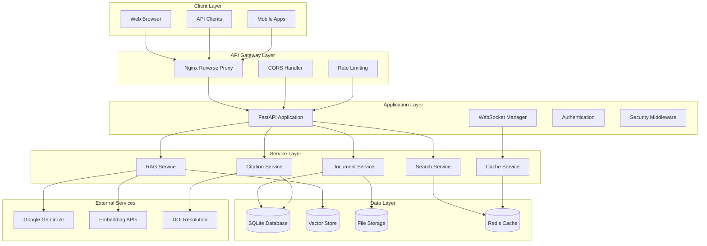

### Architecture Characteristics

- **Modular**: Clear separation of concerns with well-defined interfaces
- **Scalable**: Designed to handle growing document collections and user load
- **Resilient**: Graceful degradation and error recovery mechanisms
- **Maintainable**: Clean code architecture following SOLID principles
- **Testable**: Comprehensive test coverage with isolated components
- **Secure**: Multiple layers of security controls and validation

## Architecture Principles

### 1. Domain-Driven Design (DDD)

The system is organized around core business domains:

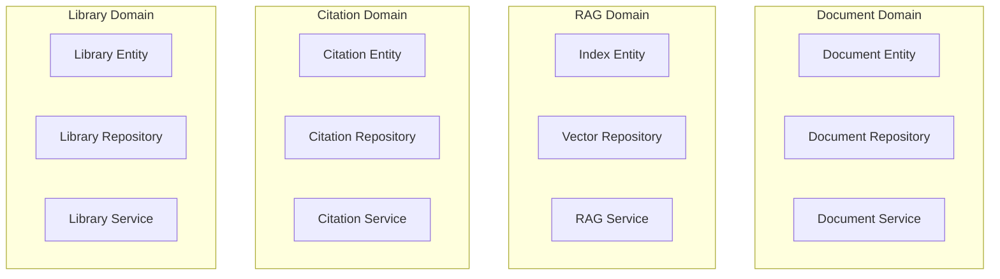

### 2. Clean Architecture (Hexagonal)

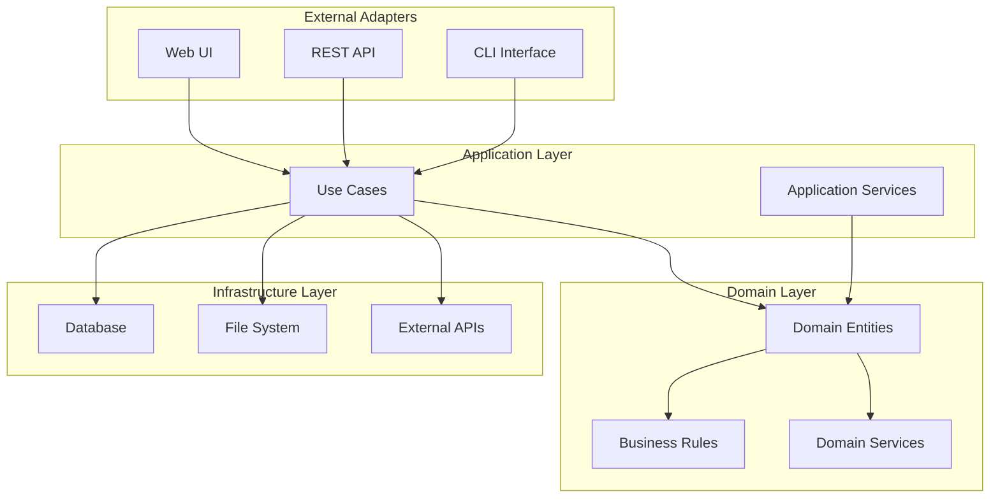

### 3. SOLID Principles Implementation

#### Single Responsibility Principle (SRP)
```python
# Each class has a single, well-defined responsibility
class DocumentRepository:
    """Responsible only for document data persistence"""
    
class DocumentService:
    """Responsible only for document business logic"""
    
class RAGService:
    """Responsible only for RAG operations"""
```

#### Open/Closed Principle (OCP)
```python
# Open for extension, closed for modification
class BaseEmbeddingProvider(ABC):
    @abstractmethod
    def generate_embeddings(self, texts: List[str]) -> List[List[float]]:
        pass

class OpenAIEmbeddingProvider(BaseEmbeddingProvider):
    def generate_embeddings(self, texts: List[str]) -> List[List[float]]:
        # OpenAI implementation
        pass

class HuggingFaceEmbeddingProvider(BaseEmbeddingProvider):
    def generate_embeddings(self, texts: List[str]) -> List[List[float]]:
        # HuggingFace implementation
        pass
```

#### Liskov Substitution Principle (LSP)
```python
# Subclasses can replace base classes without breaking functionality
def process_with_embedding_provider(provider: BaseEmbeddingProvider, texts: List[str]):
    embeddings = provider.generate_embeddings(texts)
    return embeddings

# Works with any concrete implementation
openai_provider = OpenAIEmbeddingProvider()
huggingface_provider = HuggingFaceEmbeddingProvider()

process_with_embedding_provider(openai_provider, texts)
process_with_embedding_provider(huggingface_provider, texts)
```

#### Interface Segregation Principle (ISP)
```python
# Clients depend only on methods they use
class IDocumentReader(ABC):
    @abstractmethod
    def read_document(self, document_id: int) -> Document:
        pass

class IDocumentWriter(ABC):
    @abstractmethod
    def create_document(self, document: Document) -> Document:
        pass
    
    @abstractmethod
    def update_document(self, document: Document) -> Document:
        pass

class IDocumentDeleter(ABC):
    @abstractmethod
    def delete_document(self, document_id: int) -> bool:
        pass
```

#### Dependency Inversion Principle (DIP)
```python
# High-level modules don't depend on low-level modules
class DocumentService:
    def __init__(
        self,
        document_repo: IDocumentRepository,
        file_service: IFileService,
        cache_service: ICacheService
    ):
        self.document_repo = document_repo
        self.file_service = file_service
        self.cache_service = cache_service
```

## System Components

### 1. Web Application Layer

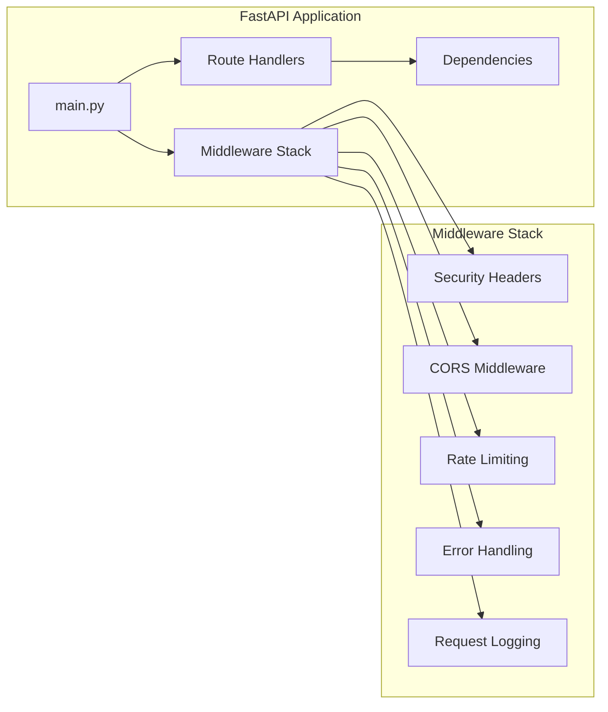

#### Key Components:

**Main Application (`backend/api/main.py`)**
- FastAPI application factory
- Route registration
- Middleware configuration
- Startup/shutdown event handlers

**Route Handlers (`backend/api/routes/`)**
- RESTful API endpoints
- Request validation using Pydantic
- Response serialization
- Error handling

**Middleware (`backend/api/middleware/`)**
- Security headers injection
- CORS configuration
- Rate limiting enforcement
- Request/response logging

### 2. Service Layer Architecture

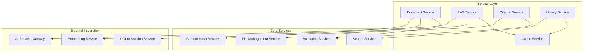

#### Service Characteristics:

**Business Logic Encapsulation**
```python
class DocumentService:
    """Encapsulates all document-related business logic"""
    
    def __init__(self, repository: IDocumentRepository, file_service: IFileService):
        self.repository = repository
        self.file_service = file_service
    
    async def create_document(self, file_data: bytes, metadata: DocumentMetadata) -> Document:
        # 1. Validate file format
        # 2. Generate content hash
        # 3. Check for duplicates
        # 4. Store file securely
        # 5. Create database record
        # 6. Generate events
        pass
```

**Interface-Driven Design**
```python
class IRAGService(ABC):
    @abstractmethod
    async def build_index(self, document_id: int, options: IndexOptions) -> IndexResult:
        pass
    
    @abstractmethod
    async def query(self, query: str, document_id: int, options: QueryOptions) -> RAGResponse:
        pass
    
    @abstractmethod
    async def get_index_status(self, document_id: int) -> IndexStatus:
        pass
```

### 3. Repository Layer

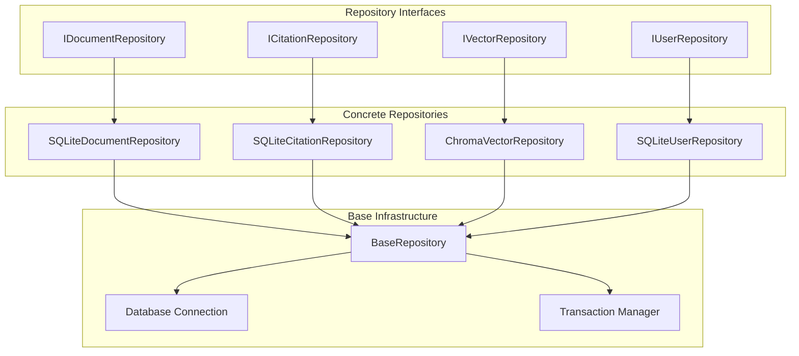

#### Repository Pattern Implementation:

```python
class BaseRepository(ABC, Generic[T]):
    """Base repository with common CRUD operations"""
    
    def __init__(self, db: AsyncSession):
        self.db = db
    
    @abstractmethod
    def get_model_class(self) -> Type[T]:
        pass
    
    async def get_by_id(self, entity_id: int) -> Optional[T]:
        result = await self.db.execute(
            select(self.get_model_class()).where(self.get_model_class().id == entity_id)
        )
        return result.scalar_one_or_none()
    
    async def create(self, entity: T) -> T:
        self.db.add(entity)
        await self.db.commit()
        await self.db.refresh(entity)
        return entity
    
    async def update(self, entity: T) -> T:
        await self.db.commit()
        await self.db.refresh(entity)
        return entity
    
    async def delete(self, entity_id: int) -> bool:
        entity = await self.get_by_id(entity_id)
        if entity:
            await self.db.delete(entity)
            await self.db.commit()
            return True
        return False
```

## Data Architecture

### 1. Database Schema

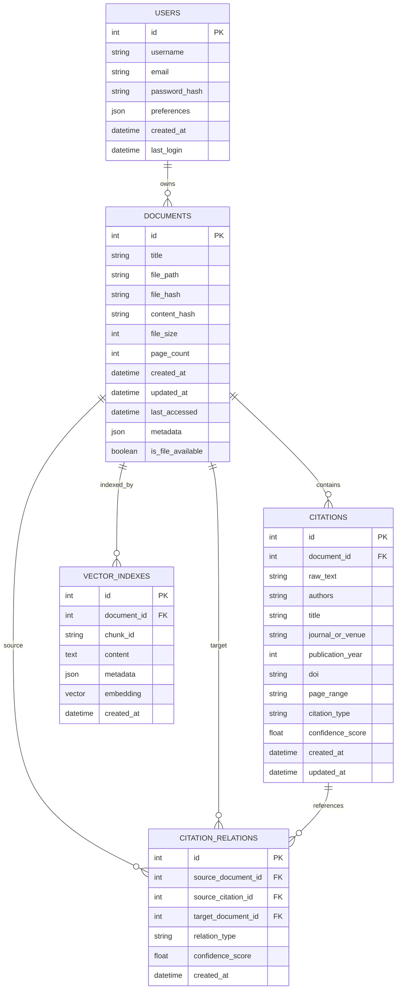

### 2. Data Flow Architecture

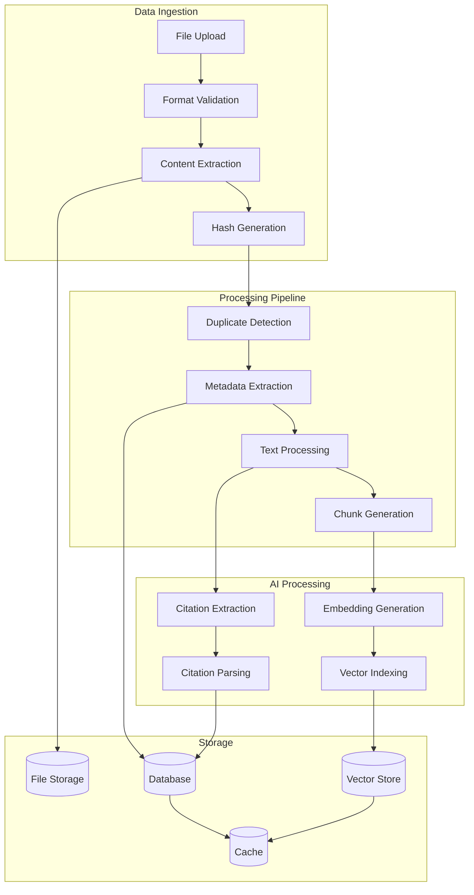

### 3. Caching Strategy

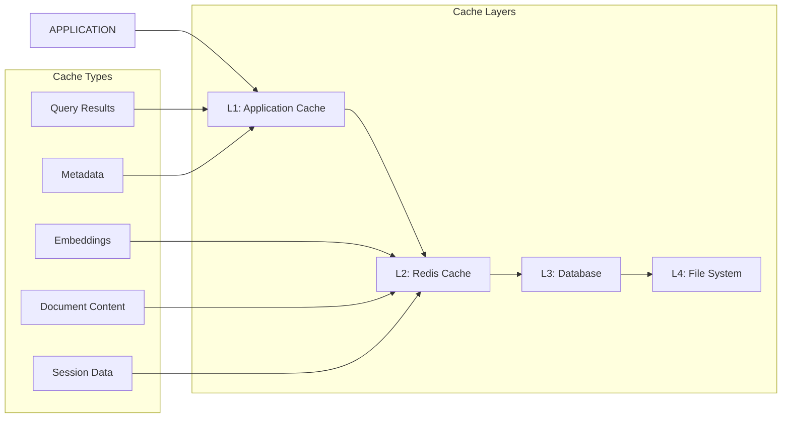

## API Architecture

### 1. RESTful API Design

```mermaid
graph TD
    subgraph "API Gateway"
        NGINX[Nginx Reverse Proxy]
        RATE_LIMITER[Rate Limiter]
        LOAD_BALANCER[Load Balancer]
    end
    
    subgraph "API Layer"
        FASTAPI[FastAPI App]
        AUTH_MIDDLEWARE[Auth Middleware]
        VALIDATION[Request Validation]
        SERIALIZATION[Response Serialization]
    end
    
    subgraph "Route Groups"
        SYSTEM_ROUTES[/api/system/*]
        DOC_ROUTES[/api/documents/*]
        RAG_ROUTES[/api/rag/*]
        CITE_ROUTES[/api/citations/*]
        LIB_ROUTES[/api/library/*]
    end
    
    CLIENT --> NGINX
    NGINX --> RATE_LIMITER
    RATE_LIMITER --> LOAD_BALANCER
    LOAD_BALANCER --> FASTAPI
    
    FASTAPI --> AUTH_MIDDLEWARE
    AUTH_MIDDLEWARE --> VALIDATION
    VALIDATION --> SERIALIZATION
    
    SERIALIZATION --> SYSTEM_ROUTES
    SERIALIZATION --> DOC_ROUTES
    SERIALIZATION --> RAG_ROUTES
    SERIALIZATION --> CITE_ROUTES
    SERIALIZATION --> LIB_ROUTES
```

#### API Design Principles:

**1. Resource-Based URLs**
```
GET /api/documents/                    # List documents
GET /api/documents/{id}                # Get specific document
POST /api/documents/upload             # Create new document
PUT /api/documents/{id}                # Update document
DELETE /api/documents/{id}             # Delete document
```

**2. HTTP Status Codes**
```python
# Success codes
200: OK - Successful GET, PUT, PATCH
201: Created - Successful POST
204: No Content - Successful DELETE

# Client error codes
400: Bad Request - Invalid request format
401: Unauthorized - Authentication required
403: Forbidden - Access denied
404: Not Found - Resource doesn't exist
409: Conflict - Resource conflict (e.g., duplicate)
413: Payload Too Large - File size exceeds limit
422: Unprocessable Entity - Validation error
429: Too Many Requests - Rate limit exceeded

# Server error codes
500: Internal Server Error - Unexpected server error
503: Service Unavailable - Service temporarily unavailable
```

**3. Consistent Response Format**
```json
{
    "success": true,
    "message": "Operation completed successfully",
    "data": {
        // Actual response data
    },
    "pagination": {
        "page": 1,
        "per_page": 50,
        "total": 150,
        "pages": 3
    },
    "timestamp": "2025-08-09T10:30:00Z",
    "request_id": "req_1234567890"
}
```

### 2. WebSocket Architecture

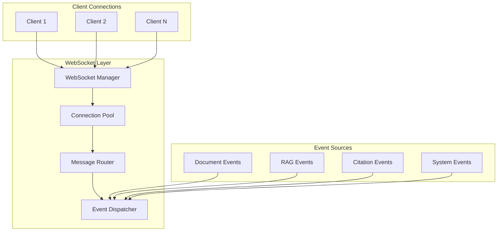

#### WebSocket Event Types:

```python
class WebSocketEventType(Enum):
    # Connection events
    CONNECT = "connect"
    DISCONNECT = "disconnect"
    PING = "ping"
    PONG = "pong"
    
    # Document events
    DOCUMENT_UPLOADED = "document.uploaded"
    DOCUMENT_UPDATED = "document.updated"
    DOCUMENT_DELETED = "document.deleted"
    
    # RAG events
    INDEX_BUILD_STARTED = "index.build_started"
    INDEX_BUILD_PROGRESS = "index.build_progress"
    INDEX_BUILD_COMPLETED = "index.build_completed"
    RAG_QUERY_STARTED = "rag.query_started"
    RAG_QUERY_PROGRESS = "rag.query_progress"
    RAG_QUERY_COMPLETED = "rag.query_completed"
    
    # Citation events
    CITATION_EXTRACTION_STARTED = "citations.extraction_started"
    CITATION_EXTRACTION_PROGRESS = "citations.extraction_progress"
    CITATION_EXTRACTION_COMPLETED = "citations.extraction_completed"
    
    # System events
    SYSTEM_STATUS_CHANGED = "system.status_changed"
    MAINTENANCE_MODE = "system.maintenance_mode"
    ERROR = "error"
```

## Service Layer Architecture

### 1. Service Composition

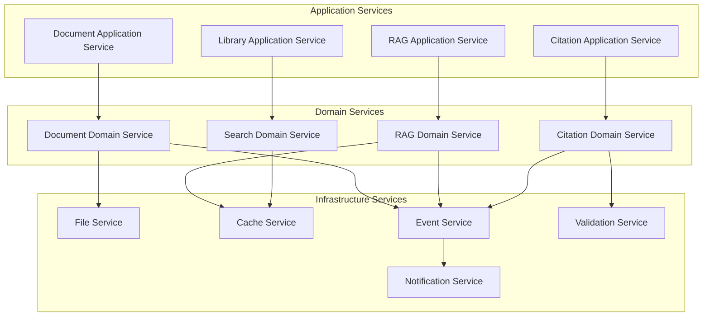

### 2. Dependency Injection Pattern

```python
# Container configuration
class DIContainer:
    def __init__(self):
        self._services = {}
        self._configure_services()
    
    def _configure_services(self):
        # Repository layer
        self.register(IDocumentRepository, SQLiteDocumentRepository)
        self.register(ICitationRepository, SQLiteCitationRepository)
        self.register(IVectorRepository, ChromaVectorRepository)
        
        # Service layer
        self.register(IFileService, LocalFileService)
        self.register(ICacheService, RedisCacheService)
        self.register(IRAGService, LlamaIndexRAGService)
        
        # Application services
        self.register(DocumentService, lambda: DocumentService(
            self.get(IDocumentRepository),
            self.get(IFileService),
            self.get(ICacheService)
        ))
    
    def register(self, interface: Type, implementation: Union[Type, Callable]):
        self._services[interface] = implementation
    
    def get(self, interface: Type) -> Any:
        implementation = self._services.get(interface)
        if implementation is None:
            raise ValueError(f"Service {interface} not registered")
        
        if callable(implementation) and not isinstance(implementation, type):
            return implementation()
        
        return implementation()

# FastAPI dependency injection
def get_document_service() -> DocumentService:
    return container.get(DocumentService)

# Route handler with injected dependencies
@router.post("/documents/upload")
async def upload_document(
    file: UploadFile,
    document_service: DocumentService = Depends(get_document_service)
):
    return await document_service.upload_document(file)
```

## Frontend Architecture

### 1. React Application Structure

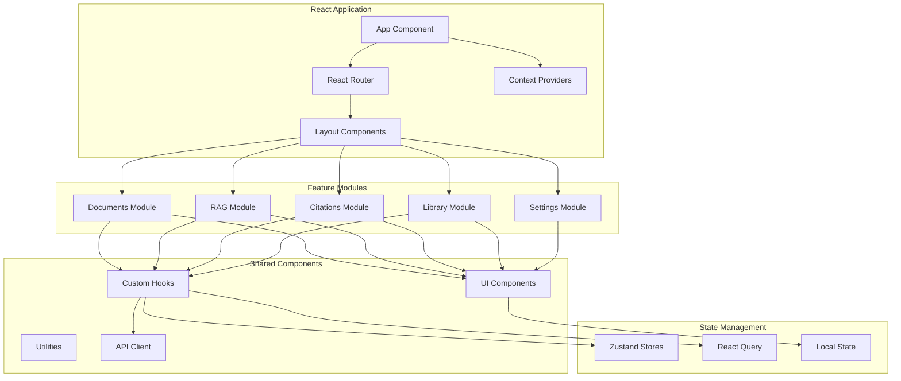

### 2. Component Architecture

```typescript
// Component hierarchy example
interface ComponentArchitecture {
    // Layout Components
    Layout: {
        Header: HeaderProps;
        Sidebar: SidebarProps;
        MainContent: MainContentProps;
        Footer: FooterProps;
    };
    
    // Feature Components
    Documents: {
        DocumentList: DocumentListProps;
        DocumentCard: DocumentCardProps;
        DocumentUpload: DocumentUploadProps;
        DocumentViewer: DocumentViewerProps;
    };
    
    // Shared Components
    UI: {
        Button: ButtonProps;
        Input: InputProps;
        Modal: ModalProps;
        Toast: ToastProps;
        Loading: LoadingProps;
    };
    
    // Business Components
    RAG: {
        QueryInterface: QueryInterfaceProps;
        ResponseDisplay: ResponseDisplayProps;
        SourceList: SourceListProps;
    };
}
```

### 3. State Management Strategy

```typescript
// Zustand store example
interface AppStore {
    // Document state
    documents: Document[];
    selectedDocument: Document | null;
    uploadProgress: UploadProgress | null;
    
    // RAG state
    queryHistory: RAGQuery[];
    currentQuery: string;
    queryResults: RAGResponse | null;
    
    // UI state
    sidebarOpen: boolean;
    theme: 'light' | 'dark';
    notifications: Notification[];
    
    // Actions
    setDocuments: (documents: Document[]) => void;
    selectDocument: (document: Document | null) => void;
    addQuery: (query: RAGQuery) => void;
    toggleSidebar: () => void;
    addNotification: (notification: Notification) => void;
}

// React Query for server state
const useDocuments = () => {
    return useQuery({
        queryKey: ['documents'],
        queryFn: () => api.getDocuments(),
        staleTime: 5 * 60 * 1000, // 5 minutes
        cacheTime: 10 * 60 * 1000, // 10 minutes
    });
};

const useUploadDocument = () => {
    const queryClient = useQueryClient();
    
    return useMutation({
        mutationFn: api.uploadDocument,
        onSuccess: () => {
            queryClient.invalidateQueries(['documents']);
        },
        onError: (error) => {
            toast.error(`Upload failed: ${error.message}`);
        },
    });
};
```

## Security Architecture

### 1. Security Layers

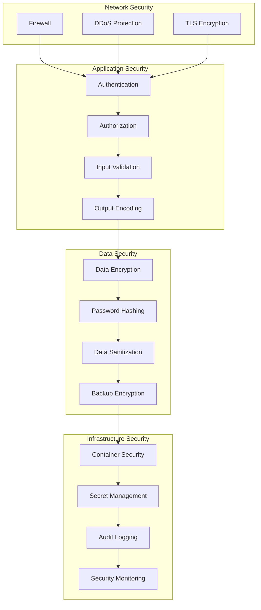

### 2. Authentication & Authorization

```python
# Authentication system
class AuthenticationService:
    def __init__(
        self,
        jwt_service: JWTService,
        password_service: PasswordService,
        user_repository: IUserRepository
    ):
        self.jwt_service = jwt_service
        self.password_service = password_service
        self.user_repository = user_repository
    
    async def authenticate(self, username: str, password: str) -> AuthResult:
        # 1. Rate limiting check
        # 2. User lookup
        # 3. Password verification
        # 4. JWT token generation
        # 5. Session management
        pass
    
    async def verify_token(self, token: str) -> User:
        # 1. JWT signature verification
        # 2. Token expiration check
        # 3. User status verification
        # 4. Permission loading
        pass

# Authorization decorators
@require_permission("documents:read")
async def get_document(document_id: int, current_user: User = Depends(get_current_user)):
    pass

@require_role("admin")
async def delete_all_documents(current_user: User = Depends(get_current_user)):
    pass
```

### 3. Input Validation & Sanitization

```python
# Pydantic models for validation
class DocumentUploadRequest(BaseModel):
    title: Optional[str] = Field(None, max_length=255, min_length=1)
    tags: Optional[List[str]] = Field(None, max_items=10)
    check_duplicates: bool = Field(True)
    
    @validator('title')
    def validate_title(cls, v):
        if v is not None:
            # Remove dangerous characters
            v = re.sub(r'[<>"\']', '', v)
            # Trim whitespace
            v = v.strip()
        return v
    
    @validator('tags')
    def validate_tags(cls, v):
        if v is not None:
            # Sanitize each tag
            v = [re.sub(r'[<>"\']', '', tag.strip()) for tag in v]
            # Remove empty tags
            v = [tag for tag in v if tag]
        return v

# SQL injection prevention
class DocumentRepository:
    async def search_documents(self, query: str) -> List[Document]:
        # Use parameterized queries
        stmt = select(DocumentModel).where(
            DocumentModel.title.contains(query) |
            DocumentModel.content.contains(query)
        )
        result = await self.db.execute(stmt)
        return result.scalars().all()
```

## Deployment Architecture

### 1. Container Architecture

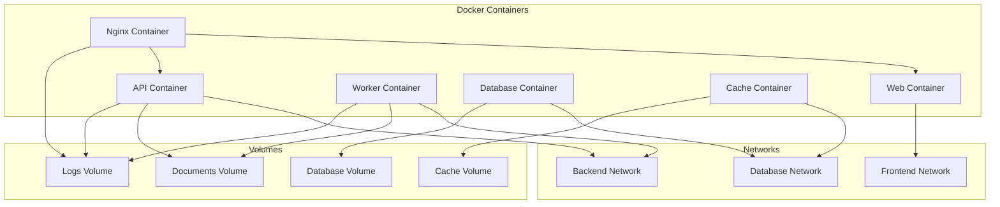

### 2. Kubernetes Deployment

```yaml
# deployment.yaml
apiVersion: apps/v1
kind: Deployment
metadata:
  name: pdf-scholar-api
  labels:
    app: pdf-scholar-api
spec:
  replicas: 3
  selector:
    matchLabels:
      app: pdf-scholar-api
  template:
    metadata:
      labels:
        app: pdf-scholar-api
    spec:
      containers:
      - name: api
        image: pdf-scholar-api:latest
        ports:
        - containerPort: 8000
        env:
        - name: DATABASE_URL
          valueFrom:
            secretKeyRef:
              name: pdf-scholar-secrets
              key: database-url
        - name: GEMINI_API_KEY
          valueFrom:
            secretKeyRef:
              name: pdf-scholar-secrets
              key: gemini-api-key
        volumeMounts:
        - name: documents-storage
          mountPath: /app/documents
        - name: logs-storage
          mountPath: /app/logs
        resources:
          requests:
            memory: "512Mi"
            cpu: "250m"
          limits:
            memory: "1Gi"
            cpu: "500m"
        livenessProbe:
          httpGet:
            path: /api/system/health
            port: 8000
          initialDelaySeconds: 30
          periodSeconds: 10
        readinessProbe:
          httpGet:
            path: /api/system/health
            port: 8000
          initialDelaySeconds: 5
          periodSeconds: 5
      volumes:
      - name: documents-storage
        persistentVolumeClaim:
          claimName: documents-pvc
      - name: logs-storage
        persistentVolumeClaim:
          claimName: logs-pvc
```

### 3. Infrastructure as Code

```terraform
# terraform/main.tf
resource "aws_ecs_cluster" "pdf_scholar_cluster" {
  name = "pdf-scholar"
  
  setting {
    name  = "containerInsights"
    value = "enabled"
  }
}

resource "aws_ecs_service" "pdf_scholar_api" {
  name            = "pdf-scholar-api"
  cluster         = aws_ecs_cluster.pdf_scholar_cluster.id
  task_definition = aws_ecs_task_definition.pdf_scholar_api.arn
  desired_count   = 3
  
  load_balancer {
    target_group_arn = aws_lb_target_group.pdf_scholar_api.arn
    container_name   = "api"
    container_port   = 8000
  }
  
  network_configuration {
    subnets          = var.private_subnet_ids
    security_groups  = [aws_security_group.pdf_scholar_api.id]
    assign_public_ip = false
  }
  
  service_registries {
    registry_arn = aws_service_discovery_service.pdf_scholar_api.arn
  }
}

resource "aws_ecs_task_definition" "pdf_scholar_api" {
  family                   = "pdf-scholar-api"
  requires_compatibilities = ["FARGATE"]
  network_mode             = "awsvpc"
  cpu                      = "512"
  memory                   = "1024"
  execution_role_arn       = aws_iam_role.ecs_execution_role.arn
  task_role_arn            = aws_iam_role.ecs_task_role.arn
  
  container_definitions = jsonencode([
    {
      name  = "api"
      image = "your-registry/pdf-scholar-api:latest"
      
      portMappings = [
        {
          containerPort = 8000
          protocol      = "tcp"
        }
      ]
      
      environment = [
        {
          name  = "ENVIRONMENT"
          value = "production"
        }
      ]
      
      secrets = [
        {
          name      = "DATABASE_URL"
          valueFrom = aws_ssm_parameter.database_url.arn
        },
        {
          name      = "GEMINI_API_KEY"
          valueFrom = aws_ssm_parameter.gemini_api_key.arn
        }
      ]
      
      logConfiguration = {
        logDriver = "awslogs"
        options = {
          "awslogs-group"         = aws_cloudwatch_log_group.pdf_scholar_api.name
          "awslogs-region"        = var.aws_region
          "awslogs-stream-prefix" = "ecs"
        }
      }
      
      healthCheck = {
        command = [
          "CMD-SHELL",
          "curl -f http://localhost:8000/api/system/health || exit 1"
        ]
        interval    = 30
        timeout     = 5
        retries     = 3
        startPeriod = 60
      }
    }
  ])
}
```

## Performance & Scalability

### 1. Performance Architecture

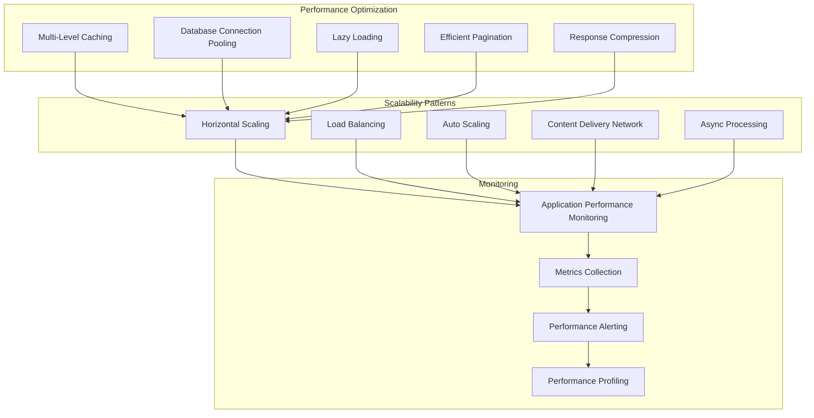

### 2. Caching Strategy

```python
# Multi-level caching implementation
class CacheManager:
    def __init__(
        self,
        l1_cache: InMemoryCache,
        l2_cache: RedisCache,
        l3_cache: DatabaseCache
    ):
        self.l1 = l1_cache
        self.l2 = l2_cache
        self.l3 = l3_cache
    
    async def get(self, key: str) -> Optional[Any]:
        # L1 cache (fastest)
        value = await self.l1.get(key)
        if value is not None:
            return value
        
        # L2 cache (distributed)
        value = await self.l2.get(key)
        if value is not None:
            await self.l1.set(key, value, ttl=300)  # 5 minutes
            return value
        
        # L3 cache (database query cache)
        value = await self.l3.get(key)
        if value is not None:
            await self.l2.set(key, value, ttl=3600)  # 1 hour
            await self.l1.set(key, value, ttl=300)   # 5 minutes
            return value
        
        return None
    
    async def set(self, key: str, value: Any, ttl: int = 3600):
        await self.l1.set(key, value, min(ttl, 300))
        await self.l2.set(key, value, ttl)
        # L3 is populated on cache miss

# Cache decorators
@cache_result(ttl=300, cache_key_template="document:{document_id}")
async def get_document(document_id: int) -> Document:
    return await document_repository.get_by_id(document_id)

@cache_result(ttl=3600, cache_key_template="documents:list:{page}:{per_page}")
async def list_documents(page: int = 1, per_page: int = 50) -> DocumentList:
    return await document_repository.list_paginated(page, per_page)
```

### 3. Database Optimization

```python
# Connection pooling
DATABASE_CONFIG = {
    "pool_size": 10,
    "max_overflow": 20,
    "pool_timeout": 30,
    "pool_recycle": 3600,
    "pool_pre_ping": True,
}

# Query optimization
class OptimizedDocumentRepository:
    async def search_documents_with_citations(
        self, 
        query: str, 
        page: int = 1, 
        per_page: int = 50
    ) -> DocumentSearchResult:
        # Use joins instead of N+1 queries
        stmt = (
            select(DocumentModel, func.count(CitationModel.id).label('citation_count'))
            .outerjoin(CitationModel, DocumentModel.id == CitationModel.document_id)
            .where(
                or_(
                    DocumentModel.title.contains(query),
                    DocumentModel.content.contains(query)
                )
            )
            .group_by(DocumentModel.id)
            .options(
                # Eager load related data
                selectinload(DocumentModel.metadata),
                selectinload(DocumentModel.tags)
            )
            .limit(per_page)
            .offset((page - 1) * per_page)
        )
        
        result = await self.db.execute(stmt)
        return result.fetchall()
    
    # Batch operations
    async def bulk_update_access_time(self, document_ids: List[int]):
        stmt = (
            update(DocumentModel)
            .where(DocumentModel.id.in_(document_ids))
            .values(last_accessed=func.now())
        )
        await self.db.execute(stmt)
```

## Monitoring & Observability

### 1. Monitoring Architecture

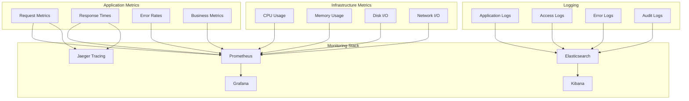

### 2. Metrics Collection

```python
# Prometheus metrics
from prometheus_client import Counter, Histogram, Gauge, start_http_server

# Custom metrics
REQUEST_COUNT = Counter(
    'pdf_scholar_requests_total',
    'Total requests',
    ['method', 'endpoint', 'status']
)

REQUEST_DURATION = Histogram(
    'pdf_scholar_request_duration_seconds',
    'Request duration',
    ['method', 'endpoint']
)

ACTIVE_CONNECTIONS = Gauge(
    'pdf_scholar_active_connections',
    'Active WebSocket connections'
)

DOCUMENT_COUNT = Gauge(
    'pdf_scholar_documents_total',
    'Total documents in system'
)

RAG_QUERY_COUNT = Counter(
    'pdf_scholar_rag_queries_total',
    'Total RAG queries',
    ['status']
)

# Metrics middleware
@app.middleware("http")
async def metrics_middleware(request: Request, call_next):
    start_time = time.time()
    
    response = await call_next(request)
    
    duration = time.time() - start_time
    
    REQUEST_COUNT.labels(
        method=request.method,
        endpoint=request.url.path,
        status=response.status_code
    ).inc()
    
    REQUEST_DURATION.labels(
        method=request.method,
        endpoint=request.url.path
    ).observe(duration)
    
    return response

# Business metrics
class BusinessMetricsCollector:
    def __init__(self):
        self.document_uploads = Counter('documents_uploaded_total')
        self.rag_queries = Counter('rag_queries_total', ['success'])
        self.citation_extractions = Counter('citation_extractions_total')
        self.user_sessions = Counter('user_sessions_total')
    
    def record_document_upload(self):
        self.document_uploads.inc()
    
    def record_rag_query(self, success: bool):
        self.rag_queries.labels(success=str(success).lower()).inc()
    
    def record_citation_extraction(self, citation_count: int):
        self.citation_extractions.inc(citation_count)
```

### 3. Distributed Tracing

```python
# OpenTelemetry configuration
from opentelemetry import trace
from opentelemetry.exporter.jaeger.thrift import JaegerExporter
from opentelemetry.instrumentation.fastapi import FastAPIInstrumentor
from opentelemetry.instrumentation.sqlalchemy import SQLAlchemyInstrumentor
from opentelemetry.instrumentation.redis import RedisInstrumentor
from opentelemetry.sdk.trace import TracerProvider
from opentelemetry.sdk.trace.export import BatchSpanProcessor

# Initialize tracing
trace.set_tracer_provider(TracerProvider())
tracer = trace.get_tracer(__name__)

# Configure exporters
jaeger_exporter = JaegerExporter(
    agent_host_name="localhost",
    agent_port=6831,
)

span_processor = BatchSpanProcessor(jaeger_exporter)
trace.get_tracer_provider().add_span_processor(span_processor)

# Auto-instrument frameworks
FastAPIInstrumentor.instrument_app(app)
SQLAlchemyInstrumentor().instrument(engine=engine)
RedisInstrumentor().instrument()

# Manual instrumentation for business logic
class DocumentService:
    async def upload_document(self, file_data: bytes, metadata: DocumentMetadata) -> Document:
        with tracer.start_as_current_span("document_upload") as span:
            span.set_attribute("file_size", len(file_data))
            span.set_attribute("file_type", metadata.file_type)
            
            # Content extraction
            with tracer.start_as_current_span("content_extraction"):
                content = await self._extract_content(file_data)
                span.set_attribute("extracted_content_length", len(content))
            
            # Hash generation
            with tracer.start_as_current_span("hash_generation"):
                file_hash = await self._generate_hash(file_data)
                content_hash = await self._generate_hash(content)
            
            # Duplicate check
            with tracer.start_as_current_span("duplicate_check"):
                is_duplicate = await self._check_duplicates(content_hash)
                span.set_attribute("is_duplicate", is_duplicate)
            
            if is_duplicate:
                span.record_exception(DuplicateDocumentError())
                raise DuplicateDocumentError()
            
            # Database save
            with tracer.start_as_current_span("database_save"):
                document = await self.repository.create(Document(
                    title=metadata.title,
                    content_hash=content_hash,
                    file_hash=file_hash,
                    content=content
                ))
            
            span.set_attribute("document_id", document.id)
            return document
```

## Future Architecture

### 1. Microservices Evolution

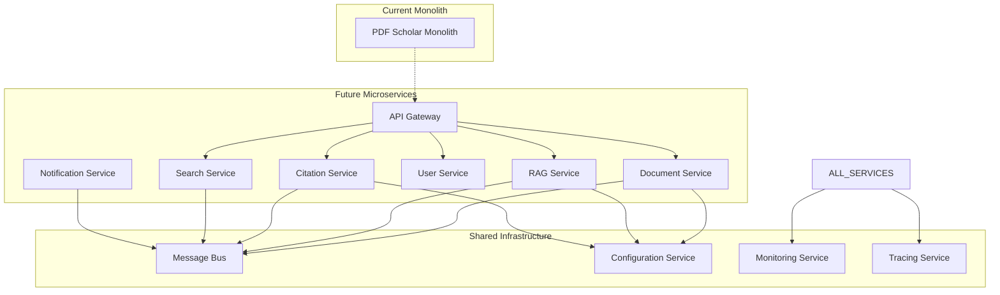

### 2. AI/ML Pipeline Architecture

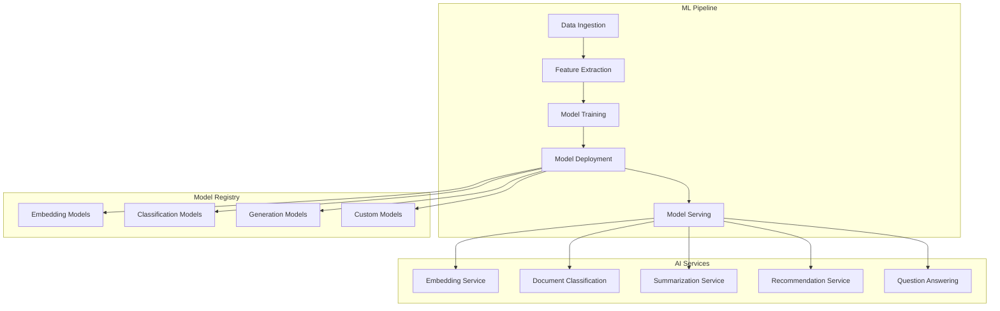

### 3. Multi-Tenant Architecture

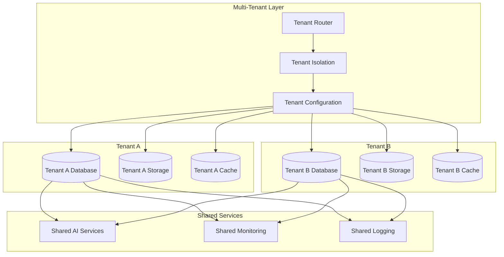

### 4. Edge Computing Architecture

```mermaid
graph TD
    subgraph "Cloud Core"
        CLOUD_API[Cloud API]
        CLOUD_DB[(Cloud Database)]
        CLOUD_ML[Cloud ML Services]
    end
    
    subgraph "Edge Nodes"
        EDGE_1[Edge Node 1]
        EDGE_2[Edge Node 2]
        EDGE_3[Edge Node 3]
    end
    
    subgraph "Edge Capabilities"
        LOCAL_PROCESSING[Local Document Processing]
        EDGE_CACHE[Edge Cache]
        OFFLINE_MODE[Offline Mode]
        DATA_SYNC[Data Synchronization]
    end
    
    CLOUD_API --> EDGE_1
    CLOUD_API --> EDGE_2
    CLOUD_API --> EDGE_3
    
    EDGE_1 --> LOCAL_PROCESSING
    EDGE_1 --> EDGE_CACHE
    EDGE_1 --> OFFLINE_MODE
    EDGE_1 --> DATA_SYNC
    
    EDGE_2 --> LOCAL_PROCESSING
    EDGE_2 --> EDGE_CACHE
    EDGE_2 --> OFFLINE_MODE
    EDGE_2 --> DATA_SYNC
    
    EDGE_3 --> LOCAL_PROCESSING
    EDGE_3 --> EDGE_CACHE
    EDGE_3 --> OFFLINE_MODE
    EDGE_3 --> DATA_SYNC
    
    DATA_SYNC --> CLOUD_DB
    LOCAL_PROCESSING --> CLOUD_ML
```

---

**Architecture Version**: 2.1.0  
**Last Updated**: 2025-08-09  
**Status**: Current Architecture  
**Next Review**: 2025-12-01  

This architecture documentation provides a comprehensive overview of the AI Enhanced PDF Scholar system design, from high-level principles to detailed implementation patterns. The architecture supports the current single-user deployment while being designed for future scalability and multi-tenant scenarios.