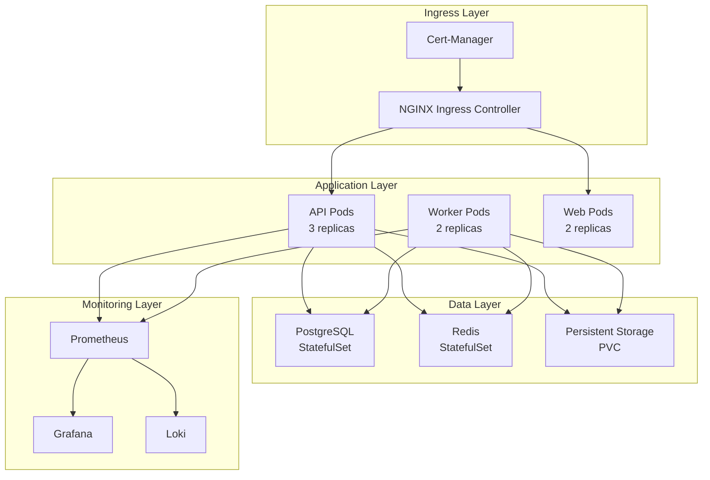

# Kubernetes Deployment Guide - AI Enhanced PDF Scholar

## Table of Contents

1. [Overview](#overview)
2. [Prerequisites](#prerequisites)
3. [Quick Deployment](#quick-deployment)
4. [Configuration Management](#configuration-management)
5. [Storage Configuration](#storage-configuration)
6. [Networking & Security](#networking--security)
7. [Monitoring & Logging](#monitoring--logging)
8. [Scaling & Performance](#scaling--performance)
9. [Backup & Recovery](#backup--recovery)
10. [Troubleshooting](#troubleshooting)
11. [Production Checklist](#production-checklist)

## Overview

This guide provides comprehensive instructions for deploying AI Enhanced PDF Scholar on Kubernetes. The deployment supports both single-node development environments and multi-node production clusters with high availability, auto-scaling, and comprehensive monitoring.

### Architecture Overview



## Prerequisites

### System Requirements

#### Development Environment
- **Kubernetes**: v1.24+ (minikube, k3s, or Docker Desktop)
- **CPU**: 4 cores minimum
- **Memory**: 8GB RAM minimum
- **Storage**: 50GB available space

#### Production Environment
- **Kubernetes**: v1.24+ (managed service recommended)
- **Nodes**: 3+ worker nodes
- **CPU**: 8+ cores per node
- **Memory**: 16GB+ RAM per node
- **Storage**: 100GB+ per node (SSD recommended)

### Required Tools

```bash
# Install kubectl
curl -LO "https://dl.k8s.io/release/$(curl -L -s https://dl.k8s.io/release/stable.txt)/bin/linux/amd64/kubectl"
sudo install -o root -g root -m 0755 kubectl /usr/local/bin/kubectl

# Install Helm
curl https://get.helm.sh/helm-v3.12.0-linux-amd64.tar.gz | tar -xz
sudo mv linux-amd64/helm /usr/local/bin/

# Install kustomize
curl -s "https://raw.githubusercontent.com/kubernetes-sigs/kustomize/master/hack/install_kustomize.sh" | bash
sudo mv kustomize /usr/local/bin/

# Verify installations
kubectl version --client
helm version
kustomize version
```

### Cluster Setup

#### Option 1: Development with minikube
```bash
# Install minikube
curl -Lo minikube https://storage.googleapis.com/minikube/releases/latest/minikube-linux-amd64
sudo install minikube /usr/local/bin/

# Start cluster with sufficient resources
minikube start --cpus=4 --memory=8192 --disk-size=50g --driver=docker

# Enable required addons
minikube addons enable ingress
minikube addons enable metrics-server
minikube addons enable dashboard
```

#### Option 2: Production with managed Kubernetes
```bash
# AWS EKS
eksctl create cluster --name pdf-scholar-prod --region us-west-2 --nodegroup-name standard-workers --node-type m5.xlarge --nodes 3 --nodes-min 1 --nodes-max 10

# Google GKE
gcloud container clusters create pdf-scholar-prod --zone us-central1-a --num-nodes 3 --machine-type n1-standard-4 --enable-autoscaling --min-nodes 1 --max-nodes 10

# Azure AKS
az aks create --resource-group pdf-scholar-rg --name pdf-scholar-prod --node-count 3 --node-vm-size Standard_D4s_v3 --enable-cluster-autoscaler --min-count 1 --max-count 10
```

## Quick Deployment

### 1. Clone and Prepare

```bash
# Clone the repository
git clone https://github.com/Jackela/ai-enhanced-pdf-scholar.git
cd ai-enhanced-pdf-scholar/k8s

# Verify cluster connectivity
kubectl cluster-info
kubectl get nodes
```

### 2. Deploy with Helm (Recommended)

```bash
# Add required Helm repositories
helm repo add ingress-nginx https://kubernetes.github.io/ingress-nginx
helm repo add prometheus-community https://prometheus-community.github.io/helm-charts
helm repo add grafana https://grafana.github.io/helm-charts
helm repo update

# Install ingress controller
helm install ingress-nginx ingress-nginx/ingress-nginx \
  --namespace ingress-nginx \
  --create-namespace \
  --set controller.replicaCount=2 \
  --set controller.resources.requests.cpu=100m \
  --set controller.resources.requests.memory=90Mi

# Deploy the application
helm install pdf-scholar ./helm/ai-pdf-scholar \
  --namespace pdf-scholar \
  --create-namespace \
  --values helm/ai-pdf-scholar/values.yaml

# Wait for deployment
kubectl wait --for=condition=ready pod -l app=pdf-scholar-api -n pdf-scholar --timeout=300s
```

### 3. Verify Deployment

```bash
# Check all components
kubectl get all -n pdf-scholar

# Check ingress
kubectl get ingress -n pdf-scholar

# View logs
kubectl logs -f deployment/pdf-scholar-api -n pdf-scholar

# Get service URL (for development)
minikube service pdf-scholar-api -n pdf-scholar --url
```

## Configuration Management

### 1. ConfigMaps and Secrets

#### Application Configuration
```yaml
# k8s/manifests/configmap.yaml
apiVersion: v1
kind: ConfigMap
metadata:
  name: pdf-scholar-config
  namespace: pdf-scholar
data:
  # Database configuration
  DATABASE_HOST: "postgresql"
  DATABASE_PORT: "5432"
  DATABASE_NAME: "pdf_scholar"

  # Redis configuration
  REDIS_HOST: "redis"
  REDIS_PORT: "6379"
  REDIS_DB: "0"

  # Application settings
  ENVIRONMENT: "production"
  LOG_LEVEL: "INFO"
  MAX_FILE_SIZE_MB: "100"
  ENABLE_METRICS: "true"
  ENABLE_TRACING: "true"

  # AI/ML settings
  RAG_CHUNK_SIZE: "1000"
  RAG_CHUNK_OVERLAP: "200"
  EMBEDDING_MODEL: "text-embedding-ada-002"

  # Performance settings
  WORKERS_COUNT: "4"
  MAX_CONNECTIONS: "100"
  CACHE_TTL: "3600"
```

#### Secrets Management
```yaml
# k8s/manifests/secrets.yaml
apiVersion: v1
kind: Secret
metadata:
  name: pdf-scholar-secrets
  namespace: pdf-scholar
type: Opaque
data:
  # Database credentials (base64 encoded)
  DATABASE_USER: cGRmX3NjaG9sYXI=  # pdf_scholar
  DATABASE_PASSWORD: c2VjdXJlX3Bhc3N3b3Jk  # secure_password

  # API keys (base64 encoded)
  GEMINI_API_KEY: eW91cl9nZW1pbmlfYXBpX2tleQ==
  OPENAI_API_KEY: eW91cl9vcGVuYWlfa2V5

  # JWT secret
  JWT_SECRET: eW91cl9qd3Rfc2VjcmV0X2tleQ==

  # Redis password
  REDIS_PASSWORD: cmVkaXNfcGFzc3dvcmQ=
```

#### External Secrets Operator (Recommended for Production)
```bash
# Install External Secrets Operator
helm repo add external-secrets https://charts.external-secrets.io
helm install external-secrets external-secrets/external-secrets -n external-secrets-system --create-namespace

# AWS Secrets Manager integration
kubectl apply -f - <<EOF
apiVersion: external-secrets.io/v1beta1
kind: SecretStore
metadata:
  name: aws-secrets-manager
  namespace: pdf-scholar
spec:
  provider:
    aws:
      service: SecretsManager
      region: us-west-2
      auth:
        secretRef:
          accessKeyID:
            name: aws-creds
            key: access-key-id
          secretAccessKey:
            name: aws-creds
            key: secret-access-key
---
apiVersion: external-secrets.io/v1beta1
kind: ExternalSecret
metadata:
  name: pdf-scholar-external-secrets
  namespace: pdf-scholar
spec:
  refreshInterval: 15s
  secretStoreRef:
    name: aws-secrets-manager
    kind: SecretStore
  target:
    name: pdf-scholar-secrets
    creationPolicy: Owner
  data:
  - secretKey: GEMINI_API_KEY
    remoteRef:
      key: pdf-scholar/gemini-api-key
  - secretKey: DATABASE_PASSWORD
    remoteRef:
      key: pdf-scholar/database-password
EOF
```

### 2. Environment-Specific Configurations

#### Kustomization for Multiple Environments
```yaml
# k8s/environments/base/kustomization.yaml
apiVersion: kustomize.config.k8s.io/v1beta1
kind: Kustomization

resources:
  - ../../manifests/namespace.yaml
  - ../../manifests/configmap.yaml
  - ../../manifests/secrets.yaml
  - ../../manifests/backend.yaml
  - ../../manifests/frontend.yaml
  - ../../manifests/postgresql.yaml
  - ../../manifests/redis.yaml
  - ../../manifests/nginx.yaml
  - ../../manifests/monitoring.yaml

commonLabels:
  app: pdf-scholar
  version: v2.1.0

images:
  - name: pdf-scholar-api
    newTag: v2.1.0
  - name: pdf-scholar-frontend
    newTag: v2.1.0
```

```yaml
# k8s/environments/development/kustomization.yaml
apiVersion: kustomize.config.k8s.io/v1beta1
kind: Kustomization

namespace: pdf-scholar-dev

resources:
  - ../base

patchesStrategicMerge:
  - replica-patch.yaml
  - resource-patch.yaml

configMapGenerator:
  - name: pdf-scholar-config
    behavior: merge
    literals:
      - LOG_LEVEL=DEBUG
      - ENABLE_DEBUG=true
      - WORKERS_COUNT=2
```

```yaml
# k8s/environments/production/kustomization.yaml
apiVersion: kustomize.config.k8s.io/v1beta1
kind: Kustomization

namespace: pdf-scholar

resources:
  - ../base

patchesStrategicMerge:
  - replica-patch.yaml
  - resource-patch.yaml
  - security-patch.yaml

configMapGenerator:
  - name: pdf-scholar-config
    behavior: merge
    literals:
      - LOG_LEVEL=INFO
      - ENABLE_DEBUG=false
      - WORKERS_COUNT=8
      - MAX_CONNECTIONS=200
```

### 3. Deploy with Kustomize

```bash
# Development environment
kubectl apply -k k8s/environments/development

# Production environment
kubectl apply -k k8s/environments/production

# Dry run to preview changes
kubectl diff -k k8s/environments/production
```

## Storage Configuration

### 1. Persistent Volume Configuration

#### Storage Classes
```yaml
# k8s/manifests/storage-class.yaml
apiVersion: storage.k8s.io/v1
kind: StorageClass
metadata:
  name: pdf-scholar-ssd
provisioner: kubernetes.io/aws-ebs  # Change based on cloud provider
parameters:
  type: gp3
  fsType: ext4
  encrypted: "true"
volumeBindingMode: WaitForFirstConsumer
allowVolumeExpansion: true
reclaimPolicy: Retain
```

#### Persistent Volumes
```yaml
# k8s/manifests/persistent-volumes.yaml
apiVersion: v1
kind: PersistentVolume
metadata:
  name: pdf-scholar-documents-pv
spec:
  capacity:
    storage: 100Gi
  accessModes:
    - ReadWriteMany
  persistentVolumeReclaimPolicy: Retain
  storageClassName: pdf-scholar-ssd
  hostPath:  # Use appropriate volume type for production
    path: /mnt/data/documents
---
apiVersion: v1
kind: PersistentVolumeClaim
metadata:
  name: documents-pvc
  namespace: pdf-scholar
spec:
  accessModes:
    - ReadWriteMany
  storageClassName: pdf-scholar-ssd
  resources:
    requests:
      storage: 100Gi
```

#### Database Storage
```yaml
# k8s/manifests/database-storage.yaml
apiVersion: v1
kind: PersistentVolumeClaim
metadata:
  name: postgresql-pvc
  namespace: pdf-scholar
spec:
  accessModes:
    - ReadWriteOnce
  storageClassName: pdf-scholar-ssd
  resources:
    requests:
      storage: 50Gi
---
apiVersion: v1
kind: PersistentVolumeClaim
metadata:
  name: redis-pvc
  namespace: pdf-scholar
spec:
  accessModes:
    - ReadWriteOnce
  storageClassName: pdf-scholar-ssd
  resources:
    requests:
      storage: 10Gi
```

### 2. Backup Configuration

```yaml
# k8s/manifests/backup-cronjob.yaml
apiVersion: batch/v1
kind: CronJob
metadata:
  name: database-backup
  namespace: pdf-scholar
spec:
  schedule: "0 2 * * *"  # Daily at 2 AM
  jobTemplate:
    spec:
      template:
        spec:
          containers:
          - name: postgres-backup
            image: postgres:15
            command:
            - /bin/bash
            - -c
            - |
              BACKUP_FILE="/backup/postgres-$(date +%Y%m%d_%H%M%S).sql"
              pg_dump -h postgresql -U $POSTGRES_USER -d $POSTGRES_DB > $BACKUP_FILE

              # Compress backup
              gzip $BACKUP_FILE

              # Upload to S3 (optional)
              aws s3 cp $BACKUP_FILE.gz s3://pdf-scholar-backups/database/

              # Clean old local backups (keep last 7 days)
              find /backup -name "postgres-*.sql.gz" -mtime +7 -delete
            env:
            - name: POSTGRES_USER
              valueFrom:
                secretKeyRef:
                  name: pdf-scholar-secrets
                  key: DATABASE_USER
            - name: POSTGRES_PASSWORD
              valueFrom:
                secretKeyRef:
                  name: pdf-scholar-secrets
                  key: DATABASE_PASSWORD
            - name: POSTGRES_DB
              valueFrom:
                configMapKeyRef:
                  name: pdf-scholar-config
                  key: DATABASE_NAME
            - name: PGPASSWORD
              valueFrom:
                secretKeyRef:
                  name: pdf-scholar-secrets
                  key: DATABASE_PASSWORD
            volumeMounts:
            - name: backup-storage
              mountPath: /backup
          volumes:
          - name: backup-storage
            persistentVolumeClaim:
              claimName: backup-pvc
          restartPolicy: OnFailure
```

## Networking & Security

### 1. Network Policies

```yaml
# k8s/manifests/network-policy.yaml
apiVersion: networking.k8s.io/v1
kind: NetworkPolicy
metadata:
  name: pdf-scholar-network-policy
  namespace: pdf-scholar
spec:
  podSelector:
    matchLabels:
      app: pdf-scholar-api
  policyTypes:
  - Ingress
  - Egress
  ingress:
  - from:
    - namespaceSelector:
        matchLabels:
          name: ingress-nginx
    - podSelector:
        matchLabels:
          app: pdf-scholar-frontend
    ports:
    - protocol: TCP
      port: 8000
  egress:
  - to:
    - podSelector:
        matchLabels:
          app: postgresql
    ports:
    - protocol: TCP
      port: 5432
  - to:
    - podSelector:
        matchLabels:
          app: redis
    ports:
    - protocol: TCP
      port: 6379
  - to: []  # Allow external API calls
    ports:
    - protocol: TCP
      port: 443
```

### 2. RBAC Configuration

```yaml
# k8s/manifests/rbac.yaml
apiVersion: v1
kind: ServiceAccount
metadata:
  name: pdf-scholar-service-account
  namespace: pdf-scholar
---
apiVersion: rbac.authorization.k8s.io/v1
kind: Role
metadata:
  name: pdf-scholar-role
  namespace: pdf-scholar
rules:
- apiGroups: [""]
  resources: ["configmaps", "secrets"]
  verbs: ["get", "list", "watch"]
- apiGroups: [""]
  resources: ["pods"]
  verbs: ["get", "list", "watch"]
- apiGroups: ["apps"]
  resources: ["deployments"]
  verbs: ["get", "list", "watch"]
---
apiVersion: rbac.authorization.k8s.io/v1
kind: RoleBinding
metadata:
  name: pdf-scholar-role-binding
  namespace: pdf-scholar
subjects:
- kind: ServiceAccount
  name: pdf-scholar-service-account
  namespace: pdf-scholar
roleRef:
  kind: Role
  name: pdf-scholar-role
  apiGroup: rbac.authorization.k8s.io
```

### 3. Pod Security Standards

```yaml
# k8s/manifests/pod-security-policy.yaml
apiVersion: policy/v1beta1
kind: PodSecurityPolicy
metadata:
  name: pdf-scholar-psp
spec:
  privileged: false
  allowPrivilegeEscalation: false
  requiredDropCapabilities:
    - ALL
  volumes:
    - 'configMap'
    - 'emptyDir'
    - 'projected'
    - 'secret'
    - 'downwardAPI'
    - 'persistentVolumeClaim'
  runAsUser:
    rule: 'MustRunAsNonRoot'
  seLinux:
    rule: 'RunAsAny'
  fsGroup:
    rule: 'RunAsAny'
```

### 4. Ingress Configuration

```yaml
# k8s/manifests/ingress.yaml
apiVersion: networking.k8s.io/v1
kind: Ingress
metadata:
  name: pdf-scholar-ingress
  namespace: pdf-scholar
  annotations:
    kubernetes.io/ingress.class: nginx
    cert-manager.io/cluster-issuer: letsencrypt-prod
    nginx.ingress.kubernetes.io/ssl-redirect: "true"
    nginx.ingress.kubernetes.io/proxy-body-size: "100m"
    nginx.ingress.kubernetes.io/rate-limit: "100"
    nginx.ingress.kubernetes.io/rate-limit-window: "1m"
spec:
  tls:
  - hosts:
    - pdf-scholar.yourdomain.com
    secretName: pdf-scholar-tls
  rules:
  - host: pdf-scholar.yourdomain.com
    http:
      paths:
      - path: /api
        pathType: Prefix
        backend:
          service:
            name: pdf-scholar-api
            port:
              number: 8000
      - path: /
        pathType: Prefix
        backend:
          service:
            name: pdf-scholar-frontend
            port:
              number: 80
```

## Monitoring & Logging

### 1. Prometheus Monitoring

```bash
# Install Prometheus stack
helm install prometheus prometheus-community/kube-prometheus-stack \
  --namespace monitoring \
  --create-namespace \
  --values - <<EOF
grafana:
  adminPassword: admin
  ingress:
    enabled: true
    hosts:
      - grafana.yourdomain.com
    tls:
      - secretName: grafana-tls
        hosts:
          - grafana.yourdomain.com

prometheus:
  prometheusSpec:
    storageSpec:
      volumeClaimTemplate:
        spec:
          storageClassName: pdf-scholar-ssd
          accessModes: ["ReadWriteOnce"]
          resources:
            requests:
              storage: 50Gi

alertmanager:
  alertmanagerSpec:
    storage:
      volumeClaimTemplate:
        spec:
          storageClassName: pdf-scholar-ssd
          accessModes: ["ReadWriteOnce"]
          resources:
            requests:
              storage: 10Gi
EOF
```

### 2. Custom Metrics and Alerts

```yaml
# k8s/manifests/servicemonitor.yaml
apiVersion: monitoring.coreos.com/v1
kind: ServiceMonitor
metadata:
  name: pdf-scholar-metrics
  namespace: pdf-scholar
  labels:
    app: pdf-scholar-api
spec:
  selector:
    matchLabels:
      app: pdf-scholar-api
  endpoints:
  - port: metrics
    interval: 30s
    path: /metrics
```

```yaml
# k8s/manifests/prometheusrule.yaml
apiVersion: monitoring.coreos.com/v1
kind: PrometheusRule
metadata:
  name: pdf-scholar-alerts
  namespace: pdf-scholar
spec:
  groups:
  - name: pdf-scholar
    rules:
    - alert: PDFScholarHighErrorRate
      expr: rate(pdf_scholar_requests_total{status=~"5.."}[5m]) > 0.1
      for: 5m
      labels:
        severity: critical
      annotations:
        summary: "High error rate in PDF Scholar API"
        description: "Error rate is {{ $value }} errors per second"

    - alert: PDFScholarHighResponseTime
      expr: histogram_quantile(0.95, rate(pdf_scholar_request_duration_seconds_bucket[5m])) > 2
      for: 5m
      labels:
        severity: warning
      annotations:
        summary: "High response time in PDF Scholar API"
        description: "95th percentile response time is {{ $value }}s"

    - alert: PDFScholarPodCrashLooping
      expr: rate(kube_pod_container_status_restarts_total{namespace="pdf-scholar"}[5m]) > 0
      for: 5m
      labels:
        severity: critical
      annotations:
        summary: "PDF Scholar pod is crash looping"
        description: "Pod {{ $labels.pod }} is restarting frequently"
```

### 3. Logging with Loki

```bash
# Install Loki stack
helm repo add grafana https://grafana.github.io/helm-charts
helm install loki grafana/loki-stack \
  --namespace logging \
  --create-namespace \
  --values - <<EOF
loki:
  persistence:
    enabled: true
    storageClassName: pdf-scholar-ssd
    size: 10Gi

promtail:
  config:
    clients:
      - url: http://loki:3100/loki/api/v1/push
    scrapeConfigs:
      - job_name: kubernetes-pods
        kubernetes_sd_configs:
          - role: pod
        relabel_configs:
          - source_labels: [__meta_kubernetes_pod_annotation_prometheus_io_scrape]
            action: keep
            regex: true
          - source_labels: [__meta_kubernetes_pod_annotation_prometheus_io_path]
            action: replace
            target_label: __metrics_path__
            regex: (.+)
EOF
```

## Scaling & Performance

### 1. Horizontal Pod Autoscaler (HPA)

```yaml
# k8s/manifests/hpa.yaml
apiVersion: autoscaling/v2
kind: HorizontalPodAutoscaler
metadata:
  name: pdf-scholar-api-hpa
  namespace: pdf-scholar
spec:
  scaleTargetRef:
    apiVersion: apps/v1
    kind: Deployment
    name: pdf-scholar-api
  minReplicas: 3
  maxReplicas: 20
  metrics:
  - type: Resource
    resource:
      name: cpu
      target:
        type: Utilization
        averageUtilization: 70
  - type: Resource
    resource:
      name: memory
      target:
        type: Utilization
        averageUtilization: 80
  - type: Pods
    pods:
      metric:
        name: pdf_scholar_active_connections
      target:
        type: AverageValue
        averageValue: "100"
  behavior:
    scaleDown:
      stabilizationWindowSeconds: 300
      policies:
      - type: Percent
        value: 10
        periodSeconds: 60
    scaleUp:
      stabilizationWindowSeconds: 60
      policies:
      - type: Percent
        value: 50
        periodSeconds: 60
      - type: Pods
        value: 2
        periodSeconds: 60
      selectPolicy: Max
```

### 2. Vertical Pod Autoscaler (VPA)

```yaml
# k8s/manifests/vpa.yaml
apiVersion: autoscaling.k8s.io/v1
kind: VerticalPodAutoscaler
metadata:
  name: pdf-scholar-api-vpa
  namespace: pdf-scholar
spec:
  targetRef:
    apiVersion: apps/v1
    kind: Deployment
    name: pdf-scholar-api
  updatePolicy:
    updateMode: "Auto"
  resourcePolicy:
    containerPolicies:
    - containerName: api
      minAllowed:
        cpu: 100m
        memory: 128Mi
      maxAllowed:
        cpu: 2
        memory: 4Gi
      controlledResources: ["cpu", "memory"]
```

### 3. Pod Disruption Budget

```yaml
# k8s/manifests/pdb.yaml
apiVersion: policy/v1
kind: PodDisruptionBudget
metadata:
  name: pdf-scholar-api-pdb
  namespace: pdf-scholar
spec:
  minAvailable: 2
  selector:
    matchLabels:
      app: pdf-scholar-api
---
apiVersion: policy/v1
kind: PodDisruptionBudget
metadata:
  name: pdf-scholar-frontend-pdb
  namespace: pdf-scholar
spec:
  maxUnavailable: 1
  selector:
    matchLabels:
      app: pdf-scholar-frontend
```

## Backup & Recovery

### 1. Backup Strategy

#### Database Backup
```yaml
# k8s/manifests/backup-cronjobs.yaml
apiVersion: batch/v1
kind: CronJob
metadata:
  name: postgresql-backup
  namespace: pdf-scholar
spec:
  schedule: "0 2 * * *"  # Daily at 2 AM
  concurrencyPolicy: Forbid
  jobTemplate:
    spec:
      template:
        spec:
          containers:
          - name: postgres-backup
            image: postgres:15-alpine
            command:
            - /bin/sh
            - -c
            - |
              set -e

              # Create timestamped backup
              BACKUP_FILE="/backup/postgresql-$(date +%Y%m%d_%H%M%S).sql"
              echo "Creating backup: $BACKUP_FILE"

              pg_dump -h $DATABASE_HOST -U $DATABASE_USER -d $DATABASE_NAME > $BACKUP_FILE

              # Compress backup
              gzip $BACKUP_FILE
              echo "Backup compressed: $BACKUP_FILE.gz"

              # Verify backup
              gunzip -t $BACKUP_FILE.gz
              echo "Backup verification successful"

              # Upload to cloud storage
              if [ -n "$AWS_S3_BUCKET" ]; then
                aws s3 cp $BACKUP_FILE.gz s3://$AWS_S3_BUCKET/database/
                echo "Backup uploaded to S3"
              fi

              # Clean old backups (keep last 30 days)
              find /backup -name "postgresql-*.sql.gz" -mtime +30 -delete
              echo "Old backups cleaned"

            env:
            - name: DATABASE_HOST
              valueFrom:
                configMapKeyRef:
                  name: pdf-scholar-config
                  key: DATABASE_HOST
            - name: DATABASE_USER
              valueFrom:
                secretKeyRef:
                  name: pdf-scholar-secrets
                  key: DATABASE_USER
            - name: DATABASE_NAME
              valueFrom:
                configMapKeyRef:
                  name: pdf-scholar-config
                  key: DATABASE_NAME
            - name: PGPASSWORD
              valueFrom:
                secretKeyRef:
                  name: pdf-scholar-secrets
                  key: DATABASE_PASSWORD
            - name: AWS_S3_BUCKET
              value: "pdf-scholar-backups"
            volumeMounts:
            - name: backup-volume
              mountPath: /backup
          volumes:
          - name: backup-volume
            persistentVolumeClaim:
              claimName: backup-pvc
          restartPolicy: OnFailure
```

#### Volume Snapshots
```yaml
# k8s/manifests/volume-snapshot.yaml
apiVersion: v1
kind: ConfigMap
metadata:
  name: snapshot-script
  namespace: pdf-scholar
data:
  backup.sh: |
    #!/bin/bash
    set -e

    # Create volume snapshots
    kubectl apply -f - <<EOF
    apiVersion: snapshot.storage.k8s.io/v1
    kind: VolumeSnapshot
    metadata:
      name: documents-snapshot-$(date +%Y%m%d-%H%M%S)
      namespace: pdf-scholar
    spec:
      source:
        persistentVolumeClaimName: documents-pvc
      volumeSnapshotClassName: csi-snapshotter
    EOF

    # Clean old snapshots (keep last 7)
    kubectl get volumesnapshot -n pdf-scholar --sort-by=.metadata.creationTimestamp -o name | head -n -7 | xargs -r kubectl delete -n pdf-scholar
```

### 2. Disaster Recovery

#### Point-in-Time Recovery
```yaml
# k8s/manifests/disaster-recovery.yaml
apiVersion: v1
kind: ConfigMap
metadata:
  name: disaster-recovery-runbook
  namespace: pdf-scholar
data:
  restore.sh: |
    #!/bin/bash
    # Disaster Recovery Script

    set -e

    BACKUP_DATE=${1:-$(date +%Y%m%d)}
    NAMESPACE="pdf-scholar"

    echo "Starting disaster recovery for date: $BACKUP_DATE"

    # 1. Scale down applications
    echo "Scaling down applications..."
    kubectl scale deployment pdf-scholar-api --replicas=0 -n $NAMESPACE
    kubectl scale deployment pdf-scholar-frontend --replicas=0 -n $NAMESPACE
    kubectl scale deployment pdf-scholar-worker --replicas=0 -n $NAMESPACE

    # 2. Restore database
    echo "Restoring database..."
    BACKUP_FILE="postgresql-${BACKUP_DATE}_*.sql.gz"

    # Download backup from S3
    aws s3 cp s3://pdf-scholar-backups/database/$BACKUP_FILE /tmp/

    # Restore database
    gunzip -c /tmp/$BACKUP_FILE | kubectl exec -i postgresql-0 -n $NAMESPACE -- psql -U $DATABASE_USER -d postgres -c "DROP DATABASE IF EXISTS $DATABASE_NAME; CREATE DATABASE $DATABASE_NAME;"
    gunzip -c /tmp/$BACKUP_FILE | kubectl exec -i postgresql-0 -n $NAMESPACE -- psql -U $DATABASE_USER -d $DATABASE_NAME

    # 3. Restore volumes from snapshots
    echo "Restoring volumes..."
    kubectl apply -f - <<EOF
    apiVersion: v1
    kind: PersistentVolumeClaim
    metadata:
      name: documents-pvc-restored
      namespace: $NAMESPACE
    spec:
      dataSource:
        name: documents-snapshot-$BACKUP_DATE
        kind: VolumeSnapshot
        apiGroup: snapshot.storage.k8s.io
      accessModes:
        - ReadWriteMany
      resources:
        requests:
          storage: 100Gi
    EOF

    # 4. Scale up applications
    echo "Scaling up applications..."
    kubectl scale deployment pdf-scholar-api --replicas=3 -n $NAMESPACE
    kubectl scale deployment pdf-scholar-frontend --replicas=2 -n $NAMESPACE
    kubectl scale deployment pdf-scholar-worker --replicas=2 -n $NAMESPACE

    # 5. Verify recovery
    echo "Verifying recovery..."
    kubectl wait --for=condition=ready pod -l app=pdf-scholar-api -n $NAMESPACE --timeout=300s

    # Health check
    kubectl exec deployment/pdf-scholar-api -n $NAMESPACE -- curl -f http://localhost:8000/api/system/health

    echo "Disaster recovery completed successfully!"
```

## Troubleshooting

### 1. Common Issues and Solutions

#### Pod Startup Issues
```bash
# Check pod status and events
kubectl describe pod -l app=pdf-scholar-api -n pdf-scholar

# Check logs
kubectl logs -f deployment/pdf-scholar-api -n pdf-scholar --previous

# Check resource constraints
kubectl top pods -n pdf-scholar

# Debug with temporary pod
kubectl run debug --image=busybox -it --rm --restart=Never -n pdf-scholar -- sh
```

#### Database Connection Issues
```bash
# Test database connectivity
kubectl exec -it postgresql-0 -n pdf-scholar -- psql -U pdf_scholar -d pdf_scholar -c "SELECT version();"

# Check database logs
kubectl logs postgresql-0 -n pdf-scholar

# Test from application pod
kubectl exec deployment/pdf-scholar-api -n pdf-scholar -- nc -zv postgresql 5432
```

#### Storage Issues
```bash
# Check PVC status
kubectl get pvc -n pdf-scholar

# Check storage class
kubectl get storageclass

# Check volume events
kubectl describe pvc documents-pvc -n pdf-scholar

# Check node disk space
kubectl describe nodes
```

### 2. Debug Tools

#### Enable Debug Mode
```yaml
# Add to ConfigMap
apiVersion: v1
kind: ConfigMap
metadata:
  name: pdf-scholar-config
  namespace: pdf-scholar
data:
  LOG_LEVEL: "DEBUG"
  ENABLE_DEBUG: "true"
  DEBUG_SQL: "true"
```

#### Debug Container
```yaml
# k8s/manifests/debug-pod.yaml
apiVersion: v1
kind: Pod
metadata:
  name: debug-pod
  namespace: pdf-scholar
spec:
  containers:
  - name: debug
    image: nicolaka/netshoot
    command: ["sleep", "3600"]
    volumeMounts:
    - name: documents-volume
      mountPath: /documents
    - name: backup-volume
      mountPath: /backup
  volumes:
  - name: documents-volume
    persistentVolumeClaim:
      claimName: documents-pvc
  - name: backup-volume
    persistentVolumeClaim:
      claimName: backup-pvc
```

### 3. Performance Debugging

#### Resource Monitoring
```bash
# Monitor resource usage
kubectl top pods -n pdf-scholar
kubectl top nodes

# Check HPA status
kubectl get hpa -n pdf-scholar
kubectl describe hpa pdf-scholar-api-hpa -n pdf-scholar

# Monitor metrics
kubectl port-forward svc/prometheus-server 9090:80 -n monitoring
# Visit http://localhost:9090
```

#### Application Profiling
```bash
# Enable profiling endpoint
kubectl patch deployment pdf-scholar-api -n pdf-scholar -p '{"spec":{"template":{"spec":{"containers":[{"name":"api","env":[{"name":"ENABLE_PROFILING","value":"true"}]}]}}}}'

# Access profiling data
kubectl port-forward deployment/pdf-scholar-api 6060:6060 -n pdf-scholar
# Visit http://localhost:6060/debug/pprof/
```

## Production Checklist

### Pre-Deployment Checklist

- [ ] **Infrastructure**
  - [ ] Kubernetes cluster with adequate resources
  - [ ] Storage classes configured for SSD storage
  - [ ] Ingress controller installed and configured
  - [ ] Certificate management (cert-manager) configured
  - [ ] DNS configured for ingress hosts

- [ ] **Security**
  - [ ] Secrets properly configured (not hardcoded)
  - [ ] RBAC policies defined
  - [ ] Network policies configured
  - [ ] Pod security standards applied
  - [ ] Container images scanned for vulnerabilities

- [ ] **Monitoring**
  - [ ] Prometheus stack installed
  - [ ] Custom metrics configured
  - [ ] Alerting rules defined
  - [ ] Log aggregation configured
  - [ ] Distributed tracing enabled

- [ ] **Backup & Recovery**
  - [ ] Database backup jobs configured
  - [ ] Volume snapshot policies configured
  - [ ] Disaster recovery procedures documented
  - [ ] Backup retention policies defined
  - [ ] Recovery procedures tested

### Post-Deployment Checklist

- [ ] **Functional Testing**
  - [ ] All endpoints responding correctly
  - [ ] Document upload functionality working
  - [ ] RAG queries functioning (if API key configured)
  - [ ] Citation extraction working
  - [ ] WebSocket connections stable

- [ ] **Performance Testing**
  - [ ] Load testing completed
  - [ ] Response times within acceptable limits
  - [ ] Auto-scaling functioning correctly
  - [ ] Resource utilization optimized

- [ ] **Security Testing**
  - [ ] Security scans completed
  - [ ] Penetration testing performed
  - [ ] Access controls verified
  - [ ] Data encryption verified

- [ ] **Operational Readiness**
  - [ ] Monitoring alerts configured
  - [ ] Runbooks documented
  - [ ] Team trained on operations
  - [ ] Incident response procedures defined
  - [ ] Backup and recovery tested

### Maintenance Tasks

#### Daily
```bash
# Check system health
kubectl get pods -n pdf-scholar
kubectl get hpa -n pdf-scholar
kubectl top pods -n pdf-scholar

# Check recent alerts
kubectl logs -n monitoring alertmanager-0 --since=24h | grep -i critical

# Verify backups
kubectl logs -n pdf-scholar jobs/postgresql-backup --since=24h
```

#### Weekly
```bash
# Update container images
kubectl set image deployment/pdf-scholar-api api=pdf-scholar-api:v2.1.1 -n pdf-scholar

# Review resource usage
kubectl describe hpa -n pdf-scholar
kubectl describe vpa -n pdf-scholar

# Clean up old resources
kubectl delete pod --field-selector=status.phase==Succeeded -n pdf-scholar
```

#### Monthly
```bash
# Security updates
kubectl apply -f k8s/manifests/security-patch.yaml

# Performance review
# - Analyze monitoring data
# - Review auto-scaling policies
# - Optimize resource requests/limits

# Disaster recovery test
# - Test backup restoration
# - Verify recovery procedures
# - Update runbooks as needed
```

---

**Deployment Guide Version**: 2.1.0
**Last Updated**: 2025-08-09
**Kubernetes Compatibility**: v1.24+
**Status**: Production Ready

This guide provides comprehensive instructions for deploying AI Enhanced PDF Scholar on Kubernetes with enterprise-grade features including high availability, auto-scaling, monitoring, and disaster recovery capabilities.