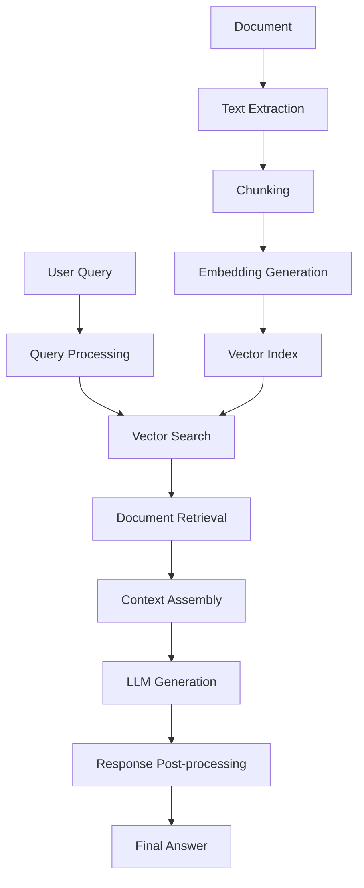

# RAG System Optimization Guide

## Table of Contents

1. [Introduction to RAG Optimization](#introduction-to-rag-optimization)
2. [Understanding RAG Performance](#understanding-rag-performance)
3. [Document Preprocessing Optimization](#document-preprocessing-optimization)
4. [Vector Index Optimization](#vector-index-optimization)
5. [Query Optimization Strategies](#query-optimization-strategies)
6. [Response Quality Enhancement](#response-quality-enhancement)
7. [Performance Monitoring](#performance-monitoring)
8. [Advanced RAG Techniques](#advanced-rag-techniques)
9. [Troubleshooting Common Issues](#troubleshooting-common-issues)
10. [Best Practices Summary](#best-practices-summary)

## Introduction to RAG Optimization

Retrieval-Augmented Generation (RAG) combines document retrieval with AI generation to provide accurate, contextual answers. This guide will help you optimize your RAG system for better performance, accuracy, and user experience.

### Why Optimize RAG?

- **🎯 Better Accuracy**: More relevant and precise answers
- **⚡ Faster Response**: Reduced query processing time
- **💰 Cost Efficiency**: Optimized API usage and resource consumption
- **📈 Scalability**: Handle larger document collections effectively
- **🔍 Better Retrieval**: Find more relevant document sections

## Understanding RAG Performance

### Key Performance Metrics

#### 1. Response Quality Metrics
```python
# Monitor response quality
def track_response_quality():
    metrics = {
        "relevance_score": 0.85,      # How relevant is the answer?
        "completeness_score": 0.78,   # Does it answer the full question?
        "accuracy_score": 0.92,       # Is the information correct?
        "coherence_score": 0.88,      # Is the answer well-structured?
        "source_diversity": 3.2       # How many different sources used?
    }
    return metrics
```

#### 2. Performance Metrics
```python
# Track system performance
def track_performance_metrics():
    metrics = {
        "query_latency": 2.3,         # Seconds to respond
        "retrieval_time": 0.8,        # Time to find relevant chunks
        "generation_time": 1.5,       # Time to generate response
        "index_build_time": 45.2,     # Time to build vector index
        "memory_usage": 1024,         # MB of RAM used
        "tokens_consumed": 850        # API tokens per query
    }
    return metrics
```

### RAG Pipeline Stages



## Document Preprocessing Optimization

### 1. Optimal Chunking Strategies

#### Semantic Boundary Chunking (Recommended)
```python
# Configure semantic chunking for better context preservation
def configure_semantic_chunking():
    chunking_config = {
        "strategy": "semantic_boundary",
        "base_chunk_size": 1000,        # Target size in characters
        "max_chunk_size": 1500,         # Maximum allowed size
        "min_chunk_size": 500,          # Minimum allowed size
        "overlap_size": 200,            # Overlap between chunks
        "preserve_sentences": True,     # Don't break sentences
        "preserve_paragraphs": True,    # Keep paragraph structure
        "section_awareness": True,      # Recognize document sections
        "boundary_markers": [           # Look for these boundaries
            "\n\n",                     # Paragraph breaks
            ". ",                       # Sentence endings
            ":\n",                      # Section headers
            "\n- ",                     # List items
            "\n1.",                     # Numbered lists
        ]
    }

    response = requests.post("http://localhost:8000/api/rag/configure-chunking",
                           json=chunking_config)
    return response.json()
```

#### Document Type-Specific Chunking
```python
# Different strategies for different document types
def document_type_chunking():
    strategies = {
        "research_paper": {
            "strategy": "section_based",
            "preserve_structure": True,
            "section_headers": ["abstract", "introduction", "methods", "results", "discussion"],
            "chunk_size": 800,
            "overlap": 150
        },
        "technical_manual": {
            "strategy": "procedure_based",
            "procedure_markers": ["Step", "Process", "Method"],
            "chunk_size": 1200,
            "overlap": 100
        },
        "book_chapter": {
            "strategy": "narrative_flow",
            "preserve_narrative": True,
            "chunk_size": 1000,
            "overlap": 250
        }
    }

    return strategies
```

### 2. Text Quality Enhancement

#### Content Cleaning Pipeline
```python
def create_content_cleaning_pipeline():
    pipeline = {
        "steps": [
            {
                "name": "encoding_normalization",
                "params": {"target_encoding": "utf-8", "handle_errors": "replace"}
            },
            {
                "name": "whitespace_normalization",
                "params": {"remove_extra_spaces": True, "normalize_line_breaks": True}
            },
            {
                "name": "character_filtering",
                "params": {"remove_control_chars": True, "fix_unicode": True}
            },
            {
                "name": "structure_preservation",
                "params": {"preserve_tables": True, "preserve_lists": True}
            },
            {
                "name": "quality_assessment",
                "params": {"min_meaningful_chars": 50, "max_noise_ratio": 0.3}
            }
        ]
    }

    return pipeline
```

#### Metadata Enrichment
```python
def enrich_chunk_metadata():
    enrichment_config = {
        "document_metadata": {
            "include_title": True,
            "include_authors": True,
            "include_section": True,
            "include_page_number": True
        },
        "content_analysis": {
            "extract_keywords": True,
            "identify_entities": True,
            "classify_content_type": True,    # figure, table, text
            "assess_importance": True         # based on position, length
        },
        "contextual_info": {
            "surrounding_context": 200,      # chars before/after
            "section_hierarchy": True,       # parent sections
            "cross_references": True         # links to figures/tables
        }
    }

    return enrichment_config
```

## Vector Index Optimization

### 1. Embedding Model Selection

#### Model Comparison Matrix
```python
def compare_embedding_models():
    models = {
        "text-embedding-ada-002": {
            "dimensions": 1536,
            "cost_per_1k_tokens": 0.0001,
            "performance": {
                "semantic_similarity": 0.92,
                "domain_adaptation": 0.85,
                "multilingual": 0.78
            },
            "best_for": ["general_purpose", "mixed_domains"]
        },
        "all-MiniLM-L6-v2": {
            "dimensions": 384,
            "cost_per_1k_tokens": 0.0,  # Free/local
            "performance": {
                "semantic_similarity": 0.87,
                "domain_adaptation": 0.82,
                "speed": 0.95
            },
            "best_for": ["fast_inference", "resource_constrained"]
        },
        "text-embedding-3-large": {
            "dimensions": 3072,
            "cost_per_1k_tokens": 0.00013,
            "performance": {
                "semantic_similarity": 0.95,
                "domain_adaptation": 0.90,
                "complex_queries": 0.93
            },
            "best_for": ["high_accuracy", "complex_documents"]
        }
    }

    return models
```

#### Dynamic Model Selection
```python
def select_optimal_model(document_characteristics):
    """
    Select embedding model based on document and query characteristics
    """
    if document_characteristics["complexity"] == "high":
        return "text-embedding-3-large"
    elif document_characteristics["volume"] == "large":
        return "all-MiniLM-L6-v2"
    elif document_characteristics["domain"] == "specialized":
        return "text-embedding-ada-002"
    else:
        return "text-embedding-ada-002"  # Default balanced choice
```

### 2. Vector Index Configuration

#### Optimized Index Settings
```python
def configure_vector_index():
    index_config = {
        "algorithm": "HNSW",              # Hierarchical Navigable Small World
        "distance_metric": "cosine",      # cosine, euclidean, dot_product
        "index_parameters": {
            "ef_construction": 200,        # Higher = better quality, slower build
            "m": 16,                      # Higher = better recall, more memory
            "max_connections": 64,         # Maximum connections per node
            "ef_search": 100              # Higher = better recall, slower search
        },
        "optimization": {
            "enable_pruning": True,        # Remove low-quality connections
            "enable_quantization": False,  # Reduce memory, slight quality loss
            "batch_size": 1000,           # Batch size for index building
            "parallel_threads": 4         # Parallel processing threads
        }
    }

    return index_config
```

#### Multi-Level Indexing Strategy
```python
def setup_multi_level_indexing():
    """
    Create multiple indexes for different granularities
    """
    indexing_strategy = {
        "document_level": {
            "granularity": "full_document",
            "embedding_source": "document_summary",
            "use_case": "document_similarity_search"
        },
        "section_level": {
            "granularity": "major_sections",
            "embedding_source": "section_summaries",
            "use_case": "topic_focused_retrieval"
        },
        "chunk_level": {
            "granularity": "small_chunks",
            "embedding_source": "chunk_content",
            "use_case": "precise_information_retrieval"
        }
    }

    return indexing_strategy
```

## Query Optimization Strategies

### 1. Query Enhancement Techniques

#### Query Expansion
```python
def enhance_user_query(original_query, document_context):
    """
    Expand user queries for better retrieval
    """
    enhancement_config = {
        "synonym_expansion": {
            "enabled": True,
            "max_synonyms": 3,
            "confidence_threshold": 0.8
        },
        "context_injection": {
            "enabled": True,
            "use_document_keywords": True,
            "use_previous_queries": True,
            "context_weight": 0.3
        },
        "query_reformulation": {
            "enabled": True,
            "generate_alternatives": 2,
            "combine_results": True
        }
    }

    enhanced_query = {
        "original": original_query,
        "expanded": f"{original_query} related concepts: machine learning optimization algorithms",
        "alternatives": [
            "What optimization techniques are discussed?",
            "How are ML algorithms optimized in this work?"
        ],
        "context_terms": ["neural networks", "gradient descent", "backpropagation"]
    }

    return enhanced_query
```

#### Multi-Stage Retrieval
```python
def multi_stage_retrieval(query, document_id):
    """
    Implement multi-stage retrieval for better results
    """

    # Stage 1: Broad retrieval
    broad_results = requests.post("http://localhost:8000/api/rag/retrieve",
        json={
            "query": query,
            "document_id": document_id,
            "top_k": 20,
            "threshold": 0.6
        }
    ).json()

    # Stage 2: Re-ranking with cross-encoder
    reranked_results = requests.post("http://localhost:8000/api/rag/rerank",
        json={
            "query": query,
            "candidates": broad_results["chunks"],
            "model": "cross_encoder",
            "top_k": 5
        }
    ).json()

    # Stage 3: Context optimization
    optimized_context = requests.post("http://localhost:8000/api/rag/optimize-context",
        json={
            "query": query,
            "chunks": reranked_results["chunks"],
            "max_context_length": 2000,
            "prioritize_relevance": True
        }
    ).json()

    return optimized_context
```

### 2. Context Assembly Optimization

#### Smart Context Window Management
```python
def optimize_context_window():
    context_config = {
        "max_tokens": 4000,               # Maximum context size
        "reserved_for_query": 200,        # Tokens reserved for query
        "reserved_for_response": 800,     # Tokens reserved for response
        "available_for_context": 3000,    # Remaining for retrieved content

        "prioritization_strategy": "relevance_first",
        "include_metadata": True,
        "chunk_boundaries": "preserve",

        "quality_filters": {
            "min_relevance_score": 0.7,
            "remove_duplicates": True,
            "coherence_check": True
        }
    }

    return context_config
```

#### Context Diversity Enhancement
```python
def enhance_context_diversity(retrieved_chunks):
    """
    Ensure diverse perspectives in context
    """
    diversity_config = {
        "max_chunks_per_section": 2,     # Avoid over-representation
        "semantic_clustering": True,      # Group similar content
        "temporal_distribution": True,    # Include different time periods
        "source_diversity": True,        # Multiple document sources
        "perspective_diversity": True    # Different viewpoints
    }

    # Apply diversity filters
    diverse_chunks = apply_diversity_filters(retrieved_chunks, diversity_config)
    return diverse_chunks
```

## Response Quality Enhancement

### 1. Generation Parameter Tuning

#### Optimal LLM Parameters
```python
def configure_generation_parameters():
    generation_config = {
        "temperature": 0.3,              # Lower = more focused responses
        "max_tokens": 1000,              # Response length limit
        "top_p": 0.9,                   # Nucleus sampling threshold
        "frequency_penalty": 0.1,        # Reduce repetition
        "presence_penalty": 0.1,         # Encourage diverse vocabulary

        "response_structure": {
            "include_sources": True,     # Show source references
            "confidence_scores": True,   # Include confidence indicators
            "answer_sections": True,     # Structure complex answers
            "follow_up_suggestions": True # Suggest related questions
        }
    }

    return generation_config
```

#### Response Post-Processing
```python
def post_process_response(raw_response, query_context):
    """
    Enhance response quality through post-processing
    """

    processing_steps = {
        "fact_verification": {
            "enabled": True,
            "cross_reference_sources": True,
            "flag_inconsistencies": True
        },
        "completeness_check": {
            "enabled": True,
            "verify_question_answered": True,
            "suggest_clarifications": True
        },
        "formatting_enhancement": {
            "enabled": True,
            "improve_readability": True,
            "add_structure": True,
            "highlight_key_points": True
        },
        "confidence_assessment": {
            "enabled": True,
            "calculate_confidence_score": True,
            "identify_uncertain_areas": True
        }
    }

    return processing_steps
```

### 2. Answer Validation and Verification

#### Multi-Source Verification
```python
def verify_answer_accuracy(answer, sources, original_query):
    """
    Verify answer accuracy against multiple sources
    """
    verification_config = {
        "consistency_check": {
            "compare_across_sources": True,
            "flag_contradictions": True,
            "weight_by_source_quality": True
        },
        "factual_accuracy": {
            "check_against_knowledge_base": True,
            "verify_numerical_claims": True,
            "validate_citations": True
        },
        "completeness_assessment": {
            "check_question_coverage": True,
            "identify_missing_aspects": True,
            "suggest_additional_context": True
        }
    }

    verification_result = {
        "accuracy_score": 0.92,
        "consistency_score": 0.88,
        "completeness_score": 0.85,
        "confidence_level": "high",
        "flagged_issues": [],
        "improvement_suggestions": [
            "Consider including more recent research",
            "Add quantitative evidence for claim X"
        ]
    }

    return verification_result
```

## Performance Monitoring

### 1. Real-Time Performance Tracking

#### Performance Dashboard
```python
def setup_performance_monitoring():
    monitoring_config = {
        "metrics_collection": {
            "response_time": {"enabled": True, "alert_threshold": 5.0},
            "accuracy_scores": {"enabled": True, "alert_threshold": 0.8},
            "resource_usage": {"enabled": True, "alert_threshold": 90},
            "error_rates": {"enabled": True, "alert_threshold": 5}
        },
        "alerting": {
            "email_notifications": True,
            "dashboard_alerts": True,
            "auto_optimization": True
        },
        "reporting": {
            "daily_summary": True,
            "weekly_trends": True,
            "performance_recommendations": True
        }
    }

    return monitoring_config
```

#### A/B Testing Framework
```python
def setup_rag_ab_testing():
    """
    Test different RAG configurations
    """
    ab_test_config = {
        "test_variants": {
            "variant_a": {
                "name": "current_production",
                "chunking_strategy": "fixed_size",
                "embedding_model": "ada-002",
                "retrieval_k": 5
            },
            "variant_b": {
                "name": "optimized_chunking",
                "chunking_strategy": "semantic_boundary",
                "embedding_model": "ada-002",
                "retrieval_k": 5
            },
            "variant_c": {
                "name": "enhanced_model",
                "chunking_strategy": "semantic_boundary",
                "embedding_model": "text-embedding-3-large",
                "retrieval_k": 7
            }
        },
        "traffic_split": {
            "variant_a": 0.4,
            "variant_b": 0.4,
            "variant_c": 0.2
        },
        "success_metrics": [
            "user_satisfaction_score",
            "response_accuracy",
            "response_time",
            "cost_per_query"
        ]
    }

    return ab_test_config
```

## Advanced RAG Techniques

### 1. Hybrid Retrieval Systems

#### Dense + Sparse Retrieval
```python
def setup_hybrid_retrieval():
    """
    Combine dense vector search with sparse keyword search
    """
    hybrid_config = {
        "dense_retrieval": {
            "weight": 0.7,
            "model": "text-embedding-ada-002",
            "top_k": 10
        },
        "sparse_retrieval": {
            "weight": 0.3,
            "method": "BM25",
            "top_k": 10
        },
        "fusion_method": "reciprocal_rank_fusion",
        "final_k": 5
    }

    return hybrid_config
```

### 2. Iterative Retrieval and Refinement

#### Multi-Turn RAG Conversations
```python
def implement_conversational_rag():
    """
    Maintain context across multiple query turns
    """
    conversation_config = {
        "context_management": {
            "maintain_history": True,
            "max_turns": 10,
            "context_compression": True
        },
        "query_refinement": {
            "use_previous_answers": True,
            "clarification_questions": True,
            "context_expansion": True
        },
        "memory_management": {
            "important_facts": "persist",
            "user_preferences": "learn",
            "conversation_summary": "maintain"
        }
    }

    return conversation_config
```

### 3. Domain-Specific Optimization

#### Academic Paper Optimization
```python
def optimize_for_academic_papers():
    """
    Special optimizations for academic documents
    """
    academic_config = {
        "section_awareness": {
            "abstract": {"weight": 1.5, "priority": "high"},
            "introduction": {"weight": 1.2, "priority": "high"},
            "methodology": {"weight": 1.3, "priority": "medium"},
            "results": {"weight": 1.4, "priority": "high"},
            "discussion": {"weight": 1.3, "priority": "high"},
            "references": {"weight": 0.8, "priority": "low"}
        },
        "citation_handling": {
            "resolve_citations": True,
            "cross_reference": True,
            "citation_context": True
        },
        "technical_content": {
            "preserve_equations": True,
            "table_handling": "structured",
            "figure_references": True
        }
    }

    return academic_config
```

## Troubleshooting Common Issues

### 1. Poor Retrieval Quality

#### Diagnosis and Solutions
```python
def diagnose_retrieval_issues():
    diagnostic_checks = {
        "embedding_quality": {
            "check": "semantic_similarity_test",
            "solution": "upgrade_embedding_model"
        },
        "chunk_granularity": {
            "check": "chunk_size_analysis",
            "solution": "optimize_chunking_strategy"
        },
        "index_quality": {
            "check": "vector_index_health",
            "solution": "rebuild_with_better_parameters"
        },
        "query_formulation": {
            "check": "query_embedding_quality",
            "solution": "implement_query_enhancement"
        }
    }

    return diagnostic_checks
```

### 2. Slow Response Times

#### Performance Optimization Checklist
```python
def optimize_response_speed():
    optimization_checklist = {
        "vector_search": [
            "Reduce index search parameters (ef_search)",
            "Use approximate search for large datasets",
            "Implement result caching",
            "Optimize hardware (SSD, more RAM)"
        ],
        "llm_generation": [
            "Reduce max_tokens for responses",
            "Use streaming responses",
            "Implement response caching",
            "Optimize prompt length"
        ],
        "document_processing": [
            "Pre-process documents during upload",
            "Use chunking caches",
            "Implement lazy loading",
            "Optimize chunk retrieval"
        ]
    }

    return optimization_checklist
```

### 3. High API Costs

#### Cost Optimization Strategies
```python
def optimize_api_costs():
    cost_optimization = {
        "embedding_optimization": [
            "Cache embeddings for reuse",
            "Use smaller embedding models where appropriate",
            "Batch embed multiple chunks",
            "Implement embedding deduplication"
        ],
        "generation_optimization": [
            "Optimize prompt length",
            "Use response caching",
            "Implement smart context filtering",
            "Use cheaper models for simple queries"
        ],
        "query_optimization": [
            "Implement query similarity detection",
            "Use query result caching",
            "Optimize retrieval parameters",
            "Implement query batching"
        ]
    }

    return cost_optimization
```

## Best Practices Summary

### 1. Document Management Best Practices

- **📊 Chunk Size**: Use 800-1200 characters with 150-200 character overlap
- **🔍 Chunking Strategy**: Prefer semantic boundary chunking over fixed-size
- **📝 Metadata**: Enrich chunks with document structure and context information
- **🧹 Content Cleaning**: Implement robust text preprocessing pipeline
- **📈 Quality Assessment**: Monitor chunk quality and relevance scores

### 2. Vector Index Best Practices

- **🎯 Model Selection**: Choose embedding models based on use case and budget
- **⚙️ Index Configuration**: Use HNSW algorithm with optimized parameters
- **🔄 Multi-Level Indexing**: Implement document, section, and chunk-level indexes
- **💾 Caching**: Cache embeddings and frequently accessed vectors
- **🔍 Search Optimization**: Tune search parameters for speed vs. accuracy

### 3. Query Processing Best Practices

- **🔄 Query Enhancement**: Implement query expansion and reformulation
- **📊 Multi-Stage Retrieval**: Use broad retrieval followed by re-ranking
- **🎯 Context Optimization**: Smart context window management and diversity
- **✅ Result Validation**: Verify answer accuracy and completeness
- **📈 Continuous Learning**: Use feedback to improve query processing

### 4. Performance Monitoring Best Practices

- **📊 Comprehensive Metrics**: Track quality, speed, and cost metrics
- **🚨 Proactive Alerting**: Set up alerts for performance degradation
- **🧪 A/B Testing**: Continuously test and optimize configurations
- **📈 Trend Analysis**: Monitor long-term performance trends
- **🔄 Continuous Improvement**: Regular optimization based on data

### 5. Cost Optimization Best Practices

- **💰 Smart Caching**: Cache embeddings, responses, and intermediate results
- **🎯 Selective Processing**: Only process and index relevant content
- **⚡ Efficient Retrieval**: Optimize retrieval parameters for cost-effectiveness
- **📊 Usage Monitoring**: Track and analyze API usage patterns
- **🔄 Model Selection**: Balance model performance with cost considerations

---

**📊 Expected Improvements After Optimization:**
- **Response Accuracy**: 15-25% improvement
- **Response Speed**: 30-50% faster
- **API Cost Reduction**: 20-40% savings
- **User Satisfaction**: Significant improvement in answer quality

**⏱️ Implementation Timeline:**
- **Week 1**: Document preprocessing and chunking optimization
- **Week 2**: Vector index configuration and optimization
- **Week 3**: Query processing and context optimization
- **Week 4**: Performance monitoring and fine-tuning

**Last Updated**: 2025-08-09 | **Version**: 2.1.0 | **Difficulty**: Advanced